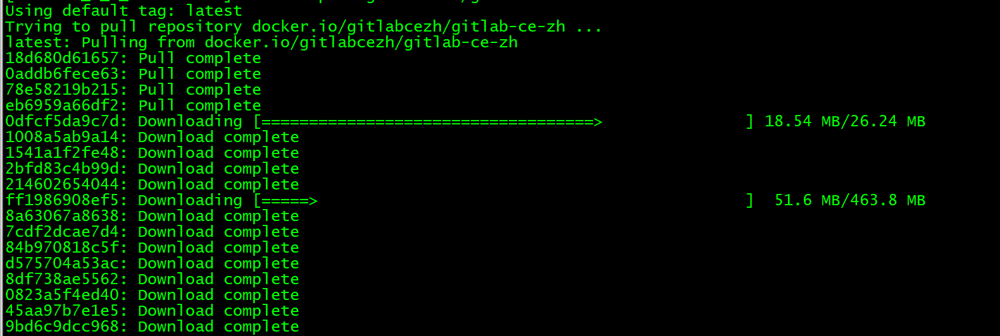
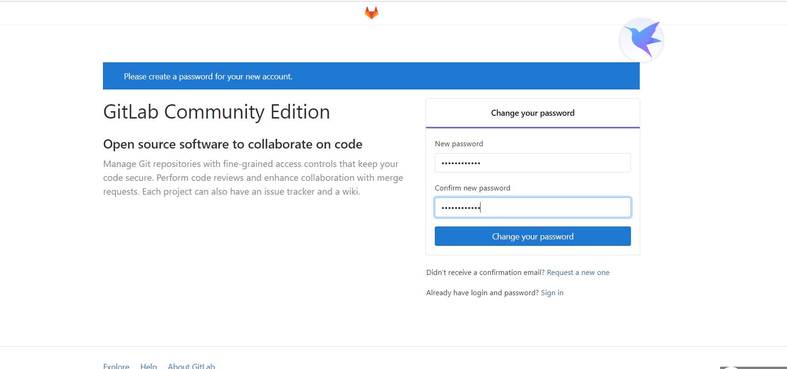
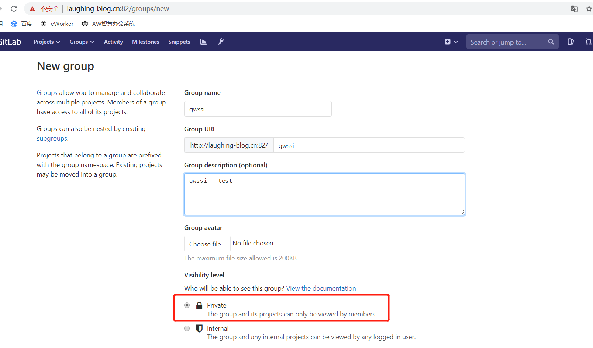
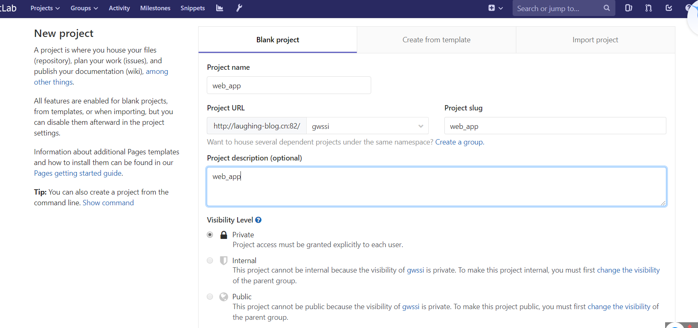

### 一、安装 

用docker比较方便<br>

&nbsp;&nbsp;&nbsp;&nbsp;在[https://hub.docker.com/](https://hub.docker.com/)中搜索gitlab,这里我们用的是
&nbsp;&nbsp;&nbsp;&nbsp;[https://hub.docker.com/r/gitlabcezh/gitlab-ce-zh](https://hub.docker.com/r/gitlabcezh/gitlab-ce-zh)<br/>
       拉取镜像<br/>

       docker pull gitlabcezh/gitlab-ce-zh


 

run 镜像<br/>

```
sudo docker run --detach \
  --publish 5443:443 \
  --publish 82:82 \
  --publish 2222:22 \
  --name gitlab \
  --volume /data/gitlab/config:/etc/gitlab \
  --volume /data/gitlab/logs:/var/log/gitlab \
  --volume /data/gitlab/data:/var/opt/gitlab \
  gitlab/gitlab-ce:11.11.3-ce.0
```

修改配置文件的端口<br/>

```
 vim /data/gitlab/config/gitlab.rb


external_url


// 修改如下语句
external_url 'http://49.232.61.212:82'

# https需要下面这句

# nginx['redirect_http_to_https_port'] = 82

nginx['listen_port'] = 82

# 配置2222端口

gitlab_rails['gitlab_shell_ssh_port'] = 2222


docker restart gitlab

```

第一次初始化root的密码





新建组：


新建项目：



添加用户：


&nbsp;&nbsp;&nbsp;&nbsp; 本人授权[维权骑士](http://rightknights.com)对我发布文章的版权行为进行追究与维权。未经本人许可，不可擅自转载或用于其他商业用途。


