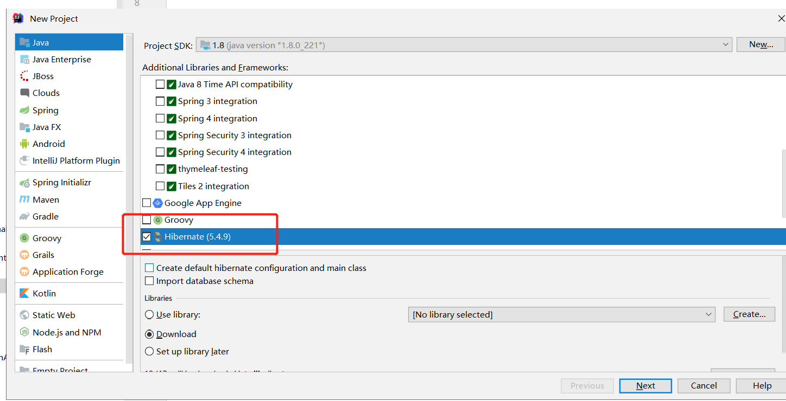
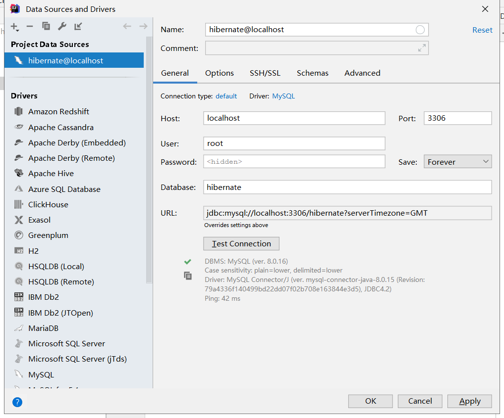
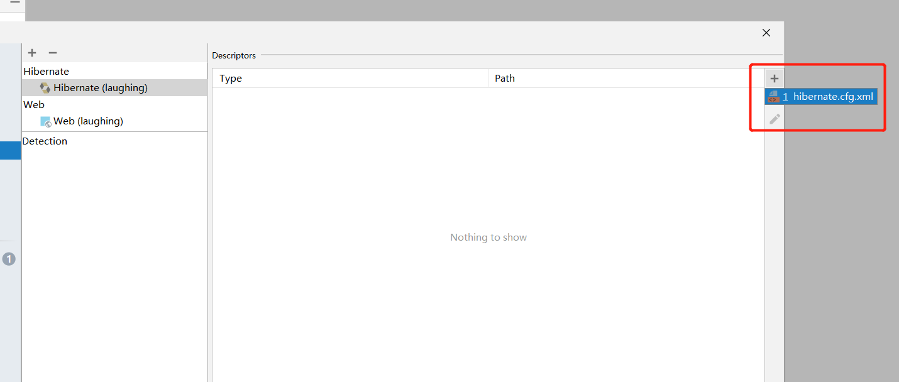
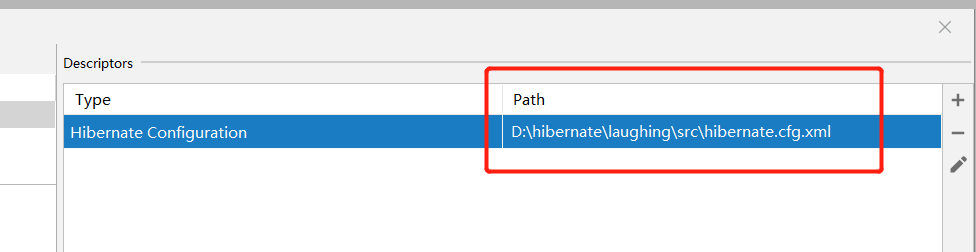
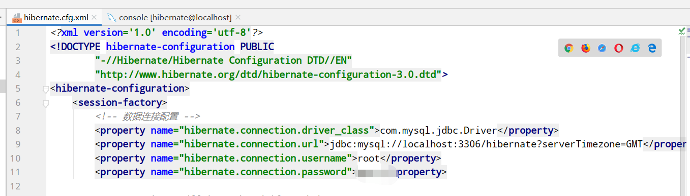
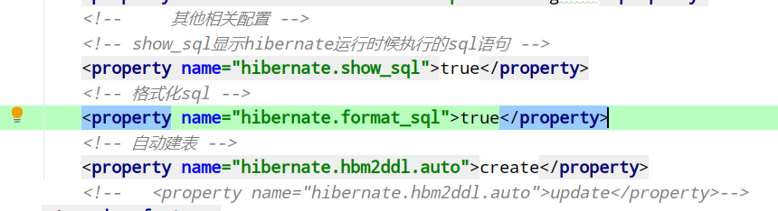
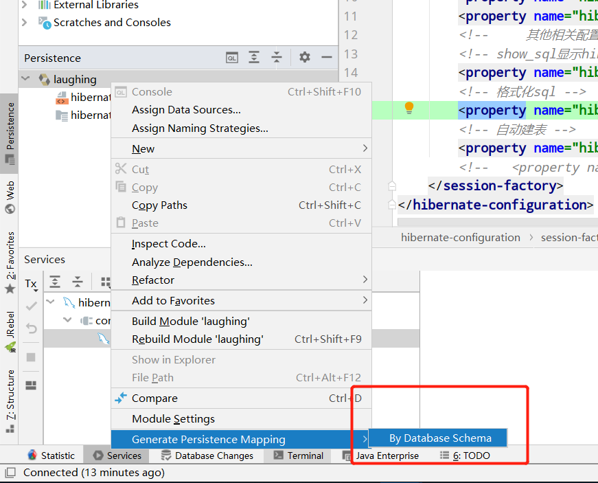
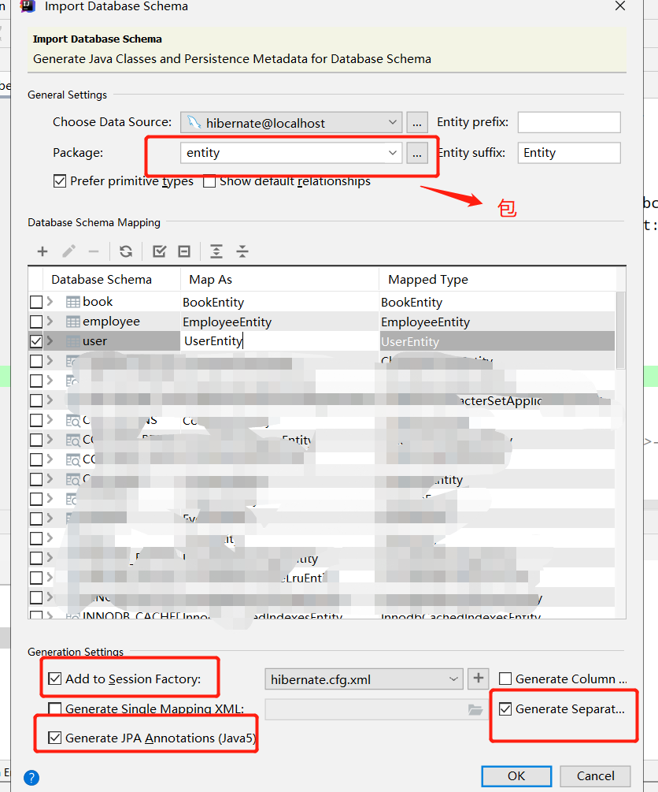
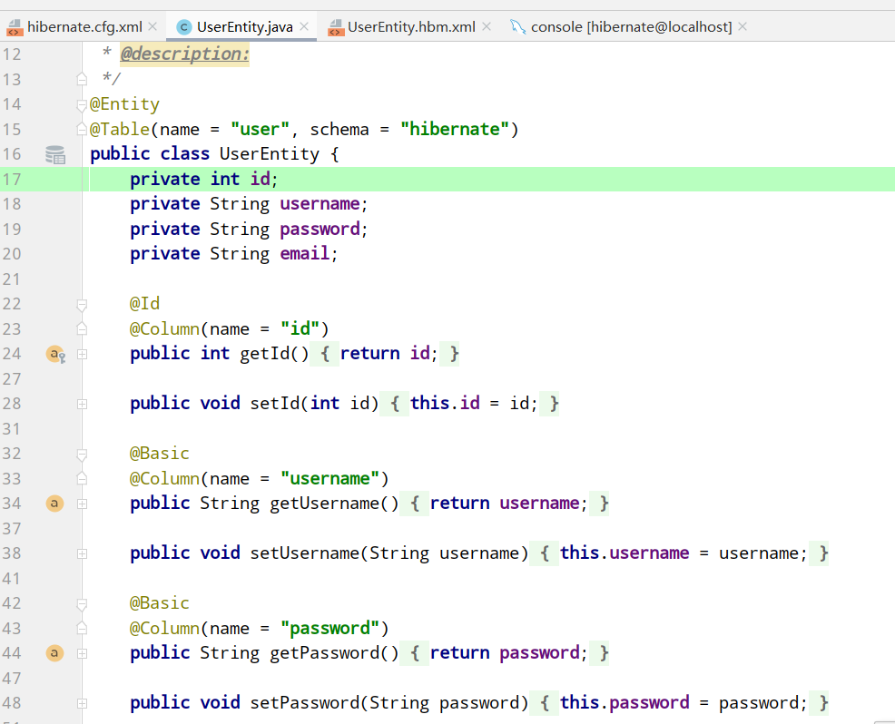
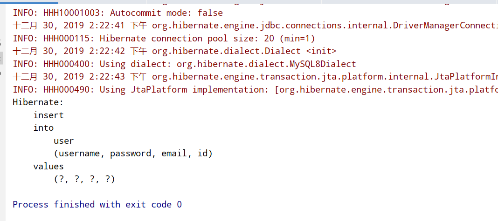

&nbsp;&nbsp;&nbsp;&nbsp;Hibernate是一个开源的对象关系映射框架，它对JDBC进行了非常轻量级的对象封装，它将POJO与数据库表建立映射关系，是一个全自动的orm框架。
hibernate可以自动生成SQL语句，自动执行。你可xxxx以一句sql都不用写来完成业务数据操作。 
&nbsp;&nbsp;&nbsp;&nbsp;有很多人都说有了Mybatis，Hibernate就不用看了，这都是很片面的。首先hibernate更多提供了一种理想化的编程思想面向对象。
hibernate能够帮助你真正理解面向对象编程。
其次你可以快乐的spring data jpa。本文用idea以简单的方式使用  hibernate  对 mysql 数据库进行操作。

&nbsp;&nbsp;&nbsp;&nbsp;打开idea开始吧 
&nbsp;&nbsp;&nbsp;&nbsp; 
   * 1、新建项目 &nbsp;&nbsp;&nbsp;&nbsp;
   new project 勾选 java Application和hibernate、并配置hibernate版本
  

   * 2、连接mysql并添加jdbc驱动包 &nbsp;&nbsp;&nbsp;&nbsp;
   &nbsp;&nbsp;&nbsp;&nbsp;注意连不上的话在url后面添加 ?serverTimezone=GMT 改一下时差 &nbsp;&nbsp;&nbsp;&nbsp;
 
 &nbsp;&nbsp;&nbsp;&nbsp;
 
&nbsp;&nbsp;&nbsp;&nbsp; 
   * 3、配置hibernate.cfg.xml &nbsp;&nbsp;&nbsp;&nbsp;
hibernate.cfg.xml为Hibernate的主配置文件，配置内容包括：数据库连接信息，参数。映射信息等.
在project structure -  facets中配置hibernate可直接生成，非常方便。
 
&nbsp;&nbsp;&nbsp;&nbsp; **路径在项目src下**

&nbsp;&nbsp;&nbsp;&nbsp; **hibernate.cfg.xml配置数据库信息**
   

&nbsp;&nbsp;&nbsp;&nbsp; **其他相关配置：** &nbsp;&nbsp;&nbsp;&nbsp;
配置文件修改hibernate.hbm2ddl.auto可在项目运行时实现自动建表。
&nbsp;&nbsp;&nbsp;&nbsp;
   
   * 4、生成Hibernate的实体类以及配置文件 &nbsp;&nbsp;&nbsp;&nbsp;
在Persistence中右键项目，然后点击Generate Persistence Mapping，选择By Database Schema；
    &nbsp;&nbsp;&nbsp;&nbsp;
   

此时，就会自动生成实体类和.hbn.xml的映射类

    &nbsp;&nbsp;&nbsp;&nbsp;
   
   * 5、编写测试类并运行 &nbsp;&nbsp;&nbsp;&nbsp;
   
    public class test_insert {
       public static void main(String[] args) {
               //创建对象
               UserEntity user = new UserEntity();
               user.setPassword("123");
               user.setEmail("122222");
               user.setUsername("nihao");
               //获取加载配置管理类
               Configuration configuration = new Configuration();
               //不给参数就默认加载hibernate.cfg.xml文件，
               configuration.configure();
               //创建Session工厂对象
               SessionFactory factory = configuration.buildSessionFactory();
               //得到Session对象
               Session session = factory.openSession();
               //使用Hibernate操作数据库，都要开启事务,得到事务对象
               Transaction transaction = session.getTransaction();
               //开启事务
               transaction.begin();
               //把对象添加到数据库中
               session.save(user);
               //提交事务
               transaction.commit();
               //关闭Session
               session.close();
           } }
    &nbsp;&nbsp;&nbsp;&nbsp;我注释写的非常详尽不再赘述。
    &nbsp;&nbsp;&nbsp;&nbsp;测试一下：
   

&nbsp;&nbsp;&nbsp;&nbsp; 本人授权[维权骑士](http://rightknights.com)对我发布文章的版权行为进行追究与维权。未经本人许可，不可擅自转载或用于其他商业用途。

