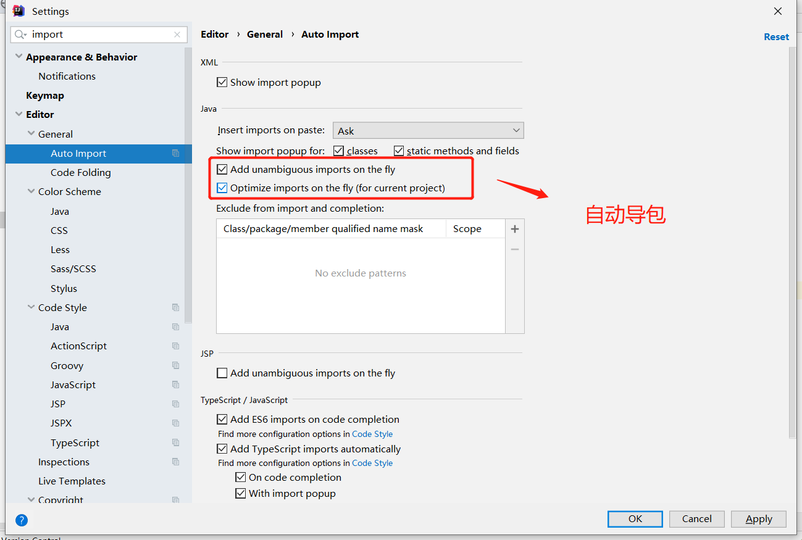
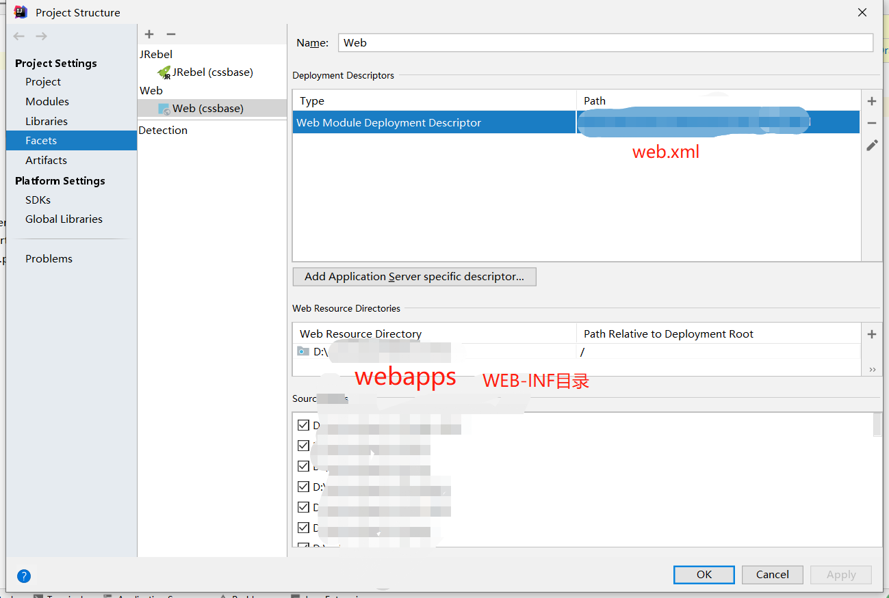

&nbsp;&nbsp;&nbsp;&nbsp;本文记录idea日常使用，长期更新。 
### &nbsp;&nbsp;&nbsp;&nbsp; 一、运行配置 

&nbsp;&nbsp;&nbsp;&nbsp;**idea64.exe.vmoptions**： 

我电脑是16GB的，将idea64.exe.vmoptions文件进行修改，增加运行速度。 
-Xms128m，设置为 -Xms1024m 
-Xmx750m，设置为 -Xmx1024m 
-XX:ReservedCodeCacheSize=225m，设置为 -XX:ReservedCodeCacheSize=500m 

&nbsp;&nbsp;&nbsp;&nbsp;**Encoding 编码**： 
一般都设置为UTF-8。 
    
&nbsp;&nbsp;&nbsp;&nbsp;**Auto Import**： 
    
 &nbsp;&nbsp;&nbsp;&nbsp;**安装插件**： 
     
 
### &nbsp;&nbsp;&nbsp;&nbsp; 二、Project Structure 

&nbsp;&nbsp;&nbsp;&nbsp;**Project**： 
   
&nbsp;&nbsp;&nbsp;&nbsp;**Modules 模块**： 
   
Sources：源代码存放的文件，蓝色。 
Tests：设置测试代码存放的文件件，绿色。 
Resources：一般对应着Sources文件，一般放配置文件，如：log4j.properties，application.yml。 
Test Resources：这个对应着Tests文件夹，存放着Tests代码的配置文件。 
Excluded：设置配出编译检查的文件，例如我们在project模块设置的out文件夹。 

&nbsp;&nbsp;&nbsp;&nbsp;**Paths**： 
   
&nbsp;&nbsp;&nbsp;&nbsp;**module dependencies**： 
   

&nbsp;&nbsp;&nbsp;&nbsp;这里注意module dependencies是libraries集合，下面的libraries是jar包的集合.Maven支持 

&nbsp;&nbsp;&nbsp;&nbsp;**Facets特征**： 
   
&nbsp;&nbsp;&nbsp;&nbsp;也可配置hibernate、spring等特征配置文件  

&nbsp;&nbsp;&nbsp;&nbsp;**artifacts**： 
&nbsp;&nbsp;&nbsp;&nbsp;Artifacts是maven中的一个概念，表示某个module要如何打包，例如war exploded、war、jar、ear等等这种打包形式。
在这里配置好以后直接往容器里加就行了。 
   

### &nbsp;&nbsp;&nbsp;&nbsp; 三、Setting 
   
1、Appearance & Behavior 外观和行为 
2、Keymap 快捷键 
3、Editor 编辑器 
4、Plugins 插件 
5、Version Control 版本控制 
6、Build,Execution,Deployment 构建，执行，部署 
7、Languages & Frameworks 语言和框架 
8、Tools 工具集 

### &nbsp;&nbsp;&nbsp;&nbsp; 四、快捷键补充 

1、Alt + j 相同字符多光标操作 
2、ctrl + shift + Alt + j 全相同字符多光标操作 
3、按住Alt 用光标选中，也可实现多光标操作 
4、ctrl + j 自动代码片 

&nbsp;&nbsp;&nbsp;&nbsp; 本人授权[维权骑士](http://rightknights.com)对我发布文章的版权行为进行追究与维权。未经本人许可，不可擅自转载或用于其他商业用途。

 