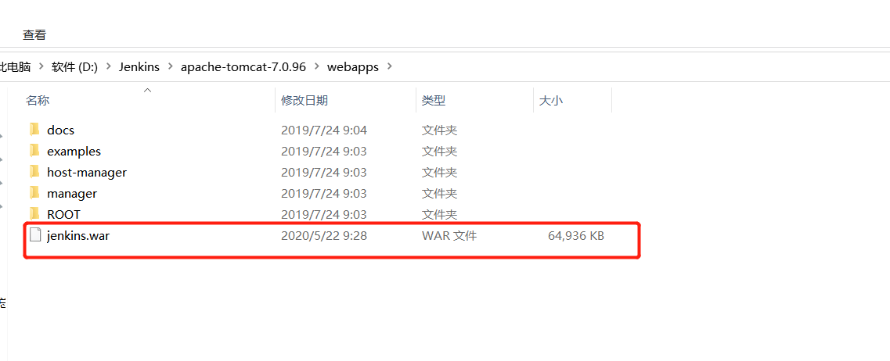
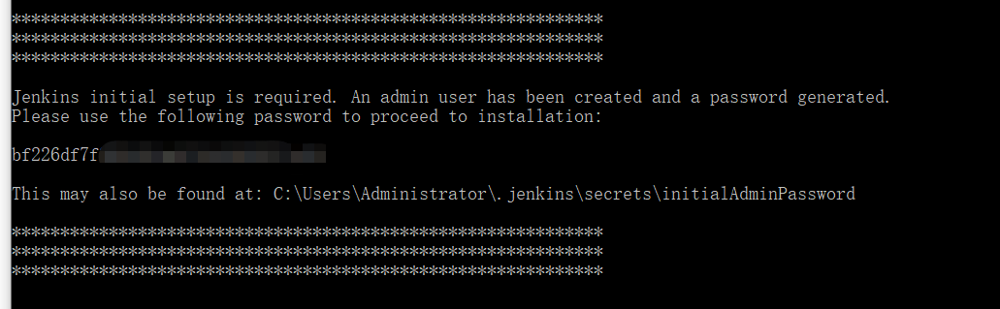
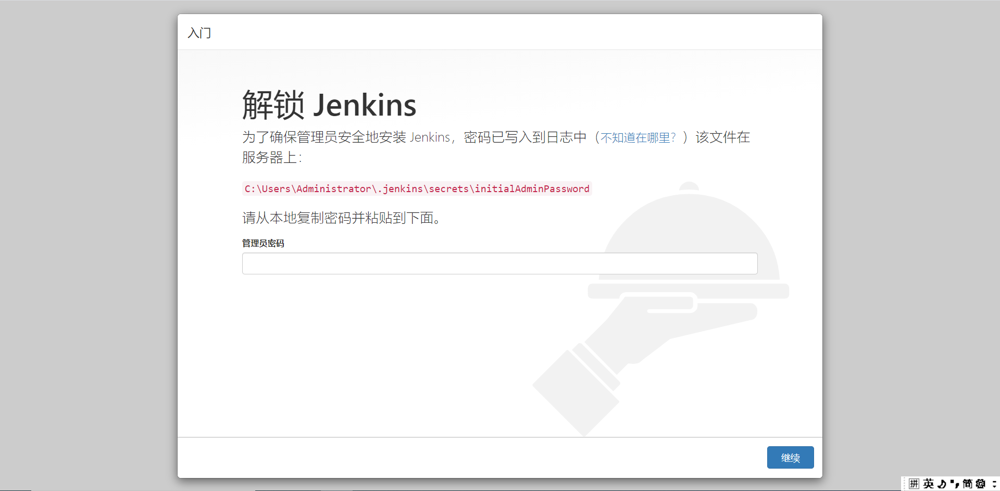
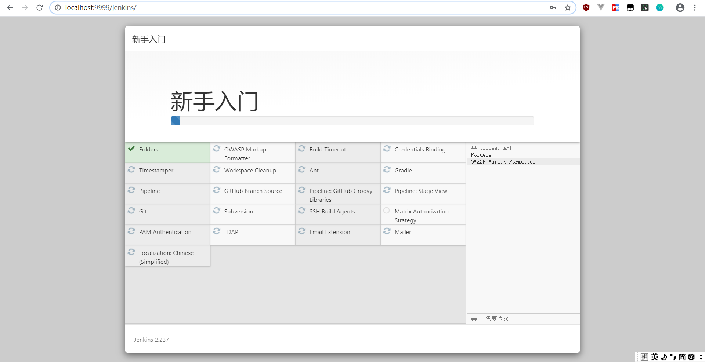
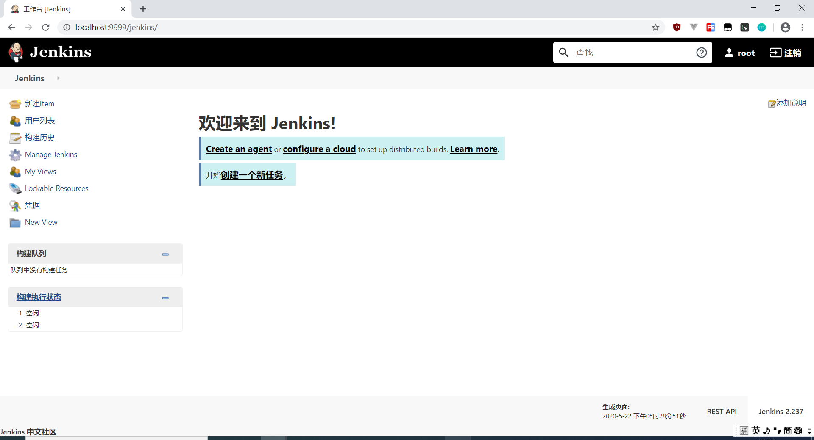

&nbsp; &nbsp;Jenkins用Java语言编写，可在Tomcat等流行的servlet容器中运行，也可独立运行。通常与版本管理工具(SCM)、构建工具结合使用。常用的版本控制工具有SVN、GIT，构建工具有Maven、Ant、Gradle。


### &nbsp;&nbsp;&nbsp;&nbsp; 一、windows环境<br/>

&nbsp; &nbsp;Jenkins官方网站：[https://jenkins.io/](https://jenkins.io/)<br/>
&nbsp; &nbsp;官网下载目录直接装在tomcat的webapps就可以了<br/>

&nbsp; &nbsp;也可以：java -jar jenkins.war --httpPort=8080<br/>

&nbsp; &nbsp;jenkins.war下载地址：[http://mirrors.jenkins-ci.org/war/latest/jenkins.war](http://mirrors.jenkins-ci.org/war/latest/jenkins.war)
&nbsp; &nbsp;安装好后，访问地址：[http://localhost:8080/jenkins](http://localhost:8080/jenkins)<br/>
  <br>

  <br>
&nbsp; &nbsp;然后去拿密码<br/>
  <br>
&nbsp; &nbsp;安装插件<br/>
  <br>
&nbsp; &nbsp;创建用户，登录<br/>
  <br>

### &nbsp;&nbsp;&nbsp;&nbsp; 二、Linux环境<br/>

```
sudo wget -O /etc/yum.repos.d/jenkins.repo https://pkg.jenkins.io/redhat/jenkins.repo
sudo rpm --import https://pkg.jenkins.io/redhat/jenkins.io.key

sudo yum install jenkins #yum安装Jenkins默认路径为 /var/lib/jenkins
##########################################
Jenkins会创建一个用户叫做jenkins
　
配置文件/etc/sysconfig/jenkins
默认启用8080

JENKINS_PORT="8080"


#####################启动和关闭#####################
sudo service jenkins start
sudo service jenkins stop
```


&nbsp;&nbsp;&nbsp;&nbsp; 本人授权[维权骑士](http://rightknights.com)对我发布文章的版权行为进行追究与维权。未经本人许可，不可擅自转载或用于其他商业用途。


