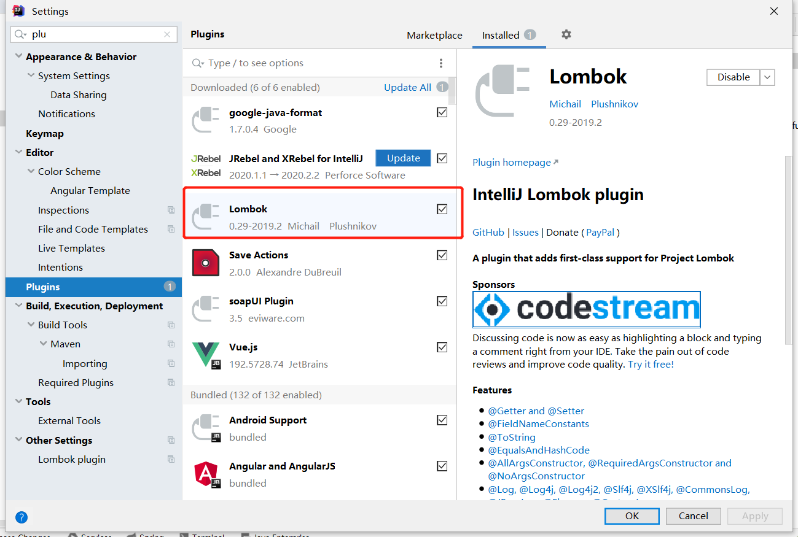

Lombok项目是一个Java库，它会自动插入编辑器和构建工具中，Lombok提供了一组有用的注释，用来消除Java类中的大量样板代码。仅五个字符(@Data)就可以替换数百行代码从而产生干净，简洁且易于维护的Java类。

### 一、使用

**引入相应的maven包：**

    <dependency>
          <groupId>org.projectlombok</groupId>
           <artifactId>lombok</artifactId>
           <version>${lombok.version}</version>
           <scope>provided</scope>
    </dependency>

**idea 安装Lombok插件：**

 

### 二、注解

#### **@Getter/@Setter:  **

**自动产生 getter/setter **

#### **@NoArgsConstructor: **

**生成空参构造 **

#### **@AllArgsConstructor: **

**生成全部参数构造 **

#### **@RequiredArgsConstructor：  **

**会生成一个包含常量，和标识了NotNull的变量的构造方法。 **

#### **@ToString: **

**生成所有属性的toString()方法 **

#### **@Data : **

**整合包，只要加了 @Data 这个注解，等于同时加了以下注解 **

**@Getter/@Setter **
**@ToString **
**@EqualsAndHashCode **
**@RequiredArgsConstructor **

 

&nbsp;&nbsp;&nbsp;&nbsp; 本人授权[维权骑士](http://rightknights.com)对我发布文章的版权行为进行追究与维权。未经本人许可，不可擅自转载或用于其他商业用途。

