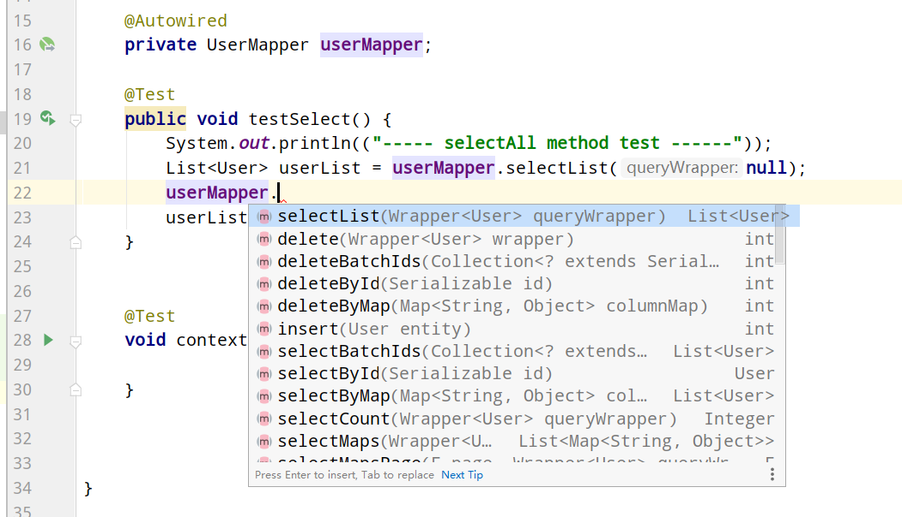

### 一、简介

**文档地址**：<br>

[https://mp.baomidou.com/](https://mp.baomidou.com/)<br>

**支持数据库：**<br>

- mysql 、 mariadb 、 oracle 、 db2 、 h2 、 hsql 、 sqlite 、 postgresql 、 sqlserver 、 presto<br>
- 达梦数据库 、 虚谷数据库 、 人大金仓数据库<br>

简单的CRUD操作不用自己写了。**支持主键自动生成**，**内置代码生成器**


### 二、使用

引入 `mybatis-plus-boot-starter`、`lombok`、`mysql` 依赖

```
<dependency>
    <groupId>org.projectlombok</groupId>
    <artifactId>lombok</artifactId>
    <optional>true</optional>
</dependency>
<dependency>
    <groupId>com.baomidou</groupId>
    <artifactId>mybatis-plus-boot-starter</artifactId>
    <version>3.3.2</version>
</dependency>
<dependency>
    <groupId>com.h2database</groupId>
    <artifactId>h2</artifactId>
    <scope>runtime</scope>
</dependency>
```

**数据源配置：**

```
spring:
  #mysql数据库相关配置
  datasource:
    url: jdbc:mysql://localhost:3306/edu?useUnicode=true&characterEncoding=utf-8&useSSL=true&serverTimezone=UTC
    username: root
    password: 
    driver-class-name: com.mysql.jdbc.Driver   #mysql驱动
```

**启动类@MapperScan注解：**

```java
@SpringBootApplication
@MapperScan("com.gwssi.mybatisplustest.mapper")
public class MybatisPlusTestApplication {

    public static void main(String[] args) {
        SpringApplication.run(MybatisPlusTestApplication.class, args);
    }

}

```

**实体类（注意和表名相同自动配置）：**

```
@Data
public class User {

    private Long id;
    private String name;
    private Integer age;
    private String email;
}
```

**Mapper 编写：**

```
@Repository // 代表持久层
public interface UserMapper extends BaseMapper<User> {

// 所有的CRUD操作都已经编写完成了
}
```
**CRUD:**
  


### 三、SQL日志

```
mybatis-plus:
  configuration:
    log-impl: org.apache.ibatis.logging.stdout.StdOutImpl
```

**log-out:**

```
==>  Preparing: SELECT id,name,age,email FROM user 
==> Parameters: 
<==    Columns: id, name, age, email
<==        Row: 1, Jone, 18, test1@baomidou.com
<==        Row: 2, Jack, 20, test2@baomidou.com
<==        Row: 3, Tom, 28, test3@baomidou.com
<==        Row: 4, Sandy, 21, test4@baomidou.com
<==        Row: 5, Billie, 24, test5@baomidou.com
<==      Total: 5
```


### 四、CURD

**查询：**

```
@Test
void testSelect() {
    System.out.println(("----- selectAll method test ------"));
    List<User> userList = userMapper.selectList(null);
    userList.forEach(System.out::println);
}
```

**默认雪花算法的主键自增：**

```
ID_WORKER(3)
```

```
@Test
void testInsert() {
    System.out.println(("----- 插入 ------"));
    User user = new User();
    user.setAge(10000);
    user.setEmail("619426619@qq.com");
    user.setName("laughing");
    int insertResult = userMapper.insert(user);
}
```

  


**自增id注解（记得mysql也配置自增）：**

```
@Data
public class User {

    @TableId(type = IdType.AUTO)
    private Long id;

    private String name;

    private Integer age;

    private String email;
}
```

**更新：**

```
@Test
void testUpdate() {
    System.out.println(("----- 插入 ------"));
    User user = new User();
    user.setId((long) 6);
    user.setAge(20000);
    user.setEmail("619426619@qq.com");
    user.setName("laughing");
    int insertResult = userMapper.updateById(user);
}
```

**动态拼接：**

```
UPDATE user SET name=?, age=?, email=? WHERE id=? 
```


### 五、创建时间、修改时间自动填充


**在表中新增字段 create_time, update_time**

**增加实体类注解：**

```
@TableField(fill = FieldFill.INSERT)
private Date createTime;
@TableField(fill = FieldFill.UPDATE)
private Date updateTime;
```

**增加处理器：**

```
@Slf4j
@Component
public class MyMetaObjectHandler implements MetaObjectHandler {

    @Override
    public void insertFill(MetaObject metaObject) {
        log.info("start insert fill ....");
        this.setFieldValByName("createTime",new Date(),metaObject);
        this.setFieldValByName("updateTime",new Date(),metaObject);
    }

    @Override
    public void updateFill(MetaObject metaObject) {
        log.info("start update fill ....");
        this.setFieldValByName("updateTime",new Date(),metaObject);
    }
}
```

  


### 六、查询操作、分页查询


```
System.out.println(("----- selectAll method test ------"));
// 1、selectAll
List<User> userList = userMapper.selectList(null);
// 2、selectById
User user = userMapper.selectById(1L);
// 3、批量BatchIds
List<User> userList2 = userMapper.selectBatchIds(Arrays.asList(1l, 2l, 3l));
// 4、自定义map查询
HashMap<String, Object> map = new HashMap<>();
map.put("name", "laughing");
map.put("age", 20000);
List<User> userList3 = userMapper.selectByMap(map);
```

**可以使用pageHelper;**

**内置插件（page对象）：**

**配置类：**

```
@MapperScan("(com.gwssi.mybatisplustest.mapper")
@EnableTransactionManagement
@Configuration
public class MyBatisPlusConfig {
    // 分页插件
    @Bean
    public PaginationInterceptor paginationInterceptor() {
        return new PaginationInterceptor();
    }
}
```

```
Page<User> page =  new Page<>(1,5);
 userMapper.selectPage(page,null);
List<User> userList2 = page.getRecords();
userList2.forEach(System.out::println);
System.out.println(page.getTotal());  //总数
```


### 七、逻辑删除操作

加删除标记的操作；

### 八、wrapper条件构造器

```
userQueryWrapper
        .isNotNull("name")
        .ge("age", 12)  //大于等于 >=
        .gt("age", 18) //大于 >
        .lt("age", 18) //小于 <
        .le("age", 18) //小于等于 <=
        .allEq(map, false) //为false时则忽略value为null的
        .eq("age", 18) // 等于 =
        .ne("age", 18) // 不等于
        .between("age", 18, 30)
        .like("name", "%aaa%")
        .isNull("age")
        .inSql("age", "1,2,3,4,5,6")
        .groupBy("id", "name")
        .orderByAsc("id")
        .orderByDesc("id");
```


### 九、代码生成器

AutoGenerator 是 MyBatis-Plus 的代码生成器，通过 AutoGenerator 可以快速生成 Entity、Mapper、Mapper XML、Service、Controller 等各个模块的代码，极大的提升了开发效率。

```xml
        <!-- https://mvnrepository.com/artifact/com.baomidou/mybatis-plus-generator -->
        <dependency>
            <groupId>com.baomidou</groupId>
            <artifactId>mybatis-plus-generator</artifactId>
            <version>3.0.5</version>
        </dependency>
        <!-- 模板引擎 -->
        <dependency>
            <groupId>org.apache.velocity</groupId>
            <artifactId>velocity-engine-core</artifactId>
            <version>2.0</version>
        </dependency>
```

```
package com.gwssi.mybatisplustest;

import com.baomidou.mybatisplus.annotation.DbType;
import com.baomidou.mybatisplus.core.exceptions.MybatisPlusException;
import com.baomidou.mybatisplus.core.toolkit.StringUtils;
import com.baomidou.mybatisplus.generator.AutoGenerator;
import com.baomidou.mybatisplus.generator.config.DataSourceConfig;
import com.baomidou.mybatisplus.generator.config.GlobalConfig;
import com.baomidou.mybatisplus.generator.config.PackageConfig;
import com.baomidou.mybatisplus.generator.config.StrategyConfig;
import com.baomidou.mybatisplus.generator.config.rules.NamingStrategy;

import java.util.Scanner;

/**
 * Mybatis plus代码生成器
 *
 * @author fzh
 * @version 1.0
 * @date 2020/6/11 10:23
 */
public class AutoCode {
    public static void main(String[] args) {
        AutoGenerator mpg = new AutoGenerator();

        // 1、全局配置
        GlobalConfig cfg = new GlobalConfig();
        // 代码生成路径
        cfg.setOutputDir(System.getProperty("user.dir") + "/src/main/java");
        cfg.setAuthor("fzh");
        cfg.setOpen(false);
        // cfg.setSwagger2(true); 实体属性 Swagger2 注解
        mpg.setGlobalConfig(cfg);

        //2、数据源
        DataSourceConfig dataSourceConfig = new DataSourceConfig();
        dataSourceConfig.setDriverName("com.mysql.jdbc.Driver");
        dataSourceConfig.setDbType(DbType.MYSQL);
        dataSourceConfig.setUrl("jdbc:mysql://localhost:3306/edu?useUnicode=true&characterEncoding=utf-8&useSSL=true&serverTimezone=UTC");
        dataSourceConfig.setUsername("root");
        dataSourceConfig.setPassword("gwssi");
        mpg.setDataSource(dataSourceConfig);

        //3、包配置
        PackageConfig packageConfig = new PackageConfig();
        packageConfig.setModuleName("fzh");
        packageConfig.setParent("com.gwssi");
        packageConfig.setEntity("entity");
        packageConfig.setController("controller");
        packageConfig.setMapper("mapper");
        mpg.setPackageInfo(packageConfig);

        //4、策略配置
        // 策略配置
        StrategyConfig strategy = new StrategyConfig();

        strategy.setInclude("user"); //表名
        strategy.setNaming(NamingStrategy.underline_to_camel);
        strategy.setColumnNaming(NamingStrategy.underline_to_camel);
        strategy.setEntityLombokModel(true);
        // 逻辑删除
        // strategy.setLogicDeleteFieldName("deleted");
        //乐观锁

        strategy.setRestControllerStyle(true); // 驼峰
        strategy.setControllerMappingHyphenStyle(true);
        mpg.setStrategy(strategy);

        mpg.execute();

    }


```


  


&nbsp;&nbsp;&nbsp;&nbsp; 本人授权[维权骑士](http://rightknights.com)对我发布文章的版权行为进行追究与维权。未经本人许可，不可擅自转载或用于其他商业用途。


