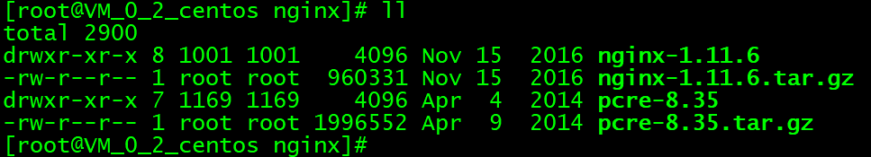

  
   Nginx是一款轻量级的Web服务器、多用于实现反向代理，具有内存占用少，启动极快，高并发能力强等特点，在互联网项目中有着广泛的应用。 
   关于nginx的介绍详情见官方网站：[http://nginx.org/en/](http://nginx.org/en/)   
   其余详细介绍会在以后补充，**本文着重介绍在linux环境下nginx的安装以及配置。**  
   **首先我们需要安装编译和库文件和安装PCRE** 
   * 1、安装编译和库文件
    
    yum -y install make zlib zlib-devel gcc-c++ libtool  openssl openssl-devel
   * 2、安装PCRE
    
    wget http://downloads.sourceforge.net/project/pcre/pcre/8.35/pcre-8.35.tar.gz
   PCRE 作用是让 Nginx 支持 Rewrite 功能，安装好之后解压：
       
       tar zxvf pcre-8.35.tar.gz
   * **3、nginx安装** 
   3.1、安装
       
    wget -c https://nginx.org/download/nginx-1.11.6.tar.gz
   
   3.2、解压
      
       tar zxvf nginx-1.11.6.tar.gz
   
 效果如图：
  
   3.3、编译安装
      
       ./configure --prefix=/usr/local/webserver/nginx --with-http_stub_status_module --with-http_ssl_module --with-pcre=/usr/nginx/pcre-8.35
      
       make
      
       make install
   
   
   这时候就安装成功了
   * 4、查看版本 安装成功
       
    /usr/local/webserver/nginx/sbin/nginx -v
    效果如图：
     
   接下来可配置环境变量,请自行参考。

   
   &nbsp;&nbsp;&nbsp;&nbsp; 本人授权[维权骑士](http://rightknights.com)对我发布文章的版权行为进行追究与维权。未经本人许可，不可擅自转载或用于其他商业用途。
   
   
