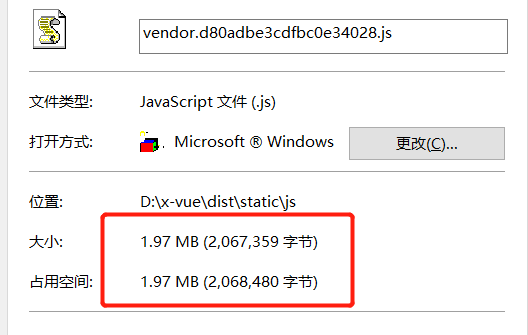
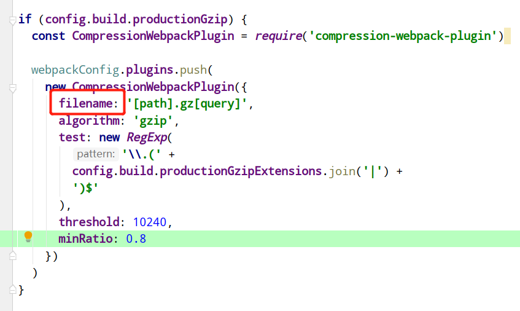
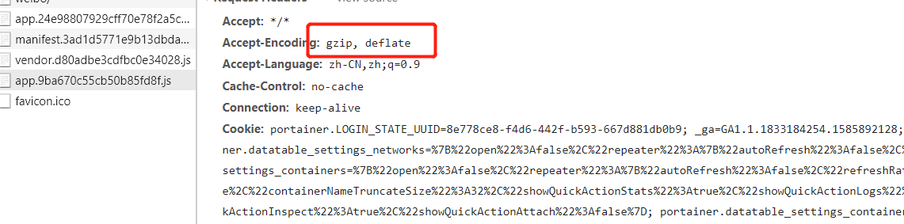

   
&nbsp;&nbsp;&nbsp;&nbsp;我们把vue部署的项目发布上线以后，发现项目的访问速度及其慢。打开build的dist包，发现js的文件特别大 
   
&nbsp;&nbsp;&nbsp;&nbsp;为了优化线上的访问速度，我们需要开启gzip优化性能。   
&nbsp;&nbsp;&nbsp;&nbsp;   * 1、**项目配置**   
&nbsp;&nbsp;&nbsp;&nbsp;首先安装compression-webpack-plugin 我这里的版本是    "compression-webpack-plugin": "^1.1.12"。   
&nbsp;&nbsp;&nbsp;&nbsp;安装好之后的配置：  
&nbsp;&nbsp;&nbsp;&nbsp;在index.js文件中开启  
       
       productionGzip: true,
&nbsp;&nbsp;&nbsp;&nbsp;Gzip配置：  
   
&nbsp;&nbsp;&nbsp;&nbsp;   * 1、**nginx.conf配置** 

    gzip            on;
    gzip_min_length 1000;
    gzip_proxied    expired no-cache no-store private auth;
    gzip_types      text/plain application/xml application/javascript;
    // 字段说明
    gzip on; #开启或关闭gzip on off
    gzip_disable "msie6"; #不使用gzip IE6
    gzip_min_length 100k; #gzip压缩最小文件大小，超出进行压缩（自行调节）
    gzip_buffers 4 16k; #buffer 不用修改
    gzip_comp_level 8; #压缩级别:1-10，数字越大压缩的越好，时间也越长
    gzip_types text/plain application/x-javascript text/css application/xml text/javascript application/x-httpd-php image/jpeg image/gif image/png; #  压缩文件类型 
 
         

&nbsp;&nbsp;&nbsp;&nbsp;别忘了 
         
    nginx  -s reload
    
    
&nbsp;&nbsp;&nbsp;&nbsp;之后访问速度就提升了很多 
   
&nbsp;&nbsp;&nbsp;&nbsp; 本人授权[维权骑士](http://rightknights.com)对我发布文章的版权行为进行追究与维权。未经本人许可，不可擅自转载或用于其他商业用途。

 