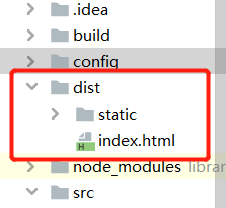

   
&nbsp;&nbsp;&nbsp;&nbsp;在我们部署项目之前需要先搞懂一个问题，就是nginx的动静分离。
 
&nbsp;&nbsp;&nbsp;&nbsp;   * 1、**nginx的动静分离** 
&nbsp;&nbsp;&nbsp;&nbsp;所谓动静分离就是nginx将动静分离和静态请求进行分离,当请求静态资源时候，我们可以不经过服务。
直接访问某个文件夹的静态文件。所以即使动态服务不可用，但静态资源不会受到影响。  
&nbsp;&nbsp;&nbsp;&nbsp;我们就可以不用部署服务，直接通过nginx实现对vue项目打包的静态文件进行访问。 
&nbsp;&nbsp;&nbsp;&nbsp;   * 2、**vue服务的打包** 
&nbsp;&nbsp;&nbsp;&nbsp;打包命令：
         
    npm run build
    
&nbsp;&nbsp;&nbsp;&nbsp;打包前要注意将index.js的静态资源访问的路径assetsPublicPath: './',从根路径/改为./当前目录 

            
    assetsPublicPath: './',
&nbsp;&nbsp;&nbsp;&nbsp;将 productionSourceMap改为false 

            
    productionSourceMap:false，
&nbsp;&nbsp;&nbsp;&nbsp;把这个改为false。不然在最终打包的文件中会出现一些map文件，map文件的作用在于：项目打包后，代码都是经过压缩加密的，如果运行时报错，输出的错误信息无法准确得知是哪里的代码报错。 
   
&nbsp;&nbsp;&nbsp;&nbsp;打包后默认生成dist目录即为其静态资源,我们把这个文件夹上传到服务器上。 
&nbsp;&nbsp;&nbsp;&nbsp;   * 3、**nginx配置** 
&nbsp;&nbsp;&nbsp;&nbsp; 我们在nginx.conf中配置location即可

        location /{
        alias /usr/tomcat/dist/;  // dist上传到服务器的目录
        index index.html;
        try_files $uri $uri/ /index.html last;
         }
         
&nbsp;      * **4、重启nginx** 
         
    nginx  -s reload
    
&nbsp;&nbsp;&nbsp;&nbsp;部署成功! 
&nbsp;&nbsp;&nbsp;&nbsp; 本人授权[维权骑士](http://rightknights.com)对我发布文章的版权行为进行追究与维权。未经本人许可，不可擅自转载或用于其他商业用途。

 