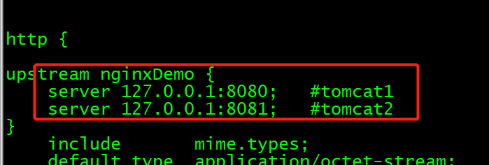

   
&nbsp;&nbsp;&nbsp;&nbsp;众所周知nginx可以实现负载均衡，用来解决高并发的问题，原理就是把请求按照一定的策略转发到不同的服务器或容器，达到负载的效果。
但是java本身就是多线程的，而我们目的不是为了提供性能。这里我们主要看的是反向代理。客户端请求Nginx，Nginx请求应用服务器，然后将结果返回给客户端 
&nbsp;&nbsp;&nbsp;&nbsp;这样做的目的有两个，一是避免服务器单节点故障，二是实现项目线上的热部署。
 
&nbsp;&nbsp;&nbsp;&nbsp;避免服务器单节点故障这个怎么理解呢？比如我有一个服务，我把它同时部署在tomcat1和tomcat2上,配置好nginx。
现在有多个用户请求我这个服务，nginx就按照策略把请求转发到
这两个tomcat上，用户可能访问到的是tomcat1也可能是tomcat2。如果tomcat1挂掉了，用户依然是可以
通过nginx向tomcat2发送请求，使服务更加稳定。 
&nbsp;&nbsp;&nbsp;&nbsp;其次一个主要目的是为了能够热部署，每次在线上发布、更新自己的服务时，总是要关闭或重启。关闭的这段时间就造成了用户无法访问
的情况。而如果你用nginx代理了两个tomcat，你就可以改nginx代理，先停掉tomcat1，然后在tomcat1上发布更新自己的服务。等
tomcat1重启以后，再去发布tomcat2。在你发布tomcat1的时候，并不影响用户通过nginx访问你的tomcat2。在你发布服务的这段时间，
服务就不用停了。本文就介绍Nginx负载均衡之Linux下实现两个tomcat热部署。

&nbsp;&nbsp;&nbsp; **前期准备:** 
&nbsp;&nbsp;&nbsp; 安装配置好nginx 
&nbsp;&nbsp;&nbsp; 两个独立运行的tomcat 

   * **1、tomcat配置**
   
注意两个tomcat的环境变量：
    
    #tomcat1
     export CATALINA_HOME=/usr/tomcat/apache-tomcat-7.0.103
     export CATALINA_BASE=/usr/tomcat/apache-tomcat-7.0.103
     export TOMCAT_HOME=/usr/tomcat/apache-tomcat-7.0.103
    #tomcat2
     export CATALINA_HOME2=/usr/tomcat/apache-tomcat-7.0.103_2
     export CATALINA_BASE2=/usr/tomcat/apache-tomcat-7.0.103_2
     export TOMCAT_HOME2=/usr/tomcat/apache-tomcat-7.0.103_2

在第二个tomcat中的 startup.sh 和 shutdown.sh 两个文件，分别在其中添加如下内容：
    
    # Start Script for the CATALINA Server
    # -----------------------------------------------------------------------------
    export CATALINA_HOME=$CATALINA_HOME2
    export CATALINA_BASE=$CATALINA_BASE2

   * **2、nginx配置**
   查看你的nginx.conf配置文件目录
       
    nginx -t
  
   进入这个目录然后vim它
         
    vim  nginx.conf
  
   你需要改两个地方反向代理【proxy_pass】和负载均衡【upstream】如下图： 
   proxy_pass说明是动态请求，需要进行转发 
   通过upstream来定义一组Tomcat，并指定负载策略 
    
     
      * **3、重启nginx**
         
    nginx  -s reload
    
&nbsp;&nbsp;&nbsp;&nbsp;这时候你直接访问nginx时（默认80口），就会跳到localhost:8080或localhost:8081的tomcat，通过nginx反向代理实现了负载均衡。
    
&nbsp;&nbsp;&nbsp;&nbsp; 本人授权[维权骑士](http://rightknights.com)对我发布文章的版权行为进行追究与维权。未经本人许可，不可擅自转载或用于其他商业用途。

