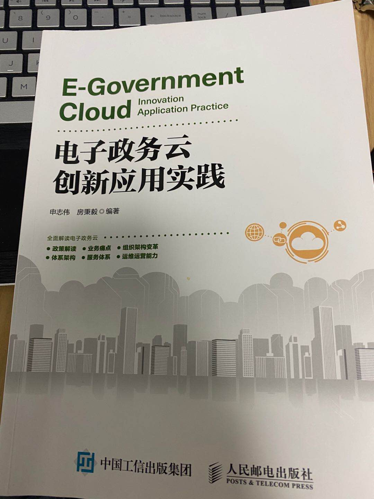
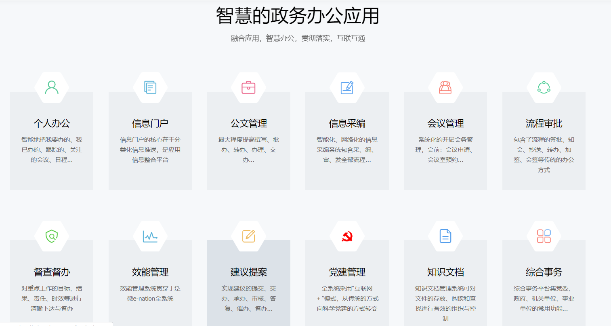
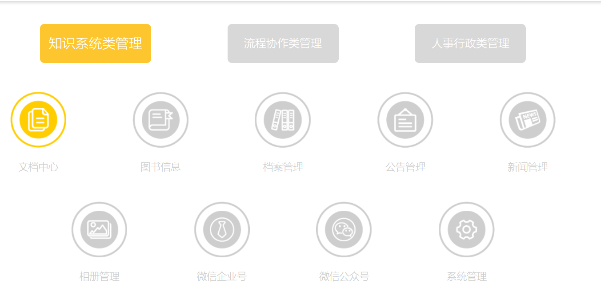
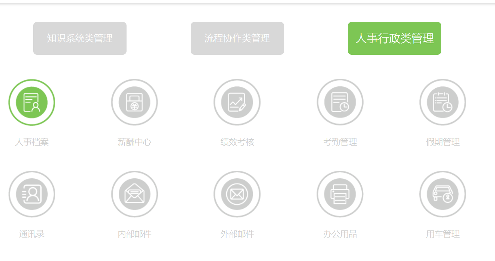

&nbsp;&nbsp;&nbsp;&nbsp;今天来谈一谈OA（office automation）办公自动化系统的建设相关，本文不涉及任何具体的业务内容，主要从纯技术角度与OA系统发展历史来分析OA系统的建设。
本文主要参考这本书和一些网络上的零碎知识： 

&nbsp;&nbsp;&nbsp;&nbsp;OA系统是电子政务的一个重要组成部分。可以试企业、政府的相关人员快捷的共享信息和高效的协同工作。是一个提高办公效率、行政管理能力的系统。  
&nbsp;&nbsp;&nbsp;&nbsp;中国的OA系统起源于政府的公文和档案管理，其发展有四个阶段： 
&nbsp;&nbsp;&nbsp;&nbsp;   * 1.1、**文件型OA**   1960-1999 ：即所谓的”无纸化办公“，档案管理为核心，多是以静态文件保存的形式，或是办公软件。  
&nbsp;&nbsp;&nbsp;&nbsp;   * 1.2、**流程型OA**   2000-2006 ：以**工作流转**为核心，属于工作流程平台，实现了信息发布、文件流转的功能。  
&nbsp;&nbsp;&nbsp;&nbsp;   * 1.3、**知识型OA**   2007-2010 ：以**知识管理**为核心，整合整个组织的信息资源。  
&nbsp;&nbsp;&nbsp;&nbsp;   * 1.4、**大数据时代OA**   2011-至今 : 大数据时代的OA系统。  

&nbsp;&nbsp;&nbsp;&nbsp;&nbsp;&nbsp;&nbsp;&nbsp;**系统设计原则：**  

&nbsp;&nbsp;&nbsp;&nbsp;   * 2.1、**阶段性**   OA系统的建设一定要符合单位的发展、部门或业务调整，可变性较大，要具有阶段性实施方案。  
&nbsp;&nbsp;&nbsp;&nbsp;   * 2.2、**可扩展性**  因为单位的业务是活的，随着业务的调整，OA系统要具有一定的可扩展性。  
&nbsp;&nbsp;&nbsp;&nbsp;   * 2.3、**成熟性**   作为复杂的系统建设，使用技术要具有成熟性，保守开发。  

&nbsp;&nbsp;&nbsp;&nbsp;&nbsp;&nbsp;&nbsp;&nbsp;**功能：**  
&nbsp;&nbsp;&nbsp;&nbsp;   * 3.1、**基本功能** 
OA系统的开发一般都偏向于Web服务，政府型OA系统以**工作流程**为核心，提供**公文流转、流程审批**的功能，这是最最基本的功能。
流程取决于实际业务的操作流程，比如说，先报谁审批？先发给谁看？到下一环节需要谁签字？

&nbsp;&nbsp;&nbsp;&nbsp;   * 3.2、**数据挖掘功能** 
基于大数据时代，比如我们可以对用户的行为进行分析，保存其在OA操作的操作习惯，或直接进行预测。第二就是结果的可视化呈现和分析，有点像传统的BI展示，但是侧重于分析数据。 
&nbsp;&nbsp;&nbsp;&nbsp;   * 3.3、**知识自动化处理** 
比如像我们大学用过的慕课（MOOC）一样，做到学习课程视频的分享与收看。 
&nbsp;&nbsp;&nbsp;&nbsp;   * 3.4、**安全控制功能** 
比如权限控制、加密传输，在这个基础上可以有电子签章、电子签名等。 
这里再多说几点，我们在保障系统的网络可用性、系统可用性的基础上，OA系统要更侧重于数据的机密性和访问的可控性。比如大家都在用一个OA系统，一个单位中，什么内容让什么级别的人才能看。
或是业务相关的人才能看，别的部门能不能看？什么地方透明，什么地方不透明。这是很重要的。这个访问的可控性就是编辑查询权限的分配。 
&nbsp;&nbsp;&nbsp;&nbsp;   * 3.4、**功能模块化** 
一般应该分为两个，一个是系统级的管理模块，一个是个人工作台的那种个人办公模块。比如系统级类似有：人事管理、信息检索、考勤、公文管理、发函、值班排班、工资记录、资产管理
公告。个人工作模块有：
消息通知、待办工作、视频会议、邮件系统、信息交流。 
我们看业界比较知名的某OA厂商的模块功能，政务办公应用:

&nbsp;&nbsp;&nbsp;&nbsp; 企业应用：

&nbsp;&nbsp;&nbsp;&nbsp;   * 4、**OA未来展望** 
未来的方向是智能化（多终端、决策多支持）、知识化（统计、交接学习）、协同化（这里的协同侧重于与其他业务系统的协同）。

&nbsp;&nbsp;&nbsp;&nbsp;   * 5.、**钉钉能取代OA吗？钉钉和OA的异同在哪里？** 
虽然他们都能发公告、都能协同办公。
但个人认为钉钉更侧重于沟通和移动办公，很多情况是当作有视频会议和打卡功能的微信使用的；而OA最重要的两个功能，1、定制性业务流程处理。2、业务数据权限控制；这些没有具备。
我认为钉钉只有形式上的管理，缺乏办公的协作性，不是真正意义上的办公自动化。

&nbsp;&nbsp;&nbsp;&nbsp; 本人授权[维权骑士](http://rightknights.com)对我发布文章的版权行为进行追究与维权。未经本人许可，不可擅自转载或用于其他商业用途。

