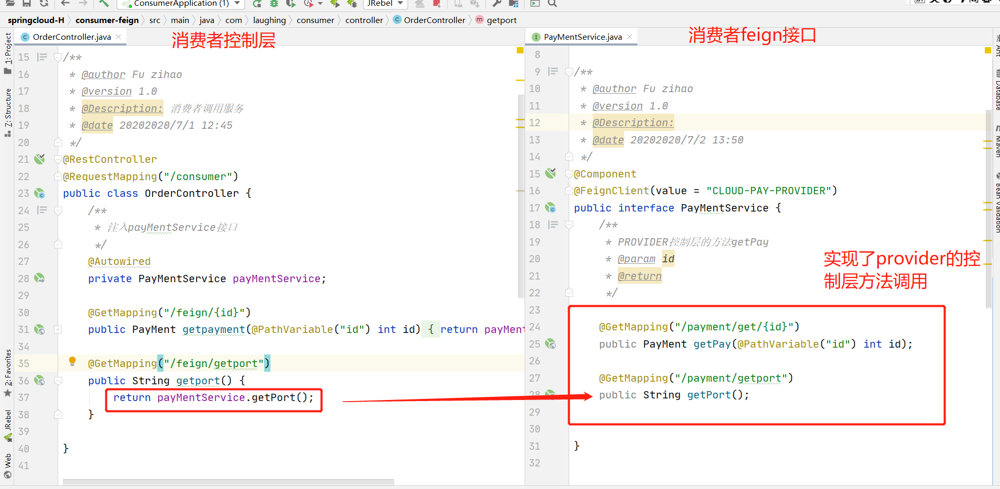
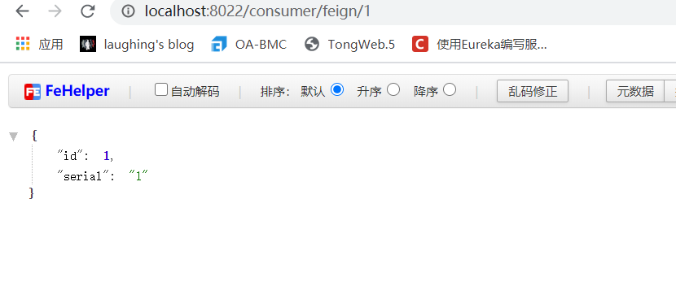
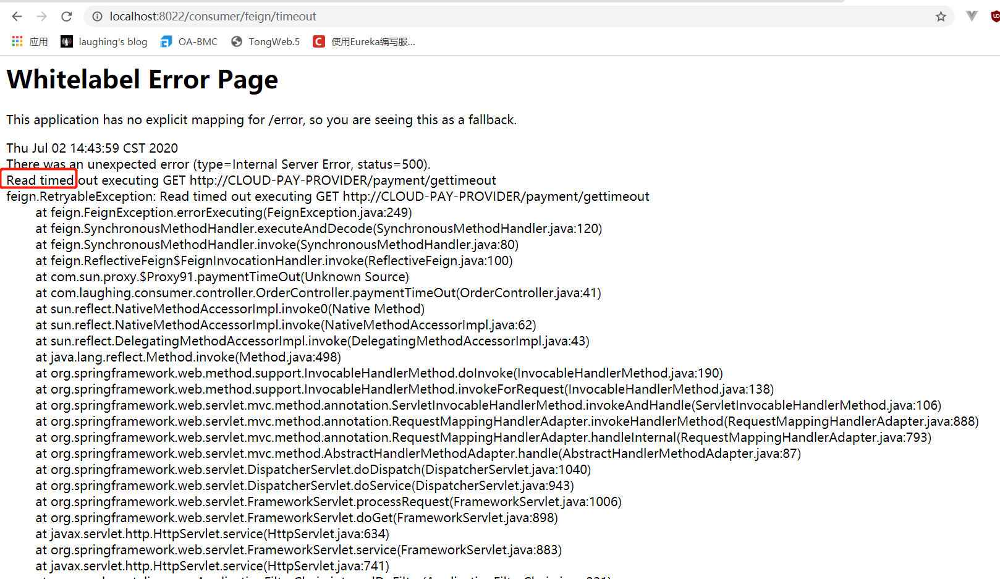
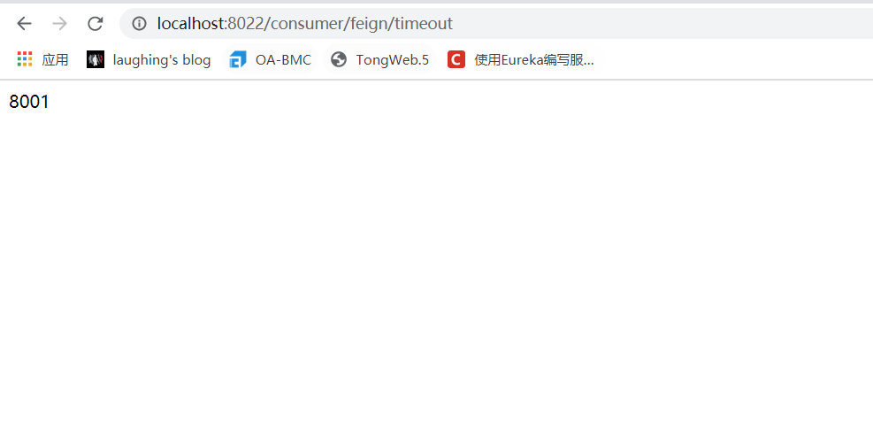
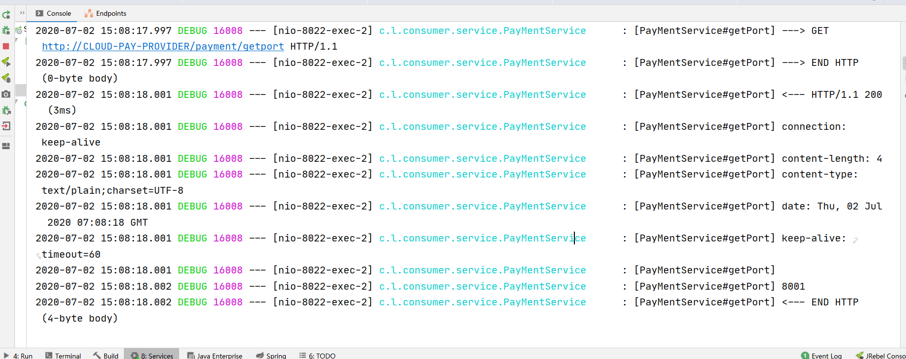

::: tip Feign
Feign是一个伪http客户端，可以以Java接口注解的方式调用，默认继承了Ribbon。
Feign通过处理注解，将请求模板化，当实际调用的时候，传入参数，根据参数再应用到请求上，进而转化成真正的请求
，OpenFeign 增加了MVC的支持。
:::

### 一、消费服务搭建

### 引入pom

```
<dependency>
    <groupId>org.springframework.cloud</groupId>
    <artifactId>spring-cloud-starter-openfeign</artifactId>
</dependency>
```

### yml配置

```
server:
 port: 8022

spring:
  application:
    name: cloud-pay-consumer-feign #消费服务

eureka:
  client:
    service-url:
      defaultZone: http://Eureka7001.com:7001/eureka/,http://Eureka7002.com:7002/eureka/
```

### @EnableFeignClients

主启动类添加@EnableFeignClients

### feign接口

@FeignClient声明调用的服务名

```
@Component
@FeignClient(value = "CLOUD-PAY-PROVIDER")
public interface PayMentService {
    /**
     * PROVIDER控制层的方法getPay
     * @param id
     * @return
     */

    @GetMapping("/payment/get/{id}")
    public PayMent getPay(@PathVariable("id") int id);

    @GetMapping("/payment/getport")
    public String getPort();
  
}
```

### 消费者控制层调用feign接口

```
@RestController
@RequestMapping("/consumer")
public class OrderController {
    /**
     * 注入payMentService接口
     */
    @Autowired
    private PayMentService payMentService;

    @GetMapping("/feign/{id}")
    public PayMent getpayment(@PathVariable("id") int id) {
        return payMentService.getPay(id);
    }

    @GetMapping("/feign/getport")
    public String getport() {
        return payMentService.getPort();
    }

}
```



### 调用



## 二、OpenFeign 超时控制

为了模拟请求缓慢，我们在provider端写一个控制层方法，需要三秒才返回。

```
@GetMapping("/gettimeout")
public String paymentTimeOut() throws InterruptedException {
    TimeUnit.SECONDS.sleep(3);
    return port;
}
```

写到消费者的feign接口

```
@GetMapping("/payment/gettimeout")
public String paymentTimeOut();
```

消费者服务层调用feign接口

```
@GetMapping("/feign/timeout")
public String paymentTimeOut(){
    return payMentService.paymentTimeOut();
}
```

provider: http://localhost:8001/payment/gettimeout 需要3秒才能返回。

consumer: 报timeout了（openFeign 默认为1s）




如果一个接口慢一点，我们需要更改这个超时控制。<br>

更改消费端yml:

```
ribbon:
  # 建立连接时间
  ReadTimeout: 5000
  # 读取资源时间
  ConnectTimeout: 5000
```

即可读到：




## 三、OpenFeign日志增强

### OpenFeign的日志级

NONE： 默认的，不显示任何日志<br>

BASIC： 仅记录请求方法、URL、响应状态码以及执行时间<br>

HEADERS：除了BASIC 中自定义的信息外，还有请求和响应的信息头<br>

FULL： 除了HEADERS中定义的信息外， 还有请求和响应的正文以及元数据。<br>

### 配置

新建一个配置bean

```
@Configuration
public class FeignConfig {
    @Bean
    Logger.Level feignLoggerLevel(){
        return  Logger.Level.FULL;
    }
}
```

### 修改yml

```
ribbon:
  # 建立连接时间
  ReadTimeout: 5000
  # 读取资源时间
  ConnectTimeout: 5000

logging:
  level:
    # 日志监控的接口 和 级别
    com.laughing.consumer.service.PayMentService: debug
```





&nbsp;&nbsp;&nbsp;&nbsp; 本人授权[维权骑士](http://rightknights.com)对我发布文章的版权行为进行追究与维权。未经本人许可，不可擅自转载或用于其他商业用途。


