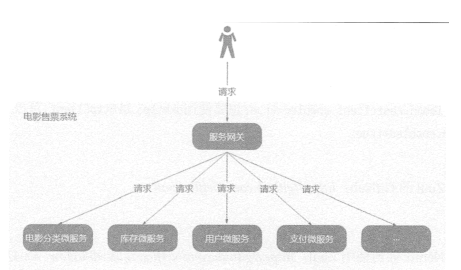
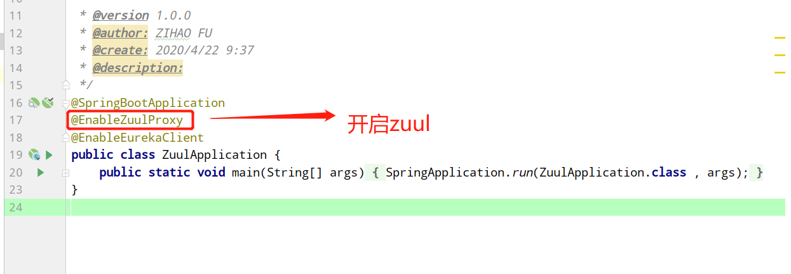
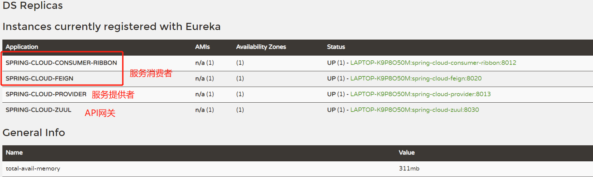
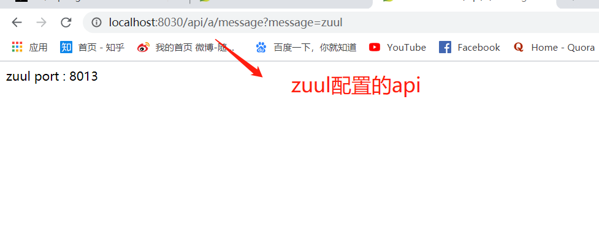
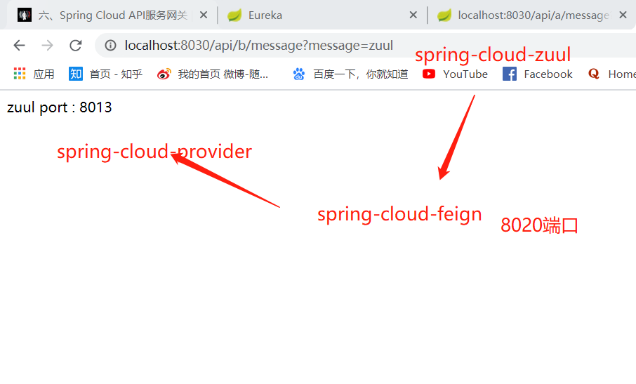

&nbsp;&nbsp;&nbsp;&nbsp;API网关是介于客户端和服务器端之间的中间层，所有的外部请求都会先经过API网关这一层,来提供接口访问。 
 
&nbsp;&nbsp;&nbsp;&nbsp;这里我们使用Zuul。Zuul 是开源的微服务网关，可与 Eureka、Ribbon、Hystrix 等组件配合使用，Zuul 它的核心是一系列过滤器和路由 
&nbsp;&nbsp;&nbsp;&nbsp;   * 1、**引入pom依赖**  

  
         
                      <dependency>
                          <groupId>org.springframework.cloud</groupId>
                          <artifactId>spring-cloud-starter-netflix-eureka-server</artifactId>
                      </dependency>
                      <dependency>
                          <groupId>org.springframework.cloud</groupId>
                          <artifactId>spring-cloud-starter-netflix-zuul</artifactId>
                      </dependency>
                  </dependencies>
&nbsp;&nbsp;&nbsp;&nbsp;   * 2、**yml配置**  

  
         
                      spring:
                        application:
                          name: spring-cloud-zuul
                      
                      server:
                        port: 8030
                      
                      eureka:
                        client:
                          service-url:
                            defaultZone: http://localhost:8009/eureka/
                      
                      
                      zuul:
                        routes:
                          api-a:
                            path: /api/a/**
                            serviceId: spring-cloud-consumer-ribbon
                          api-b:
                            path: /api/b/**
                            serviceId: spring-cloud-feign

&nbsp;&nbsp;&nbsp;&nbsp;   * 3、**启动类**  
             
 

&nbsp;&nbsp;&nbsp;&nbsp;   * 4、**访问API网关**  

 

&nbsp;&nbsp;&nbsp;&nbsp; 本人授权[维权骑士](http://rightknights.com)对我发布文章的版权行为进行追究与维权。未经本人许可，不可擅自转载或用于其他商业用途。

 