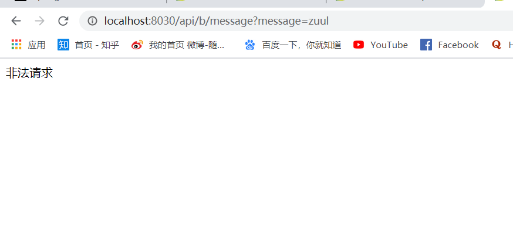

&nbsp;&nbsp;&nbsp;&nbsp;zuul Filter 提供过滤器功能 

  
         
                      package com.gwssi.spring.cloud.zuul.filter;
                      
                      import com.netflix.zuul.ZuulFilter;
                      import com.netflix.zuul.context.RequestContext;
                      import com.netflix.zuul.exception.ZuulException;
                      import org.hibernate.validator.internal.util.StringHelper;
                      import org.springframework.stereotype.Component;
                      
                      import javax.servlet.http.HttpServletRequest;
                      import javax.servlet.http.HttpServletResponse;
                      import javax.servlet.http.HttpServletResponseWrapper;
                      import java.io.IOException;
                      
                      /**
                       * Created with IntelliJ IDEA
                       *
                       * @version 1.0.0
                       * @author: ZIHAO FU
                       * @create: 2020/4/22 10:07
                       * @description:
                       */
                      @Component
                      public class AccessFilter extends ZuulFilter {
                      
                          //路由类型 pre调用前 routing调用中 post调用后 error错误
                          @Override
                          public String filterType() {
                              return "pre";
                          }
                      
                          //过滤顺序
                          @Override
                          public int filterOrder() {
                              return 0;
                          }
                      
                          @Override
                          public boolean shouldFilter() {
                              return true;
                          }
                      
                          @Override
                          public Object run() throws ZuulException {
                              RequestContext ctx = RequestContext.getCurrentContext();
                              HttpServletRequest request = ctx.getRequest();
                              String token = request.getParameter("token");
                              if(token == null){
                                  ctx.setSendZuulResponse(false);
                                  ctx.setResponseStatusCode(401);
                                  try {
                                      HttpServletResponse response = ctx.getResponse();
                                      response.setContentType("text/html;charset=utf-8");
                                      response.getWriter().write("非法请求");
                                  } catch (IOException e) {
                                      e.printStackTrace();
                                  }
                              }
                              return null;
                          }
                      }

 

&nbsp;&nbsp;&nbsp;&nbsp; 本人授权[维权骑士](http://rightknights.com)对我发布文章的版权行为进行追究与维权。未经本人许可，不可擅自转载或用于其他商业用途。

 