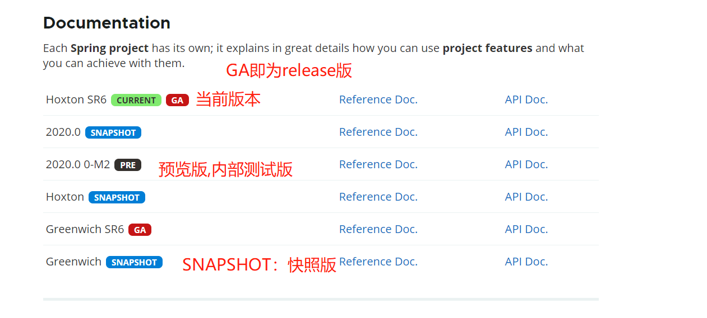
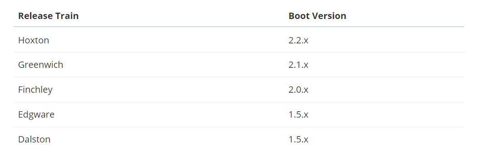

## 一、版本
做技术选型时需要对版本做了解，spring cloud是安装A、B、C的顺序发布的。

spring cloud与boot的版本对应。

## 二、组件

### 服务注册中心
#### Eureka(停止更新)
#### zookeeper
#### consul
#### Nacos

### 服务调用
#### Ribbon
#### LoadBalancer
#### Feign
#### OpenFeign

### 服务降级熔断
#### Hystrix
#### resilience4j
#### sentienl

### 服务网关
#### Zuul
#### Gateway

### 服务配置
#### Config
#### Nacos
#### Apollo

### 服务总线
#### Bus
#### Nacos

