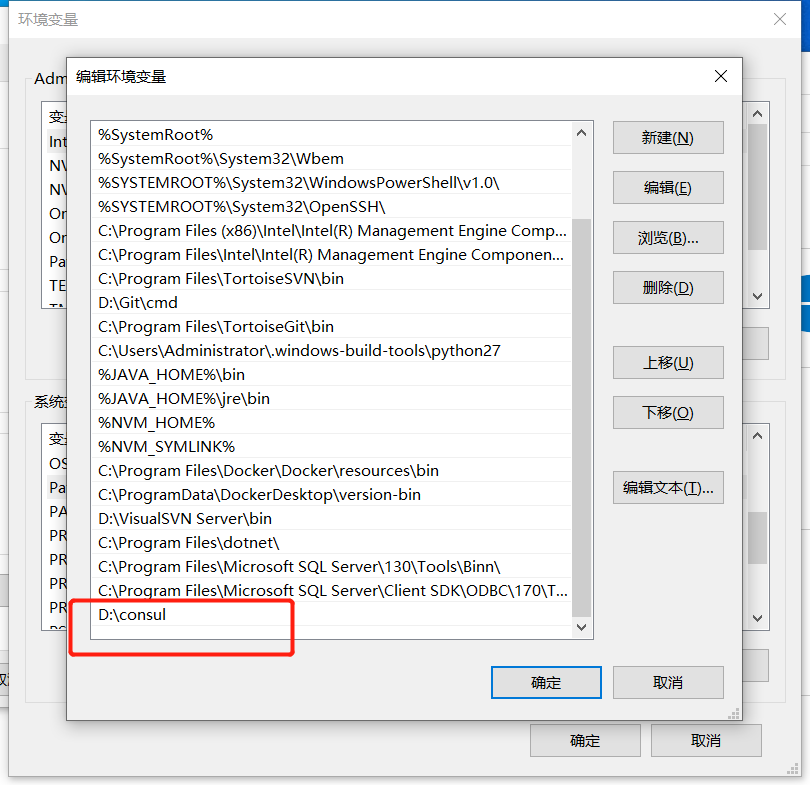
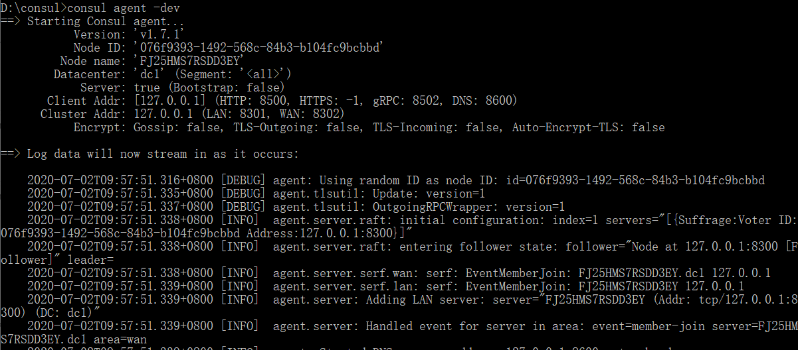
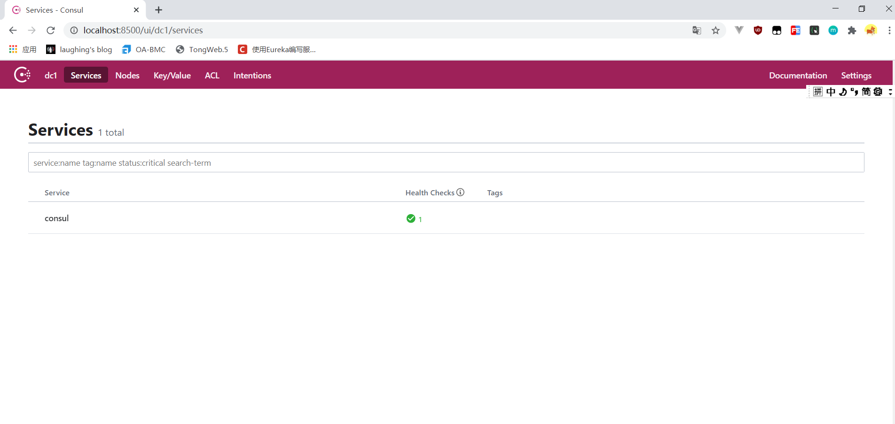
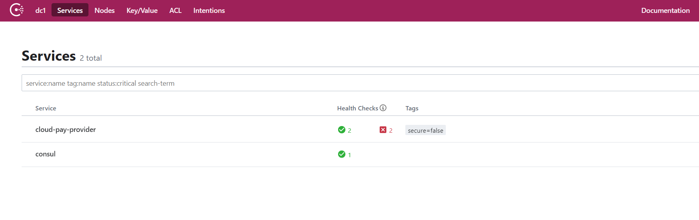
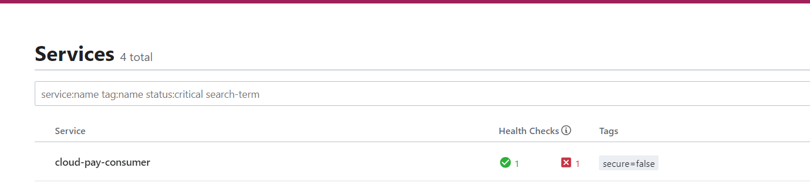
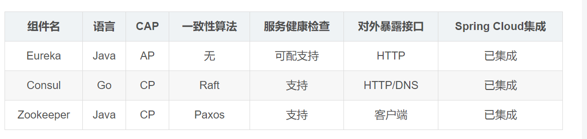
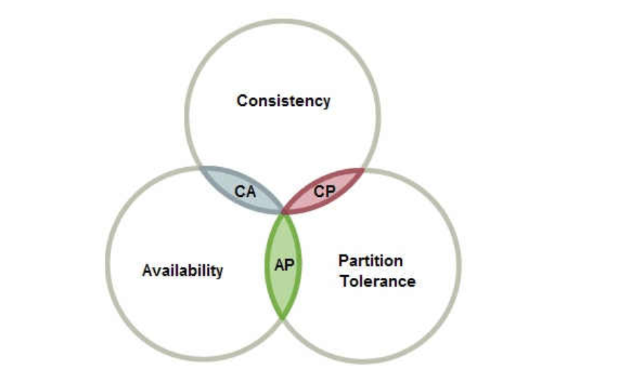

::: tip Consul
Consul是基于GO语言开发的开源工具，Consul是一个服务网格（微服务间的 TCP/IP，负责服务之间的网络调用、限流、熔断和监控）解决方案，它是一个一个分布式的，高度可用的系统，而且开发使用都很简便。它提供了一个功能齐全的控制平面，主要特点是：服务发现、健康检查、键值存储、安全服务通信、多数据中心。
:::

## 一、安装

官网：

[https://www.consul.io/downloads.html](https://www.consul.io/downloads.html)

### 配置环境变量




### 启动

```
cmd
consul agent -dev
```




访问  127.0.0.1:8500



## 二、服务端注册

### pom引入

```
<dependency>
    <groupId>org.springframework.cloud</groupId>
    <artifactId>spring-cloud-starter-consul-discovery</artifactId>
</dependency>
```

### yml配置

```
spring:
  application:
    name: cloud-pay-provider #支付服务提供者
  cloud:
    consul:
      host: localhost
      port: 8500
      discovery:
        service-name: ${spring.application.name}
```

### 启动注册



## 三、消费者

同理

### yml

```
server:
 port: 8005

spring:
  application:
    name: cloud-pay-consumer-zookeeper #消费服务
  cloud:
    consul:
      host: localhost
      port: 8500
      discovery:
        service-name: ${spring.application.name}

management:
  endpoint:
    health:
      enabled: true
```

### 启动





### 服务注册中心对比

我们使用了Eureka、zookeeper、Consul。



### CAP



CAP理论作为分布式系统的基础理论,它描述的是一个分布式系统在以下三个特性中：<br>

- 一致性（**C**onsistency）<br>
- 可用性（**A**vailability）<br>
- 分区容错性（**P**artition tolerance）<br>

最多满足其中的两个特性.<br>

**分区容错性**：指的分布式系统中的某个节点或者网络分区出现了故障的时候，整个系统仍然能对外提供满足一致性和可用性的服务。也就是说部分故障不影响整体使用。<br>

**可用性：** 一直可以正常的做读写操作。简单而言就是客户端一直可以正常访问并得到系统的正常响应。用户角度来看就是不会出现系统操作失败或者访问超时等问题。<br>

**一致性**：在分布式系统完成某写操作后任何读操作，都应该获取到该写操作写入的那个最新的值。相当于要求分布式系统中的各节点时时刻刻保持数据的一致性。<br>

**比如金融行业，就需要要求一致性多一点，则选择 Consul、Zookeeper**<br>

**比如电商系统，就需要要求可用多多一点，则选择Eureka**,数据可能更新慢等，但是高可用。<br>

