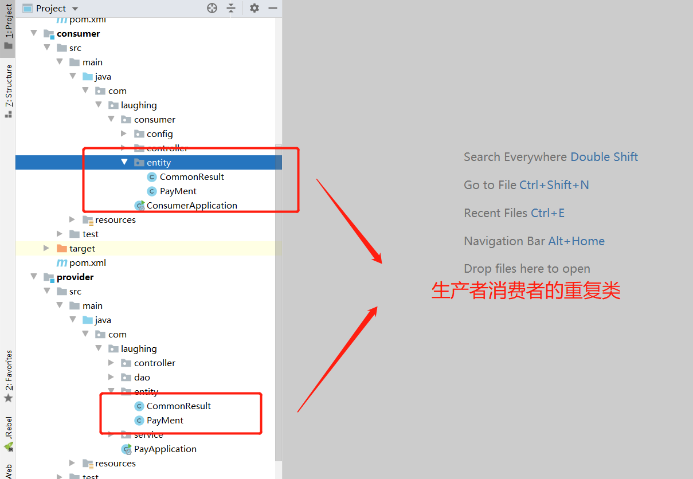
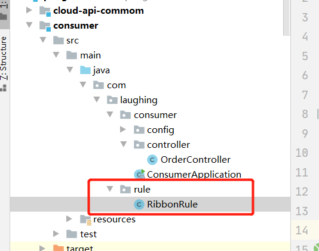

::: tip Sping boot
Spring Cloud Ribbon是一个基于HTTP和TCP的客户端负载均衡工具，它基于Netflix Ribbon实现。
通过Spring Cloud的封装，可以让我们轻松地将面向服务的REST模版请求自动转换成客户端负载均衡的服务调用。
:::


## 一、服务的生产者与消费者

之前用springboot单应用时，Controller调用Service的，直接注入Service bean即可进行调用了。

微服务之后，我们可能Controller和Service层都不在一个机器上面，就需要服务间的相互调用了。<br>

服务的生产者与消费者很好理解，就是谁调用谁的逻辑，被调用的服务为生产者，调用者为消费者。


## 二、生产者服务

搭建好eureka后，我们往里面注册一个服务提供者，他同时也是eureka的客户端。

### **pom依赖**

```
<dependency>
    <groupId>org.springframework.cloud</groupId>
    <artifactId>spring-cloud-starter-netflix-eureka-client</artifactId>
    <version>2.2.3.RELEASE</version>
</dependency>
```

### @EnableEurekaClient

开启@EnableEurekaClient

### yml配置

```
spring:
  application:
    name: spring-cloud-provider

server:
  port: 8011

eureka:
  client:
    service-url:
      defaultZone: http://localhost:7001/eureka/
```

### 服务

写一个可以返回端口的控制层。

```
@RestController
public class ProviderController {
    @Value("${server.port}")  //通过spring注入端口号
    private String port;

    @GetMapping("/provider")
    public String client() {
        return "I am EurekaClientApplication, start by " + port + "port";
    }
}
```


## 三、消费者直接调用

### pom依赖

```
<dependency>
    <groupId>org.springframework.cloud</groupId>
    <artifactId>spring-cloud-starter-netflix-eureka-client</artifactId>
    <version>2.2.3.RELEASE</version>
</dependency>
```

### yml配置

```
spring:
  application:
    name: spring-cloud-consumer

server:
  port: 9090
  
eureka:
  client:
    service-url:
      defaultZone: http://localhost:7001/eureka/  
```

### @EnableEurekaClient

开启@EnableEurekaClient

### RestTemplate 

RestTemplate是Spring提供的用于访问Rest服务的客户端，RestTemplate提供了多种便捷访问远程Http服务的方法。我们需要编写一个RestTemplate 配置类。

```
@Configuration
public class RestTemplateConfiguration {
    @Bean
    @LoadBalanced
    public RestTemplate getRestTemplate() {
        return new RestTemplate();
    }
}

```

　@LoadBalanced使用了这个注解以后 ，会在 restTemplate 里面 通过 restTemplate.setInterceptors 放入 LoadBalancerInterceptor ，这个过滤器会在 请求远程成接口的时候 动态判断请求的域是不是 负载 负载均衡支付的服务的地址，如果是，那么就会代理 使用 这个负载均衡器 来调用。

### 控制层

```
@RestController
public class ArticleController {
    @Autowired
    private RestTemplate restTemplate;
    @GetMapping("/callprovider")
    public String callProvider() {
        return restTemplate.getForObject("http://SPRING-CLOUD-PROVIDER/provider", String.class);
    }
}

```

生产、消费都已经注册进来了。


访问：


 

## 四、Ribbon负载均衡

消费者我们就需要用到Ribbon了，在新版的Eureka中已经有了Ribbon的依赖。

  


### pom依赖增加 

```
<dependency>
    <groupId>org.springframework.cloud</groupId>
    <artifactId>spring-cloud-starter-netflix-ribbon</artifactId>
    <version>2.2.3.RELEASE</version>
</dependency>
```


###  启动类                  
 

###  负载均衡

注意@LoadBalanced注解实现的负载均衡效果  <br/>

这里直接通过spring-cloud-provider进行调用，不用再关心provider在哪台机器哪个端口。并且
 实现了负载均衡


## 五、提取公共类

在微服务架构中，可能有多个子项目用到公用的实体类、工具类等，为了避免重复，可以提取出来一个api-common的子项目。




api-common，一般可以加入糊涂工具包：


```
cloud-api-commom mvn install
```

其他子项目引用只需要：

```
<dependency>
    <groupId>com.laughing</groupId>
    <artifactId>cloud-api-commom</artifactId>
    <version>1.0-SNAPSHOT</version>
</dependency>
```


## 六、Ribbon负载规则

### 配置类 

自定义的负载均衡配置类不能放在 @componentScan 所扫描的当前包下及其子包下，否则我们自定义的这个配置类就会被所有的Ribbon客户端所共享，需要新建包写配置类。<br>

负载均衡器Ribbon中的IRule负责选择什么样的负载均衡算法,默认有七种，以随机为例。




```
@Configuration
public class RibbonRule {
    @Bean
    public IRule Rule() {
        /**
         * 定义策略为随机。
         */
        return new RandomRule();
    }
}
```

### 更改启动类


 

&nbsp;&nbsp;&nbsp;&nbsp; 本人授权[维权骑士](http://rightknights.com)对我发布文章的版权行为进行追究与维权。未经本人许可，不可擅自转载或用于其他商业用途。


