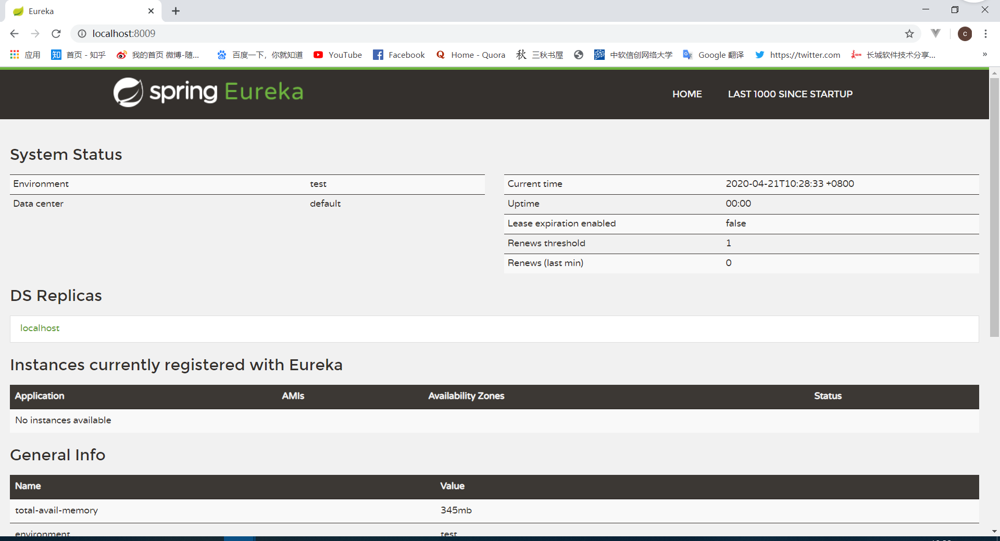
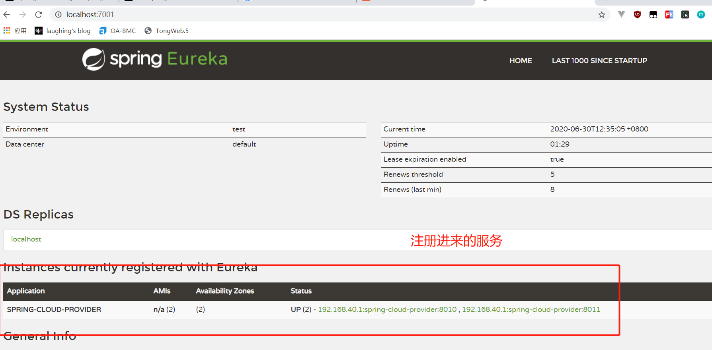
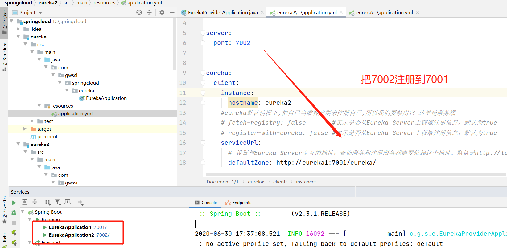
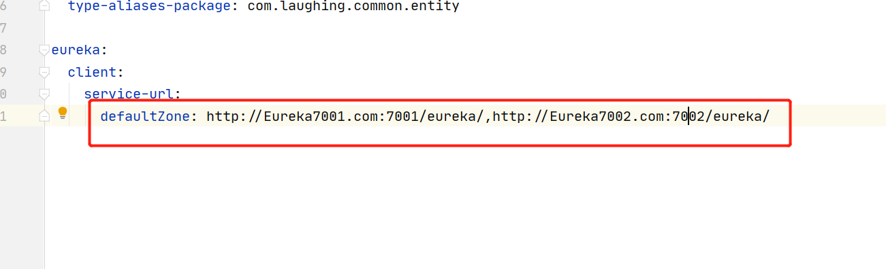
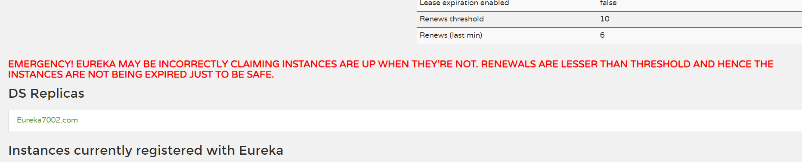

::: tip Sping boot
**Eureka**是服务中心，管理各种服务功能包括服务的注册、发现、熔断、负载、降级等。
Spring Cloud Eureka 是对Netflix公司的Eureka的二次封装。
:::

&nbsp;&nbsp;&nbsp;&nbsp;在dubbo的使用中我们通常使用zookeeper作为注册中心。在这里spring cloud使用Eureka，
用一个标准的spring boot项目就可以快捷的搭建服务注册中心。<br>

**Eureka**是一个C/S服务，我们需要区分两个，eureka Server和eureka Client<br>

eureka Server是服务注册中心(服务端)。而系统中的其他微服务作为client连接到 Eureka Server，并维持**心跳连接**。<br>

## 一、pom

### **服务端pom**

    <dependency>
          <groupId>org.springframework.cloud</groupId>
          artifactId>spring-cloud-starter-netflix-eureka-server</artifactId>
    </dependency>
### **客户端pom**

```
    <groupId>org.springframework.cloud</groupId>
    <artifactId>spring-cloud-starter-netflix-eureka-client</artifactId>
    <version>2.2.3.RELEASE</version>
</dependency>
```

使用Eureka同时需要spring-web的依赖。

## 二、服务端

### yml配置

```
spring:
  application:
    name: spring-cloud-eureka-server

server:
  port: 7001


eureka:
  client:
    #eureka默认情况下,把自己当做客户端来注册自己,所以我们要禁用它 这里是服务端
    fetch-registry: false       #表示是否从Eureka Server上获取注册信息，默认为true
    register-with-eureka: false #表示是否从Eureka Server上获取注册信息，默认为true
    serviceUrl:
      # 设置与Eureka Server交互的地址，查询服务和注册服务都需要依赖这个地址。默认是http://localhost:8761/eureka ；多个地址可使用 , 分隔
      defaultZone: http://localhost:${server.port}/eureka/
```

### @EnableEurekaServer

```
@EnableEurekaServer
@SpringBootApplication
public class EurekaApplication {
    public static void main(String[] args) {
        SpringApplication.run(EurekaApplication.class, args);
    }
}
```

### 运行

此时还没有客户端服务注册进来。


  


## 三、客户端

### yml配置

```
spring:
  application:
    name: spring-cloud-provider

server:
  port: 8010

eureka:
  client:
    service-url:
      defaultZone: http://localhost:7001/eureka/ 
```

### @EnableEurekaClient 

```
@SpringBootApplication
@EnableEurekaClient
@EnableDiscoveryClient
public class EurekaProviderApplication {
    public static void main(String[] args) {
        SpringApplication.run(EurekaProviderApplication.class, args);
    }
}
```

也可以使用@EnableDiscoveryClient<br>

@EnableEurekaClient 只支持Eureka注册中心，@EnableDiscoveryClient 支持Eureka、Zookeeper、Consul 这三个注册中心。<br>


  

## 四、Eureka集群

 理论上来讲，因为服务消费者本地缓存了服务提供者的地址，即使Eureka Server宕机，也不会影响服务之间的调用，但是一旦新服务上线，已经在缓存在本地的服务提供者不可用了，服务消费者也无法知道，所以保证Eureka Server的高可用还是很有必要的。<br>

实际上Eureka集群就是互相注册。我搭建了两台：<br>



不同节点的Eureka Server通过Replicate(复制)进行数据同步
参数eureka.client.serviceUrl.defaultZone，分别配置对方的地址作为Eureka Client进行相互注册。

.

## Eureka 集群单例多启动

### 本地修改host:

127.0.0.1  Eureka7001.com
127.0.0.1  Eureka7002.com
127.0.0.1  Eureka7003.com

### yml配置：

```
spring:
  application:
    name: spring-cloud-eureka-server

server:
  port: 7002

eureka:
  instance:
    hostname: Eureka7001.com
  client:
    #eureka默认情况下,把自己当做客户端来注册自己,所以我们要禁用它 这里是服务端
    fetch-registry: false
    register-with-eureka: false #不去检索eureka服务
    serviceUrl:
      # 设置与Eureka Server交互的地址，查询服务和注册服务都需要依赖这个地址。默认是http://localhost:8761/eureka ；
      #多个地址可使用 , 分隔
      #defaultZone: http://${eureka.instance.hostname}:${server.port}/eureka/

      #集群：7001 注册到 7002
      #defaultZone: http://Eureka7002.com:7002/eureka/

      #集群：7002 注册到 7001
      defaultZone: http://Eureka7001.com:7001/eureka/
```

把同一个Eureka 改配置启动两次，即可实现。<br>

注意服务注册时，两台Eureka 都要写




## 五、Eureka自我保护

默认情况下，当eureka server在一定时间内没有收到实例的心跳，便会把该实例从注册表中删除（默认是90秒），但是，如果短时间内丢失大量的实例心跳，便会触发eureka server的自我保护机制。

Eureka在运行期间会统计心跳失败的比例，在15分钟内是否低于85%,如果出现了低于的情况，Eureka Server会将当前的实例注册信息保护起来，同时提示一个警告，一旦进入保护模式，Eureka Server将会尝试保护其服务注册表中的信息，不再删除服务注册表中的数据。也就是不会注销任何微服务。




该保护机制的目的是避免网络连接故障，在发生网络故障时，微服务和注册中心之间无法正常通信，但服务本身是健康的，不应该注销该服务。

### 禁止自我保护

```
eureka:
  instance:
    hostname: localhost
  server:
    enable-self-preservation: false #关闭自我保护机制
```


### 修改心跳时间

```
eureka:
  server:
    #开启自我保护模式
    enable-self-preservation: false
    #清理无效节点,默认60*1000毫秒,即60秒
    eviction-interval-timer-in-ms: 5000
```


&nbsp;&nbsp;&nbsp;&nbsp; 本人授权[维权骑士](http://rightknights.com)对我发布文章的版权行为进行追究与维权。未经本人许可，不可擅自转载或用于其他商业用途。


