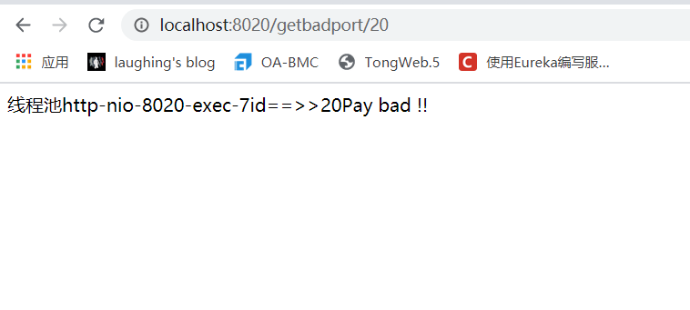

::: tip Hystrix
复杂的分布式系统依赖关系十分复杂，一个服务出现问题就会造成服务雪崩。

Hystrix是一个处理分布式系统延时和容错的开源库，防止整体服务的级联故障。

:::

### 一、Hystrix基本概念

### 服务降级fallback

当某个服务单元发生故障，不能正常返回结果时，通过熔断机制，向调用方返回一个**符合预期的、可处理的备选响应fallback**。而不是长时间无响应或报错。(请稍后再试等)。<br>

比如程序运行异常、超时、服务熔断等。

### 服务熔断break

保险丝作用。达到最大访问量后，拒绝访问、服务降级。当检测到该节点微服务响应正常后恢复调用链路。

### 服务限流flowlimit

高并发的情况。限流的目的是为了保护系统不被大量请求冲垮，通过限制请求的速度来保护系统。


## 二、Provider微服务

### 服务端构建

#### pom

```
<dependency>
    <groupId>org.springframework.cloud</groupId>
    <artifactId>spring-cloud-starter-netflix-hystrix</artifactId>
</dependency>
```

#### yml

```
server:
  port: 8020

eureka:
  client:
    service-url:
      defaultZone: http://Eureka7001.com:7001/eureka/,http://Eureka7002.com:7002/eureka/

spring:
  application:
    name: Hystrix-PayMent
```

#### 编写Service

模拟两个支付服务，一个正常，一个三秒响应。

```
@Service
public class PayMentServiceImpl implements PaymentService {
    @Override
    public String payMentOk(Integer id) {
        return "线程池" + Thread.currentThread().getName() +"id==>>" + id + "Pay ok !!";
    }

    @Override
    public String payMentBad(Integer id)  {
        try {
            TimeUnit.SECONDS.sleep(3);
        } catch (InterruptedException e) {
            e.printStackTrace();
        }
        return "线程池" + Thread.currentThread().getName() +"id==>>" + id + "Pay bad !!";
    }
}
```

#### 控制层

```
@RestController
@Slf4j
public class PayMentController {
    @Autowired
    private PaymentService paymentService;
    @Value("${server.port}")
    private String port;

    @GetMapping("/getokport/{id}")
    public String getPort(@PathVariable("id") int id){
        String result = paymentService.payMentOk(id);
        return result;
    }

    @GetMapping("/getbadport/{id}")
    public String getBadPort(@PathVariable("id") int id){
        String result = paymentService.payMentBad(id);
        return result;
    }


}
```

正常服务：


三秒响应：




## 三、高并发压力测试

### JMeter 

Apache JMeter是一款纯java编写负载功能测试和性能测试开源工具软件。我们用来模拟高并发场景。<br>

官网：[https://jmeter.apache.org/](https://jmeter.apache.org/)


请求延迟三秒的那个服务


tomcat的默认工作线程数被打满了，高并发情况下正常请求也会非常慢。<br>

**如果是微服务的消费者在这种高并发的情况下请求，就会导致消费者被拖死，因此需要Hystrix。**

## 四、消费者调用

### Feign接口

```
@Component
@FeignClient(value = "HYSTRIX-PAYMENT")
public interface PayMentService {
    /**
     * provider控制层提供的方法
     */

    @GetMapping("/getokport/{id}")
    public String getPort(@PathVariable("id") int id);

    @GetMapping("/getbadport/{id}")
    public String getBadPort(@PathVariable("id") int id);

}
```

### 控制层调用

```
@RestController
public class OrderController {
    @Autowired
    private PayMentService payMentService;

    @GetMapping("/getok/{id}")
    public  String getok(@PathVariable("id") int id){
        return payMentService.getPort(id);
    }

    @GetMapping("/getbad/{id}")
    public  String getbad(@PathVariable("id") int id){
        return payMentService.getBadPort(id);
    }

}
```

正常情况下调用provider可以访问


高并发情况下（再把JMeter线程加大）


## 五、服务端服务降级

为了避免上述情况，我们需要加入服务降级。

### 降级配置

@HystrixCommand<br>

如果超时，做服务降级fallback<br>


### @EnableCircuitBreaker

启动类添加注解@EnableCircuitBreaker<br>

### 运行


```
@Override
@HystrixCommand(fallbackMethod = "payMentBadHandler",commandProperties = {
        @HystrixProperty(name = "execution.isolation.thread.timeoutInMilliseconds",value = "3000")
})
public String payMentBad(Integer id)  {
    try {
        TimeUnit.SECONDS.sleep(5);
    } catch (InterruptedException e) {
        e.printStackTrace();
    }
    return "线程池" + Thread.currentThread().getName() +"id==>>" + id + "Pay bad !!";
}

public String payMentBadHandler(Integer id)  {
    return "FALLBACK--线程池" + Thread.currentThread().getName() +"id==>>" + id + "payMentBadHandler Pay bad !!";
}
```


### 六、客户端服务降级

控制层

```
public class OrderController {
    @Autowired
    private PayMentService payMentService;

    @GetMapping("/getok/{id}")
    public  String getok(@PathVariable("id") int id){
        return payMentService.getPort(id);
    }

    @GetMapping("/getbad/{id}")
    @HystrixCommand(fallbackMethod = "payMentBadHandler",commandProperties = {
            @HystrixProperty(name = "execution.isolation.thread.timeoutInMilliseconds",value = "2000")
    })
    public  String getbad(@PathVariable("id") int id){
        return payMentService.getBadPort(id);
    }

    public String payMentBadHandler(@PathVariable("id") int id)  {
        return "消费者FALLBACK--线程池" + Thread.currentThread().getName() +"id==>>" + id + "payMentBadHandler Pay bad !!";
    }


}
```


实现了消费者的自我保护。

## 六、全局降级处理


## 七、Feign fallback

我们可以直接在消费者Feign接口进行服务降级处理，写一个feign的接口实现类，如果调用异常，会走这个实现类的方法。 


&nbsp;&nbsp;&nbsp;&nbsp; 本人授权[维权骑士](http://rightknights.com)对我发布文章的版权行为进行追究与维权。未经本人许可，不可擅自转载或用于其他商业用途。


