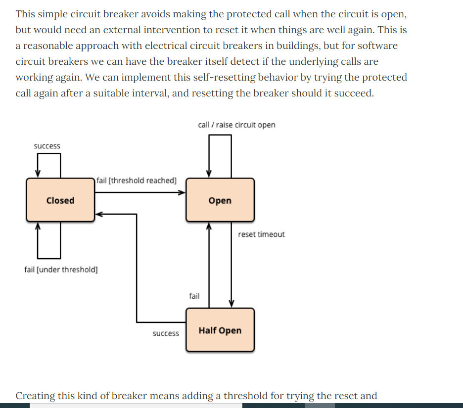
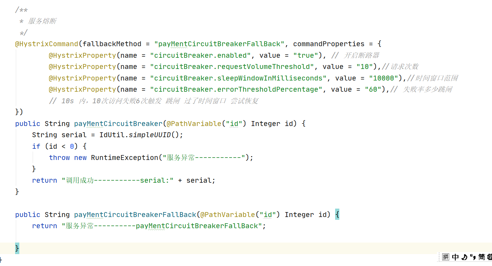
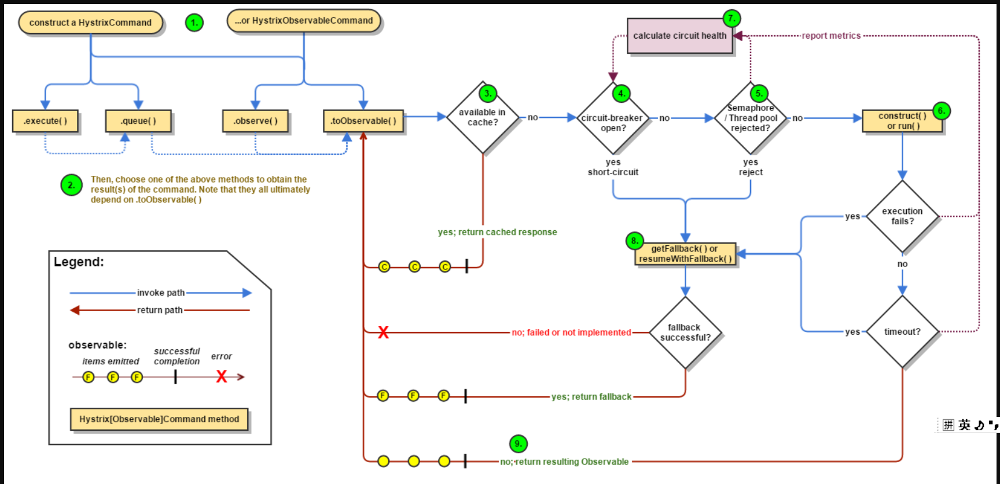

::: tip Hystrix
复杂的分布式系统依赖关系十分复杂，一个服务出现问题就会造成服务雪崩。

Hystrix是一个处理分布式系统延时和容错的开源库，防止整体服务的级联故障。

:::

## 一、服务熔断

达到最大访问量后回进行熔断，禁止访问，调用服务降级的fallback，等待链路恢复。<br>

服务熔断是[Martin Fowler](https://martinfowler.com/)提出，参考他的论文：[https://martinfowler.com/bliki/CircuitBreaker.html](https://martinfowler.com/bliki/CircuitBreaker.html)




## 二、服务熔断配置

新写个提供方法，并配置fallback和熔断，如果id为负数抛出异常，执行fallback

```
/**
 * 服务熔断
 */
@HystrixCommand(fallbackMethod = "payMentCircuitBreakerFallBack", commandProperties = {
        @HystrixProperty(name = "circuitBreaker.enabled", value = "true"), // 开启断路器
        @HystrixProperty(name = "circuitBreaker.requestVolumeThreshold", value = "10"),//请求次数
        @HystrixProperty(name = "circuitBreaker.sleepWindowInMilliseconds", value = "10000"),//时间窗口范围
        @HystrixProperty(name = "circuitBreaker.errorThresholdPercentage", value = "60"),// 失败率多少跳闸
        // 10s 内，10次访问失败6次触发 跳闸 过了时间窗口 尝试恢复
})
public String payMentCircuitBreaker(@PathVariable("id") Integer id) {
    String serial = IdUtil.simpleUUID();
    if (id < 0) {
        throw new RuntimeException("服务异常-----------");
    }
    return "调用成功-----------serial:" + serial;
}

public String payMentCircuitBreakerFallBack(@PathVariable("id") Integer id) {
    return "服务异常----------payMentCircuitBreakerFallBack";
    
}
```



控制层调用：

```
/**
 * 服务熔断控制层调用
 */
@GetMapping("/circuitbreaker/{id}")
public String getBreaker(@PathVariable("id") Integer id){
    return paymentService.payMentCircuitBreaker(id);
}
```


当我不停的用负数请求payMentCircuitBreakerFallBack（按我的配置，10秒钟10次以上失败百分之60），就会使服务熔断，此时即使传入正数id，也会返回payMentCircuitBreakerFallBack。此时所有请求都是payMentCircuitBreakerFallBack


一段时间以后（默认5s），服务自动恢复：


## 三、Hystrix流程




&nbsp;&nbsp;&nbsp;&nbsp; 本人授权[维权骑士](http://rightknights.com)对我发布文章的版权行为进行追究与维权。未经本人许可，不可擅自转载或用于其他商业用途。


