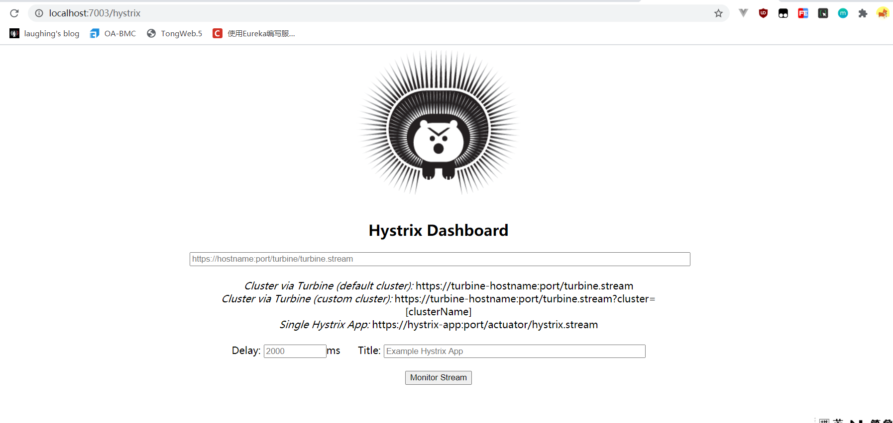
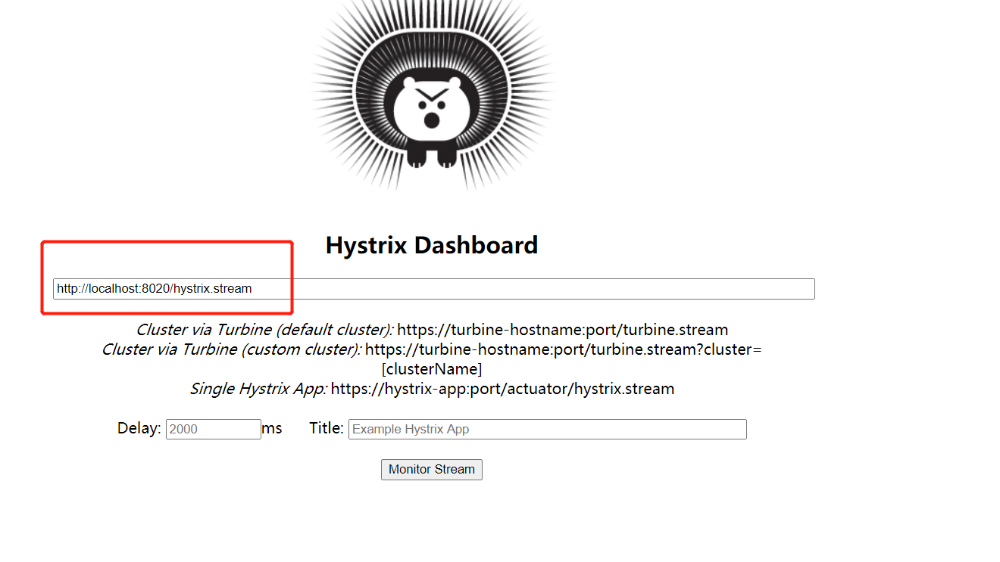
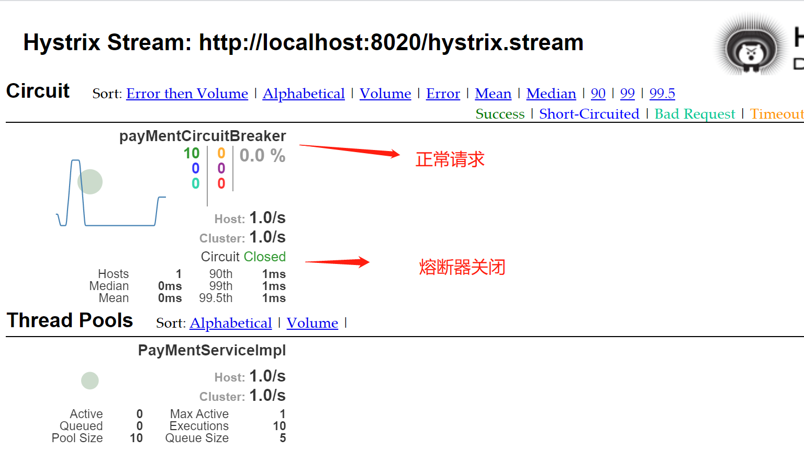
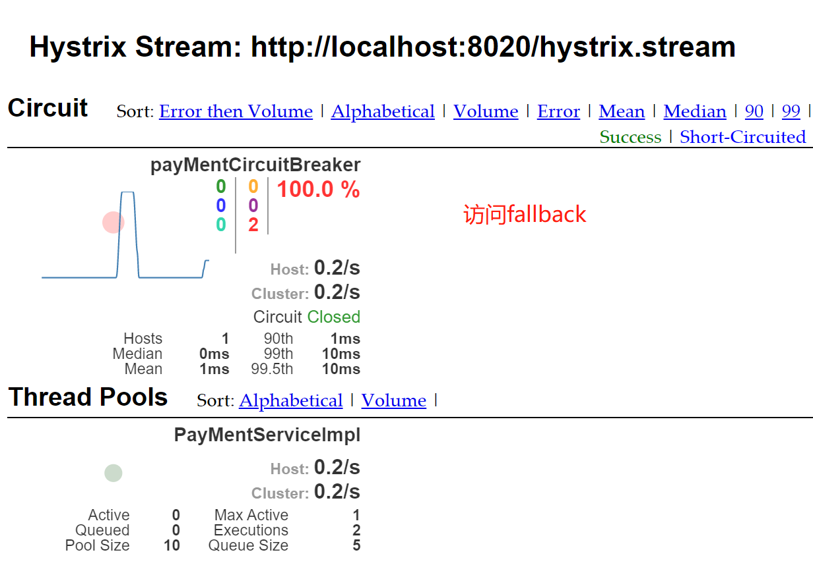
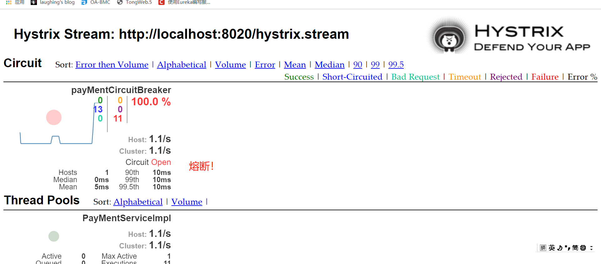

::: tip Hystrix Dashboard
Hystrix Dashboard是Hystrix的一个组件，Hystrix Dashboard提供一个断路器的监控面板，可以使我们更好的监控服务和集群的状态。

:::

## 一、pom

```
<dependency>
   <groupId>org.springframework.boot</groupId>
   <artifactId>spring-boot-starter-web</artifactId>
</dependency>
<dependency>
    <groupId>org.springframework.boot</groupId>
    <artifactId>spring-boot-actuator</artifactId>
</dependency>
<dependency>
    <groupId>org.springframework.cloud</groupId>
    <artifactId>spring-cloud-starter-netflix-hystrix-dashboard</artifactId>
</dependency>
```

## 二、@EnableHystrixDashboard

主启动了@EnableHystrixDashboard

## 三、使用

1、注意被监控端必须有spring-boot-actuator和web依赖<br>

2、被监控服务加一个bean

```
@SpringBootApplication
@EnableDiscoveryClient
@EnableCircuitBreaker
public class HystrixProvderApplication {
    public static void main(String[] args) {
        SpringApplication.run(HystrixProvderApplication.class, args);
    }

    @Bean
    public ServletRegistrationBean getServlet(){
        HystrixMetricsStreamServlet streamServlet = new HystrixMetricsStreamServlet();
        ServletRegistrationBean registrationBean = new ServletRegistrationBean(streamServlet);
        registrationBean.setLoadOnStartup(1);
        registrationBean.setEnabled(true);//是否启用该registrationBean
        registrationBean.addUrlMappings("/hystrix.stream");
        registrationBean.setName("HystrixMetricsStreamServlet");
        return registrationBean;
    }
}
```

访问成功




**监控：http://localhost:8020/hystrix.stream**




### 访问正常：



### 访问失败：




### 熔断




&nbsp;&nbsp;&nbsp;&nbsp; 本人授权[维权骑士](http://rightknights.com)对我发布文章的版权行为进行追究与维权。未经本人许可，不可擅自转载或用于其他商业用途。


