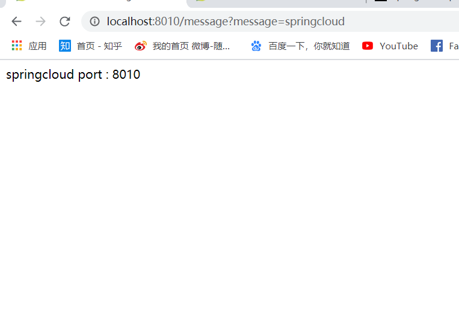
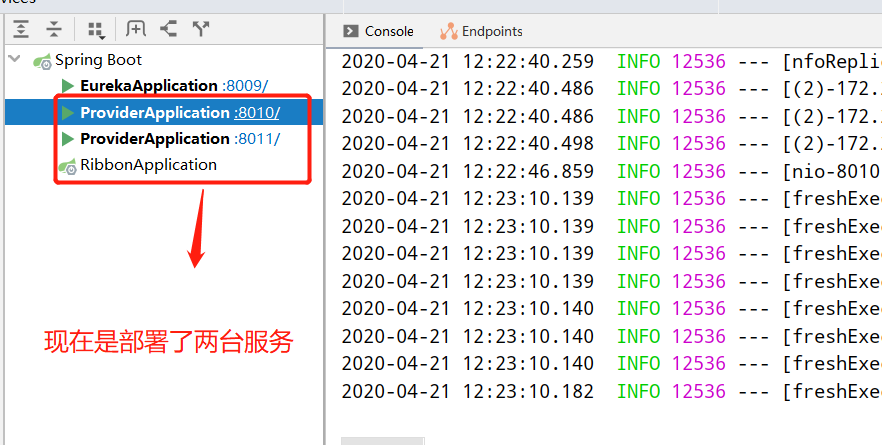

&nbsp;&nbsp;&nbsp;&nbsp;在搭建好Eureka后，开始注册服务，Provider就是服务的提供者的  
&nbsp;&nbsp;&nbsp;&nbsp;   * 1、**新建Provider的spring boot服务**  
  

&nbsp;&nbsp;&nbsp;&nbsp;   * 2、**application.yml** 
  
         
              spring:
                application:
                  name: spring-cloud-provider
              
              server:
                port: 8010
              
              eureka:
                client:
                  service-url:
                    defaultZone: http://localhost:8009/eureka/

                  
&nbsp;&nbsp;&nbsp;&nbsp;   * 3、**注册成功**                   
  

&nbsp;&nbsp;&nbsp;&nbsp;这里我们调用服务时，不用关心provider服务是在哪台机器，哪个端口，可直接在eureka注册中心用SPRING-CLOUD-PROVIDER发现服务。 

&nbsp;&nbsp;&nbsp;&nbsp;   * 4、**写一个测试服务** 
  
         
              @RestController
              public class Admincontroller {
                  @Value("${server.port}")  //通过spring注入端口号
                  private String port;
                  @RequestMapping(value = "message" ,method = RequestMethod.GET)
                  public String showMessage(String message){
                      return String.format("%s port : %s",message,port);
              
                  }
              }
                   
&nbsp;&nbsp;&nbsp;&nbsp;然后可以访问http://localhost:8010/message?message=springcloud 
  

&nbsp;&nbsp;&nbsp;&nbsp;   * 5、**启动两台实现负载均衡** 
  
 

&nbsp;&nbsp;&nbsp;&nbsp; 本人授权[维权骑士](http://rightknights.com)对我发布文章的版权行为进行追究与维权。未经本人许可，不可擅自转载或用于其他商业用途。

 