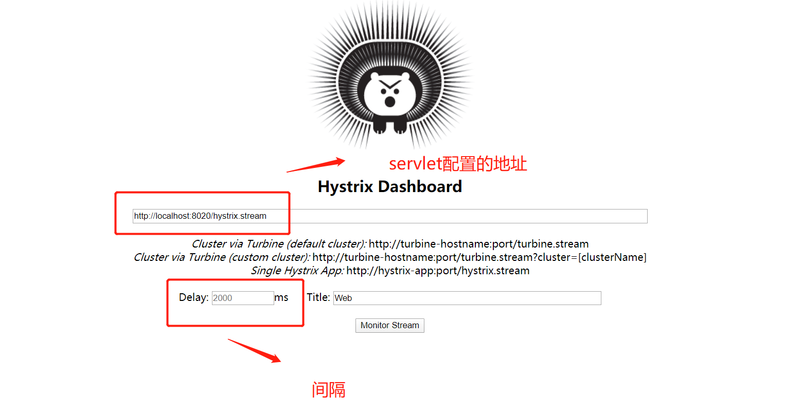
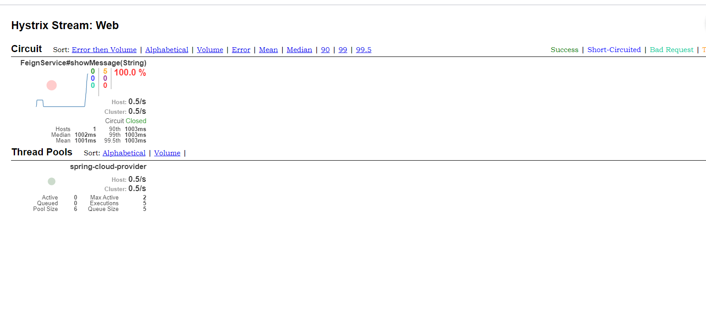

&nbsp;&nbsp;&nbsp;&nbsp;   * 1、**增加依赖** 

         
                              <dependency>
                                  <groupId>org.springframework.cloud</groupId>
                                  <artifactId>spring-cloud-starter-netflix-hystrix-dashboard</artifactId>
                              </dependency>

&nbsp;&nbsp;&nbsp;&nbsp;   * 2、**启动类增加@EnableHystrixDashboard注解** 

&nbsp;&nbsp;&nbsp;&nbsp;   * 3、**配置一个servlet** 

         
    @Configuration
    public class HystrixDashboardConfiguration {
        @Bean
        public ServletRegistrationBean getServlet(){
            HystrixMetricsStreamServlet streamServlet = new HystrixMetricsStreamServlet();
            ServletRegistrationBean registrationBean = new ServletRegistrationBean(streamServlet);
            registrationBean.setLoadOnStartup(1);
            registrationBean.addUrlMappings("/hystrix.stream");
            registrationBean.setName("HystrixMetricsStreamServlet");
            return registrationBean;
        }
    }

&nbsp;&nbsp;&nbsp;&nbsp;   * 4、**访问http://localhost:8020/hystrix** 
      
&nbsp;&nbsp;&nbsp;&nbsp;   * 5、**测试熔断** 
   
&nbsp;&nbsp;&nbsp;&nbsp; 本人授权[维权骑士](http://rightknights.com)对我发布文章的版权行为进行追究与维权。未经本人许可，不可擅自转载或用于其他商业用途。

 