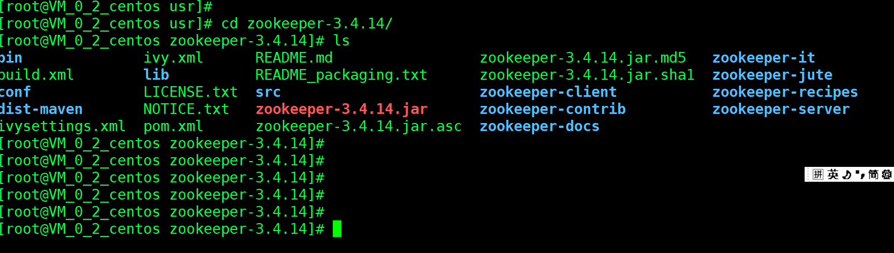
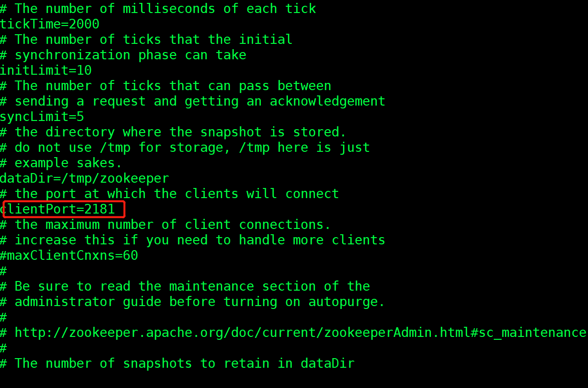
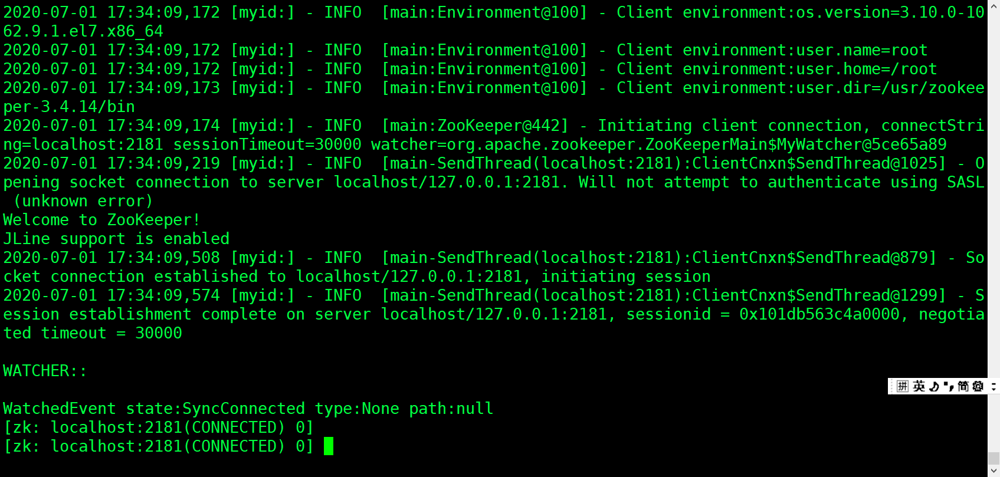
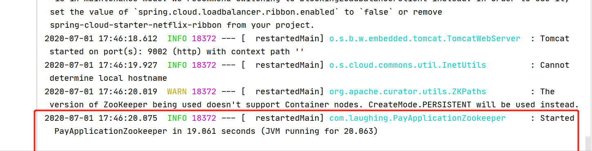
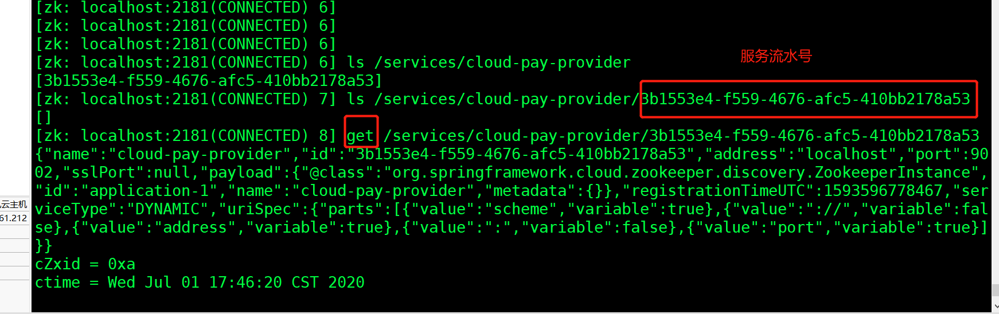
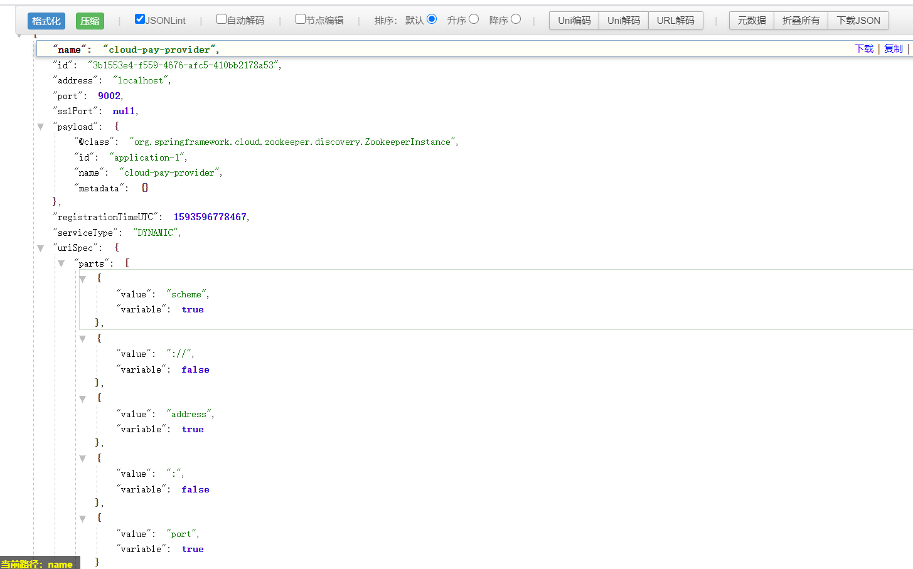
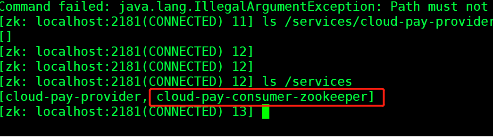
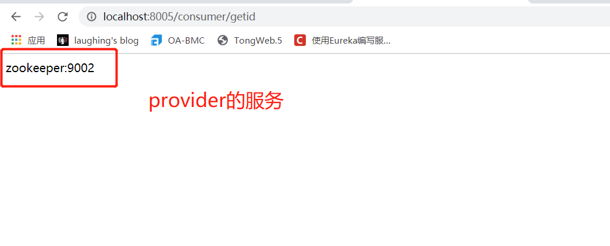
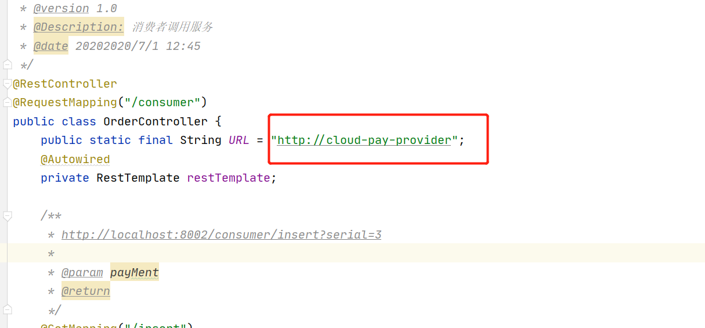

::: tip Zookeeper
和**Eureka**一样，zookeeper可以充当一个服务注册表（Service Registry），让多个服务提供者形成一个集群，让服务消费者通过服务注册表获取具体的服务访问地址（IP+端口）去访问具体的服务提供者。
:::


## 一、Zookeeper 安装

### 下载安装

官网下载最新的:[http://mirror.bit.edu.cn/apache/zookeeper/zookeeper-3.4.14/](http://mirror.bit.edu.cn/apache/zookeeper/zookeeper-3.4.14/)<br>

最新版本为3.4.14，xftp到服务器上并解压。




### 配置

配置文件在/usr/zookeeper-3.4.14/conf，他有一个样例，我们复制为zoo.cfg

```
cp  zoo_sample.cfg  zoo.cfg
```



### 启动

bin目录下面

```
./zkServer.sh start
```

启动zookeeper的客户端：

```
 ./zkCli.sh
```




## 二、服务provider注册

### 引入dependency

```
<dependency>
    <groupId>org.springframework.cloud</groupId>
    <artifactId>spring-cloud-starter-zookeeper-discovery</artifactId>
</dependency>
```

解决zookeeper版本不一致，jar冲突：

```
<dependency>
    <groupId>org.springframework.cloud</groupId>
    <artifactId>spring-cloud-starter-zookeeper-discovery</artifactId>
   <exclusions>
       <exclusion>
           <groupId>org.apache.zookeeper</groupId>
           <artifactId>zookeeper</artifactId>
       </exclusion>
   </exclusions>
</dependency>
<dependency>
    <groupId>org.apache.zookeeper</groupId>
    <artifactId>zookeeper</artifactId>
    <version>3.4.8</version>
</dependency>
```


### @EnableDiscoveryClient

这里启动类注解就只能用@EnableDiscoveryClient了

### 业务代码与在eureka写的一致


### 启动注册




### 查看服务信息







## 三、consumer注册

同理



调用成功



注意zookeeper服务名大小写敏感：




​	


&nbsp;&nbsp;&nbsp;&nbsp; 本人授权[维权骑士](http://rightknights.com)对我发布文章的版权行为进行追究与维权。未经本人许可，不可擅自转载或用于其他商业用途。


