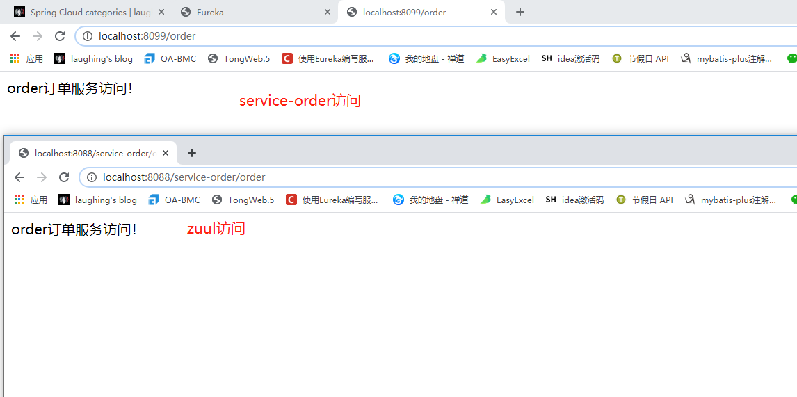
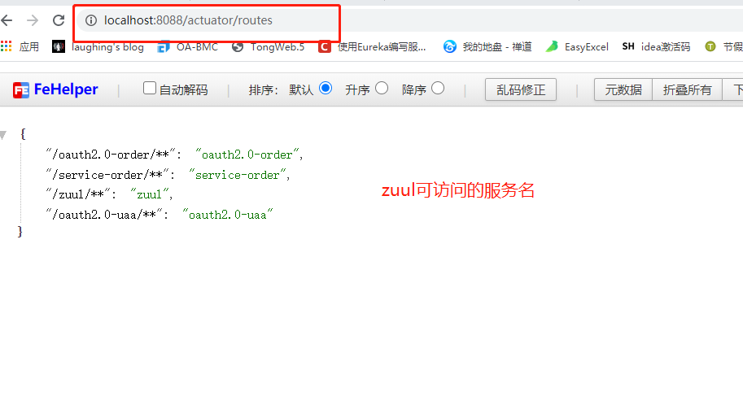
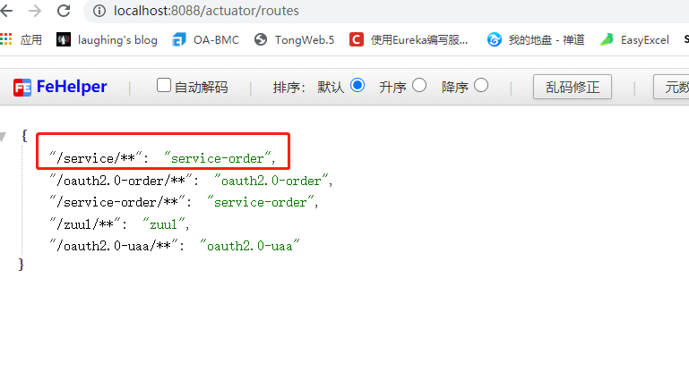
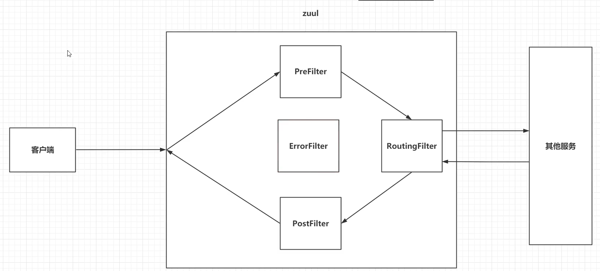

::: tip Zuul
Zuul 是 Netflix OSS 中的一员，是一个基于 JVM 路由和服务端的负载均衡器。提供路由、监控、弹性、安全等方面的服务框架。Zuul 能够与 Eureka、Ribbon、Hystrix 等组件配合使用。
:::


## 一、项目构建

### pom

```
<dependency>
    <groupId>org.springframework.cloud</groupId>
    <artifactId>spring-cloud-starter-netflix-zuul</artifactId>
</dependency>
```

### 注册入eureka

同之前一样

### 开启@EnableZuulProxy

```
@EnableZuulProxy
```

注册入eureka后，可通过zuul（8088）访问service-order(8099)的服务





## 二、Zuul的配置

### Zuul的routes监控

```
<dependency>
    <groupId>org.springframework.boot</groupId>
    <artifactId>spring-boot-starter-actuator</artifactId>
</dependency>
```

### yml

```
management:
  endpoints:
    web:
      exposure:
        include: "*"
```




自定义路由配置：

```
zuul:
  routes:
    service-order: /service/**
```




### 灰度发布

### 二、zuul过滤器




### 用前置过滤器token校验（参数）

需要继承ZuulFilter，并重写4个方法


{"principal":"laughing","client_id":"client1","authorities":["ROLE_admin"]}


