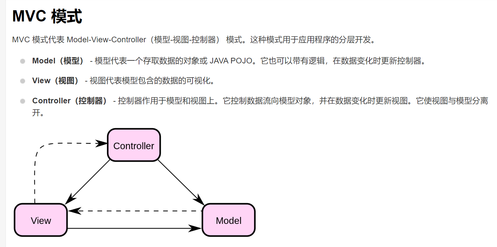
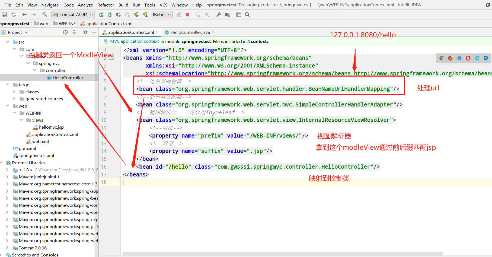
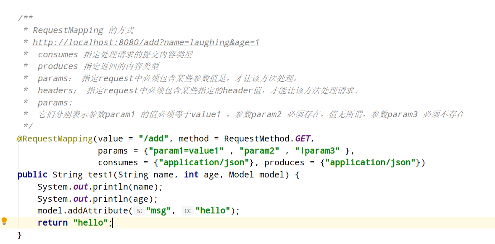
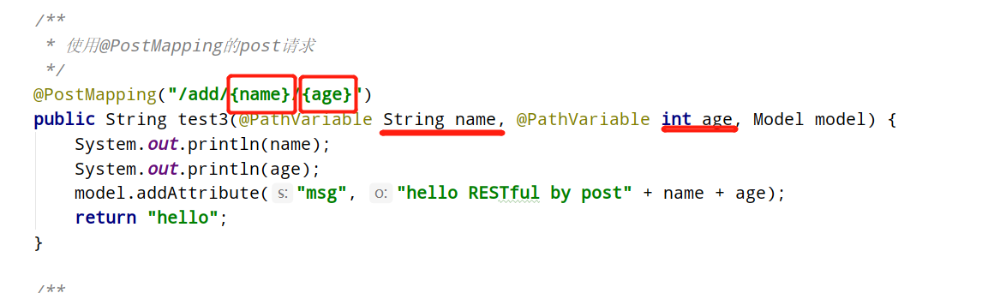
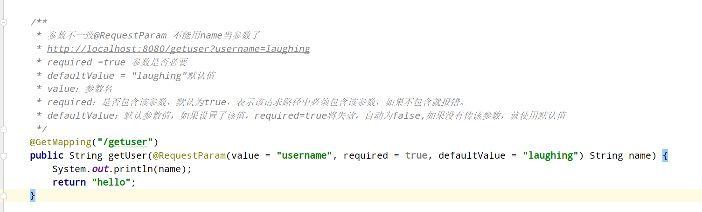

::: tip 介绍
本文介绍Spring MVC的设计模式与框架用法<br>
:::


## 一、MVC 设计模式

MVC 模式代表 Model-View-Controller（模型-视图-控制器） <br>

 

在实际的web开发过程中，简单粗暴的看法就是: <br>

Model就是Entity类和相关DAO <br>

Controller就是业务逻辑代码 <br>

View就是jsp页面 <br>

仔细分析一下这个设模式给我们带来的好处。web开发中，他最大的好处就是把用户所在的视图层和面向对象的模型、和具体的业务代码给分开了。MVC就是用这样一种解耦的方式。从JSP + servlet + javabean，到Struts2到spring MVC都是用了这一种设计模式。 <br>

甚至可以这样理解：在前后端分离的场景下，使用@RestController。**JSON是服务器端MVC框架的V，是前端MVC框架的M <br>**

## 二、SpringMVC

而Spring Web MVC就是一种基于Java的实现了Web MVC设计模式的请求驱动类型的轻量级Web框架，即使用了MVC架构模式的思想，将web层进行职责解耦。 <br>

## 三、hello springMVC

新建web项目，并引入依赖，这里我直接用mven引的在web.xml中配置servlet为springMVC的**DispatchcerServlet**

```
<?xml version="1.0" encoding="UTF-8"?>
<web-app xmlns="http://xmlns.jcp.org/xml/ns/javaee"
         xmlns:xsi="http://www.w3.org/2001/XMLSchema-instance"
         xsi:schemaLocation="http://xmlns.jcp.org/xml/ns/javaee http://xmlns.jcp.org/xml/ns/javaee/web-app_4_0.xsd"
         version="4.0">

    <!-- 配置DispatchcerServlet -->
    <servlet>
        <servlet-name>springDispatcherServlet</servlet-name>
        <servlet-class>org.springframework.web.servlet.DispatcherServlet</servlet-class>
        <!-- 配置Spring mvc下的配置文件的位置和名称 -->
        <init-param>
            <param-name>contextConfigLocation</param-name>
            <param-value>WEB-INF/applicationContext.xml</param-value>
        </init-param>
        <!--启动级别-->
        <load-on-startup>1</load-on-startup>
    </servlet>

    <servlet-mapping>
        <servlet-name>springDispatcherServlet</servlet-name>
        <url-pattern>/</url-pattern>
    </servlet-mapping>
</web-app>
```

配置applicationContext.xml

```
<?xml version="1.0" encoding="UTF-8"?>
<beans xmlns="http://www.springframework.org/schema/beans"
       xmlns:xsi="http://www.w3.org/2001/XMLSchema-instance"
       xmlns:context="http://www.springframework.org/schema/context"
       xmlns:mvc="http://www.springframework.org/schema/mvc"
       xsi:schemaLocation="http://www.springframework.org/schema/beans http://www.springframework.org/schema/beans/spring-beans.xsd
        http://www.springframework.org/schema/context http://www.springframework.org/schema/context/spring-context-4.0.xsd
        http://www.springframework.org/schema/mvc http://www.springframework.org/schema/mvc/spring-mvc-4.0.xsd">


    <!-- 配置自动扫描的包 -->
    <context:component-scan base-package="com.gwsssi.springmvc"></context:component-scan>

    <!-- 配置视图解析器 如何把handler 方法返回值解析为实际的物理视图 -->
    <bean class="org.springframework.web.servlet.view.InternalResourceViewResolver">
        <property name = "prefix" value="/WEB-INF/views/"></property>
        <property name = "suffix" value = ".jsp"></property>
    </bean>
</beans>
```

编写控制类

```
@Controller
public class HelloController {

    /**
     * 1.使用@RequestMapping注解来映射请求的url
     * 2.返回值会通过视图解析器解析为实际的物理视图，对于InternalResourceViewResolver视图解析器，
     *     会做如下解析：通过prefix+returnVal+suffix 拼接出来的实际的物理视图，然后做转化操作。
     *  prefix：/WEB-INF/views/
     *  reuturnVal:success
     *  suffix:.jsp
     * */
    // 接收请求的路径http://localhost:8080/hello
    // 响应返回的视图物理位置：/WEB-INF/views/success.jsp
    @RequestMapping("/hello")
    public String hello(){
        System.out.println("hello word...");
        return "hellomvc";
    }


}
```

这里就返回到/WEB-INF/views/success.jsp<br>

实际上这个过程就是替代了原来servlet所做的事情

## 四、Spring MVC原理

在纯servlet开发之中我们需要在web.xml中配置每一个servlet，上述过程中，我们只在web.xml中配置了DispatcherServlet，统一由DispatcherServlet完成url的映射和资源处理（所有的请求都有经过它来统一分发）。现在来分析这个过程。<br>

**SpringMVC的核心就是DispatcherServlet**，DispatcherServlet实质也是一个HttpServlet。DispatcherSevlet负责将请求分发，所有的请求都有经过它来统一分发。实际上它本质上还是HttpServlet的封装。<br>

```
public class DispatcherServlet extends FrameworkServlet
```

```
 FrameworkServlet extends HttpServletBean
```

```
class HttpServletBean extends HttpServlet
```

改一下代码：

```
public class HelloController implements Controller {

    public ModelAndView handleRequest(HttpServletRequest httpServletRequest, HttpServletResponse httpServletResponse) throws Exception {
        ModelAndView mv = new ModelAndView();

        String msg = "Hello Spring MVC!!!!";
        mv.addObject("msg", msg);
        mv.setViewName("hellomvc");
        // 返回给视图解析器
        return mv;
    }
}
```

 


## 五、使用注解开发Spring MVC

配置applicationContext.xml

```
<?xml version="1.0" encoding="UTF-8"?>
<beans xmlns="http://www.springframework.org/schema/beans"
       xmlns:xsi="http://www.w3.org/2001/XMLSchema-instance"
       xmlns:context="http://www.springframework.org/schema/context"
       xmlns:mvc="http://www.springframework.org/schema/mvc"
       xsi:schemaLocation="http://www.springframework.org/schema/beans
       http://www.springframework.org/schema/beans/spring-beans.xsd
       http://www.springframework.org/schema/context
       https://www.springframework.org/schema/context/spring-context.xsd
       http://www.springframework.org/schema/mvc
       https://www.springframework.org/schema/mvc/spring-mvc.xsd">

    <!-- 自动扫描包，让指定包下的注解生效,由IOC容器统一管理 -->
    <context:component-scan base-package="com.gwsssi.springmvc.controller"/>
    <!-- 让Spring MVC不处理静态资源 -->
    <mvc:default-servlet-handler />
    <!--
    支持mvc注解驱动
        在spring中一般采用@RequestMapping注解来完成映射关系
        要想使@RequestMapping注解生效
        必须向上下文中注册DefaultAnnotationHandlerMapping
        和一个AnnotationMethodHandlerAdapter实例
        这两个实例分别在类级别和方法级别处理。
        而annotation-driven配置帮助我们自动完成上述两个实例的注入。
     -->
    <mvc:annotation-driven />

    <!-- 视图解析器 -->
    <bean class="org.springframework.web.servlet.view.InternalResourceViewResolver"
          id="internalResourceViewResolver">
        <!-- 前缀 -->
        <property name="prefix" value="/WEB-INF/views/" />
        <!-- 后缀 -->
        <property name="suffix" value=".jsp" />
    </bean>

</beans>
```

因为上面配置了spring

    <!-- 自动扫描包，让指定包下的注解生效,由IOC容器统一管理 -->
    <context:component-scan base-package="com.gwsssi.springmvc.controller"/>
现在可以使用@Controller代替了写bean,并且用 @RequestMapping映射url,RequestMapping是可以多级嵌套的。可以使用@RequestMapping 来映射URL 到控制器类，或者是到Controller 控制器的处理方法上。

```
@Controller
public class HelloController  {

    @RequestMapping("/hello")
    public String hello(Model model){
        model.addAttribute("msg","hello spring mvc");
        return "hellomvc";  // 这个String会被视图解析器处理
    }

}
```

控制器Controller 负责处理由DispatcherServlet 分发的请求，它把用户请求的数据经过业务处理层处理之后封装成一个ViewModel ，再把该Model 返回给对应的View 进行展示

## 六、结果跳转方式

Servlet原生支持的重定向

```
//请求转发处理器
@RequestMapping("/redirectMVC")
public void forwardView(HttpServletRequest,HttpServletResponse){
response.sendRedirect(request.getContextPath()+"/xxx/forwardView");
 }
```

spring MVC的写法：

```
@RequestMapping("/redirectMVC")
public String forwardView(){
return "redirect:forwardMVC";
 }
```

## 七、RESTful接收请求

我们在Spring mvc传参用的都是RESTful风格

**传统方式操作资源**：通过不同的参数来实现不同的效果！方法单一，post 和 get

http://127.0.0.1/item/queryItem.action?id=1 查询,GET

http://127.0.0.1/item/saveItem.action 新增,POST

http://127.0.0.1/item/updateItem.action 更新,POST

http://127.0.0.1/item/deleteItem.action?id=1 删除,GET或POST

**使用RESTful操作资源**：可以通过**不同的请求方式**来实现不同的效果！如下：请求地址一样，但是功能可以不同！

http://127.0.0.1/item/1 查询,GET

http://127.0.0.1/item 新增,POST

http://127.0.0.1/item 更新,PUT

http://127.0.0.1/item/1 删除,DELETE

```
@Controller
public class HelloController {

    /**
     * RequestMapping 的方式
     * http://localhost:8080/add?name=laughing&age=1
     */
    @RequestMapping("/add")
    public String test1(String name, int age, Model model) {
        System.out.println(name);
        System.out.println(age);
        model.addAttribute("msg", "hello");
        return "hello";
    }

    /**
     * RESTful风格
     * http://localhost:8080/add/name/age
     * 加入路径变量的注解@PathVariable 增加value(地址)和method（请求方式）
     * 等同于@GetMapping
     */
    @RequestMapping(value = "/add/{name}/{age}", method = RequestMethod.GET)
    @GetMapping("/add/{name}/{age}")
    public String test2(@PathVariable String name, @PathVariable int age, Model model) {
        System.out.println(name);
        System.out.println(age);
        model.addAttribute("msg", "hello RESTful" + name + age);
        return "hello";
    }

    /**
     * 使用@PostMapping的post请求
     */
    @PostMapping("/add/{name}/{age}")
    public String test3(@PathVariable String name, @PathVariable int age, Model model) {
        System.out.println(name);
        System.out.println(age);
        model.addAttribute("msg", "hello RESTful by post" + name + age);
        return "hello";
    }
}
```

## 八、处理接收数据

**@RequestPatam**注解：<br>

若提交的Url与后台处理的参数名不一致

```
/**
 * 参数不一致@RequestParam 不能用name当参数了
 * http://localhost:8080/getuser?username=laughing
 * required =true 参数是否必要
 * defaultValue = "laughing"默认值
 */
@GetMapping("/getuser")
public String getUser(@RequestParam(value = "username",required =true,defaultValue = "laughing") String name) {
    System.out.println(name);
    return "hello";
}
```

接收的参数为一个对象

```
/**
 * 接收的参数为一个对象
 * http://localhost:8080/getuserdao?name=laughing&age=1
 */
@GetMapping("/getuserdao")
public String getUserDao(UserDao user){
    System.out.println(user.toString());
    return "hello";
}
```

## 九、Controller返回json

因为做前后端分离的项目，需要返回的数据我json的形式。现在一般是用Jackson或者Alibaba fastjson;

### 使用jackson

```
<dependency>
    <groupId>com.fasterxml.jackson.core</groupId>
    <artifactId>jackson-databind</artifactId>
    <version>2.10.0</version>
</dependency>
```

利用ObjectMapper对象转json:

```
/**
 * 利用ObjectMapper对象转json
 */
@GetMapping("/get")
@ResponseBody // 不会走视图解析器，返回字符串
public String getUserJson() throws JsonProcessingException {
    ObjectMapper mapper = new ObjectMapper();
    UserDao user = new UserDao("laughing", 1);
    String str = mapper.writeValueAsString(user);
    return str;
}
```

中文乱码解决方法，更改Spring的applicationContext.xml 的mvc:annotation-driven

```
<mvc:annotation-driven>
    <mvc:message-converters register-defaults="true">
        <bean class="org.springframework.http.converter.StringHttpMessageConverter">
        <property name="supportedMediaTypes">
            <list>
                <value>text/html;charset=UTF-8</value>
                <value>application/json;charset=UTF-8</value>
            </list>
        </property>
    </bean>
    </mvc:message-converters>
</mvc:annotation-driven>
```

如果你不想用@ResponseBody，可以在类上加@RestController,也可以直接跳过视图解析器，返回字符串。

### 使用fastjson

```
<dependency>
    <groupId>com.alibaba</groupId>
    <artifactId>fastjson</artifactId>
    <version>1.2.61.sec10</version>
</dependency>
```

```
@GetMapping("/get")
@ResponseBody // 不会走视图解析器，返回字符串
public String getUserJson() throws JsonProcessingException {
    UserDao user = new UserDao("laughing", 1);
    return JSON.toJSONString(user);
}


@GetMapping("/getlsit")
@ResponseBody // 不会走视图解析器，返回字符串
public String getUserJsonList() throws JsonProcessingException {
    List<UserDao> userDaoList = new ArrayList<UserDao>();

    UserDao user1 = new UserDao("laughing1", 1);
    UserDao user2 = new UserDao("laughing2", 2);
    userDaoList.add(user1);
    userDaoList.add(user2);
    return JSON.toJSONString(userDaoList);
}
```

## 十、spring mvc 注解总结

关于spring常用的url解析映射和参数处理的注解：

### @Controller

用于标记在一个类上，使用它标记的类就是一个SpringMVC Controller 对象，就相当于实现了spring mvc DispatcherServlet 封装的http分发控制器接口。spring会扫描xml里配置的context:component-scan包。

### @RequestMapping

@RequestMapping 注解的方法才是真正处理请求的处理器。<br>

RequestMapping是一个用来处理请求地址映射的注解，可用于类或方法上。用于类上，表示类中的所有响应请求的方法都是以该地址作为父路径。



### @GetMapping、@PostMapping

如果我们想使用传统的*@RequestMapping*注释实现URL处理程序，那么它应该是这样的：<br>

@RequestMapping(value = "/get/{id}", method = RequestMethod.GET)<br>

新方法可以简化为：<br>

@GetMapping("/get/{id}")<br>

### @PathVariable

通过 @PathVariable 可以将URL中占位符参数{xxx}绑定到处理器类的方法形参中@PathVariable(“xxx“) 



### @RequestParam



### @ResponseBody

@ResponseBody注解通常使用在控制层的方法上，用于将Controller的方法返回的对象，返回的数据不是html标签的页面，而是其他某种格式的数据时（如json、xml等）使用,就不用之前的返回视图对象了。


