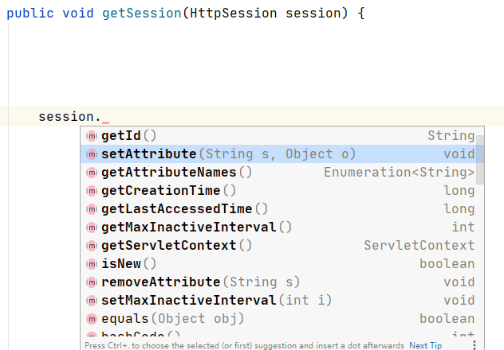

## 一、基本概念

### 1、认证 (authentication) 

认证是判断用户身份是否合法的过程。如密码登录、二维码登录等。

### 2、授权(Authorization)

授权是尝试对用户授予访问或操作权限的过程

### 3、session

**会话**(Session)是一个客户与服务器之间的不中断的请求响应序列。对客户的每个请求，服务器能够识别出请求来自于同一个客户。当一个未知的客户向Web应用程序发送第一个请求时就开始了一个会话。当客户明确结束会话或服务器在一个预定义的时限内不从客户接受任何请求时，会话就结束了。当会话结束后，服务器就忘记了客户以及客户的请求。

因为HTTP请求是无状态的，为了能够在HTTP协议之上保持住状态，比如用户是否登陆，就使用了session。

session有很多种实现方式：

1、在Cookie里放个JSESSIONID,在服务器中存上状态，用户请求来了，根据JSESSIONID去服务器里查状态。如Tomcat的实现方法。

2、把所有状态都存在Cookie里，服务器给个签名防止伪造，每次请求来了，直接从Cookie里提取状态，这是JWT的实现方法。

3、在Cookie里放个token，状态不存在中间件里，而是存在Redis里，这也是一种Session实现方法


### 4、session的生命周期

**创建：**

Sessinon在用户访问第一次访问服务器时创建

需要注意只有访问JSP、Servlet等程序时才会创建Session，只访问HTML、IMAGE等静态资源并不会创建Session，可调用request.getSession(true)强制生成Session。

新开的浏览器窗口会生成新的Session，但子窗口除外。子窗口会共用父窗口的Session。

**失效：**

服务器会把长时间没有活动的Session从服务器内存中清除，此时Session便失效。Tomcat中Session的默认失效时间为20分钟。

调用Session的invalidate方法。


### 5、JSESSIONID的会话认证方式


对Tomcat而言，Session是一块在服务器开辟的内存空间，其存储结构为ConcurrentHashMap；

 访问时web服务器就会创建一个与该客户端对应的HttpSession对象




存在问题：

通常而言session都是保存在内存中，而随着认证用户的增多，服务端的开销会明显增大。

**CSRF**: 因为是基于cookie来进行用户识别的, cookie如果被截获，用户就会很容易受到跨站请求伪造的攻击。


### 6、基于**token**的会话认证方式


　　Token是服务端生成的一串字符串，以作客户端进行请求的一个令牌，当第一次登录后，服务器生成一个Token便将此Token返回给客户端，以后客户端只需带上这个Token前来请求数据即可，无需再次带上用户名和密码。

简单token的组成；uid(用户唯一的身份标识)、time(当前时间的时间戳)、sign（签名，token的前几位以哈希算法压缩成的一定长度的十六进制字符串。为防止token泄露）。


## 二、以角色为基础的权限管理设计RBAC

RBAC（Role-Based Access Control，基于角色的访问控制），就是用户通过角色与权限进行关联。
简单地说，一个用户拥有若干角色，每一个角色拥有若干权限。这样，就构造成“用户-角色-权限”的授权模型。在这种模型中，用户与角色之间，角色与权限之间，一般是多对多的关系。<br>


**表结构：**<br>

  <br>

   用户表、角色表、角色权限表
（用户角色关系表）（角色权限关系表）

```sql
CREATE TABLE `tb_permission` (
  `id` bigint(20) NOT NULL AUTO_INCREMENT,
  `parent_id` bigint(20) DEFAULT NULL COMMENT '父权限',
  `name` varchar(64) NOT NULL COMMENT '权限名称',
  `enname` varchar(64) NOT NULL COMMENT '权限英文名称',
  `url` varchar(255) NOT NULL COMMENT '授权路径',
  `description` varchar(200) DEFAULT NULL COMMENT '备注',
  `created` datetime NOT NULL,
  `updated` datetime NOT NULL,
  PRIMARY KEY (`id`)
) ENGINE=InnoDB AUTO_INCREMENT=37 DEFAULT CHARSET=utf8 COMMENT='权限表';

CREATE TABLE `tb_role` (
  `id` bigint(20) NOT NULL AUTO_INCREMENT,
  `parent_id` bigint(20) DEFAULT NULL COMMENT '父角色',
  `name` varchar(64) NOT NULL COMMENT '角色名称',
  `enname` varchar(64) NOT NULL COMMENT '角色英文名称',
  `description` varchar(200) DEFAULT NULL COMMENT '备注',
  `created` datetime NOT NULL,
  `updated` datetime NOT NULL,
  PRIMARY KEY (`id`)
) ENGINE=InnoDB AUTO_INCREMENT=37 DEFAULT CHARSET=utf8 COMMENT='角色表';

CREATE TABLE `tb_role_permission` (
  `id` bigint(20) NOT NULL AUTO_INCREMENT,
  `role_id` bigint(20) NOT NULL COMMENT '角色 ID',
  `permission_id` bigint(20) NOT NULL COMMENT '权限 ID',
  PRIMARY KEY (`id`)
) ENGINE=InnoDB AUTO_INCREMENT=37 DEFAULT CHARSET=utf8 COMMENT='角色权限表';

CREATE TABLE `tb_user` (
  `id` bigint(20) NOT NULL AUTO_INCREMENT,
  `username` varchar(50) NOT NULL COMMENT '用户名',
  `password` varchar(64) NOT NULL COMMENT '密码，加密存储',
  `phone` varchar(20) DEFAULT NULL COMMENT '注册手机号',
  `email` varchar(50) DEFAULT NULL COMMENT '注册邮箱',
  `created` datetime NOT NULL,
  `updated` datetime NOT NULL,
  PRIMARY KEY (`id`),
  UNIQUE KEY `username` (`username`) USING BTREE,
  UNIQUE KEY `phone` (`phone`) USING BTREE,
  UNIQUE KEY `email` (`email`) USING BTREE
) ENGINE=InnoDB AUTO_INCREMENT=37 DEFAULT CHARSET=utf8 COMMENT='用户表';

CREATE TABLE `tb_user_role` (
  `id` bigint(20) NOT NULL AUTO_INCREMENT,
  `user_id` bigint(20) NOT NULL COMMENT '用户 ID',
  `role_id` bigint(20) NOT NULL COMMENT '角色 ID',
  PRIMARY KEY (`id`)
) ENGINE=InnoDB AUTO_INCREMENT=37 DEFAULT CHARSET=utf8 COMMENT='用户角色表';
```


