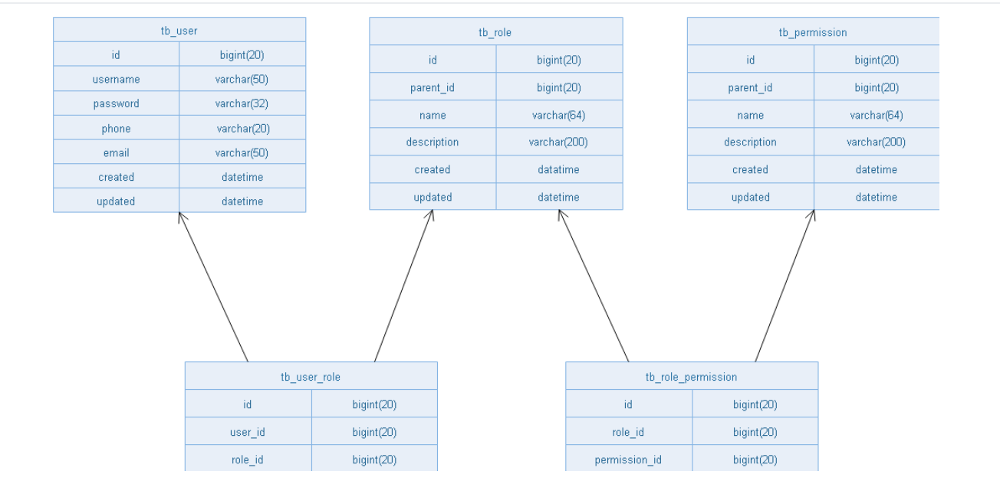

## 一、基本概念

### 认证 (authentication) 

认证是判断用户身份是否合法的过程。如密码登录、二维码登录等。

### 基于**session**的会话认证方式


### 基于**token**的会话认证方式


### 授权(Authorization)
授权是尝试对用户授予访问或操作权限的过程


## 二、以角色为基础的权限管理设计RBAC

RBAC（Role-Based Access Control，基于角色的访问控制），就是用户通过角色与权限进行关联。
简单地说，一个用户拥有若干角色，每一个角色拥有若干权限。这样，就构造成“用户-角色-权限”的授权模型。在这种模型中，用户与角色之间，角色与权限之间，一般是多对多的关系。<br>


**表结构：**<br>

  <br>

   用户表、角色表、角色权限表
（用户角色关系表）（角色权限关系表）

```sql
CREATE TABLE `tb_permission` (
  `id` bigint(20) NOT NULL AUTO_INCREMENT,
  `parent_id` bigint(20) DEFAULT NULL COMMENT '父权限',
  `name` varchar(64) NOT NULL COMMENT '权限名称',
  `enname` varchar(64) NOT NULL COMMENT '权限英文名称',
  `url` varchar(255) NOT NULL COMMENT '授权路径',
  `description` varchar(200) DEFAULT NULL COMMENT '备注',
  `created` datetime NOT NULL,
  `updated` datetime NOT NULL,
  PRIMARY KEY (`id`)
) ENGINE=InnoDB AUTO_INCREMENT=37 DEFAULT CHARSET=utf8 COMMENT='权限表';

CREATE TABLE `tb_role` (
  `id` bigint(20) NOT NULL AUTO_INCREMENT,
  `parent_id` bigint(20) DEFAULT NULL COMMENT '父角色',
  `name` varchar(64) NOT NULL COMMENT '角色名称',
  `enname` varchar(64) NOT NULL COMMENT '角色英文名称',
  `description` varchar(200) DEFAULT NULL COMMENT '备注',
  `created` datetime NOT NULL,
  `updated` datetime NOT NULL,
  PRIMARY KEY (`id`)
) ENGINE=InnoDB AUTO_INCREMENT=37 DEFAULT CHARSET=utf8 COMMENT='角色表';

CREATE TABLE `tb_role_permission` (
  `id` bigint(20) NOT NULL AUTO_INCREMENT,
  `role_id` bigint(20) NOT NULL COMMENT '角色 ID',
  `permission_id` bigint(20) NOT NULL COMMENT '权限 ID',
  PRIMARY KEY (`id`)
) ENGINE=InnoDB AUTO_INCREMENT=37 DEFAULT CHARSET=utf8 COMMENT='角色权限表';

CREATE TABLE `tb_user` (
  `id` bigint(20) NOT NULL AUTO_INCREMENT,
  `username` varchar(50) NOT NULL COMMENT '用户名',
  `password` varchar(64) NOT NULL COMMENT '密码，加密存储',
  `phone` varchar(20) DEFAULT NULL COMMENT '注册手机号',
  `email` varchar(50) DEFAULT NULL COMMENT '注册邮箱',
  `created` datetime NOT NULL,
  `updated` datetime NOT NULL,
  PRIMARY KEY (`id`),
  UNIQUE KEY `username` (`username`) USING BTREE,
  UNIQUE KEY `phone` (`phone`) USING BTREE,
  UNIQUE KEY `email` (`email`) USING BTREE
) ENGINE=InnoDB AUTO_INCREMENT=37 DEFAULT CHARSET=utf8 COMMENT='用户表';

CREATE TABLE `tb_user_role` (
  `id` bigint(20) NOT NULL AUTO_INCREMENT,
  `user_id` bigint(20) NOT NULL COMMENT '用户 ID',
  `role_id` bigint(20) NOT NULL COMMENT '角色 ID',
  PRIMARY KEY (`id`)
) ENGINE=InnoDB AUTO_INCREMENT=37 DEFAULT CHARSET=utf8 COMMENT='用户角色表';
```


