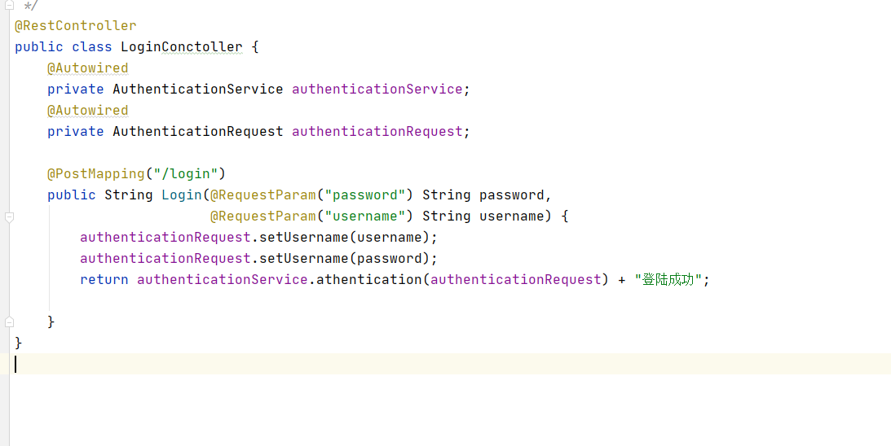
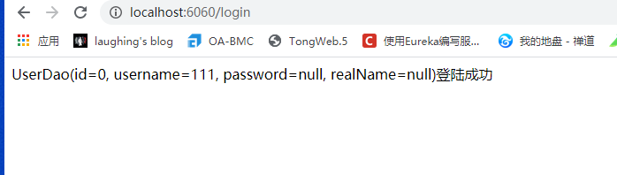
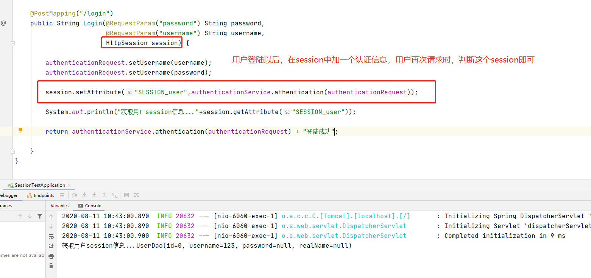
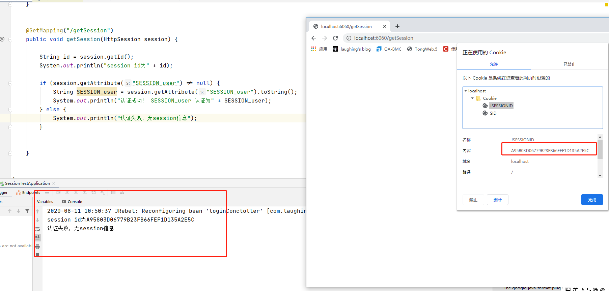
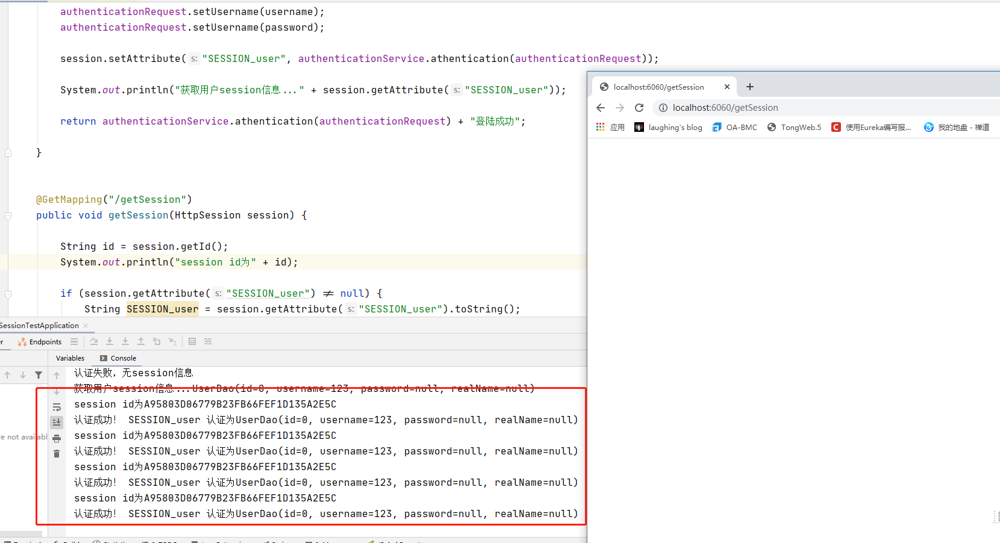
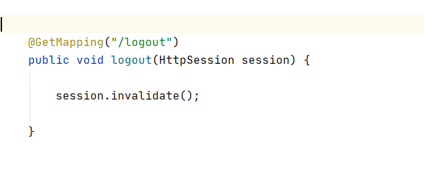
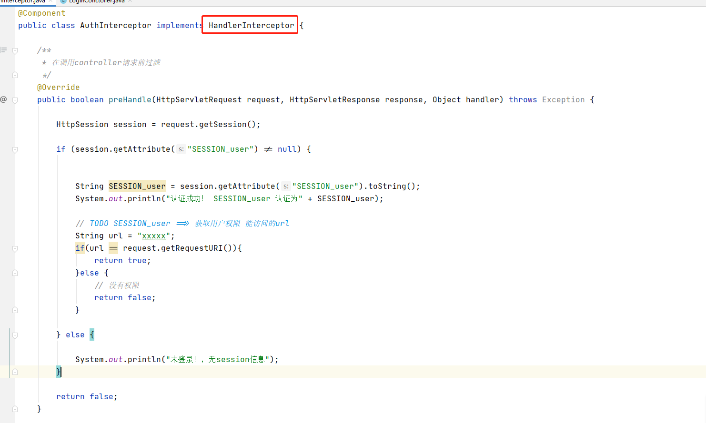

用户登录认证可通过RBAC查表的方式返回认证信息。这里具体的业务略，主要学习session的问题。






## 一、session 会话和认证

登陆之后会

```
session.setAttribute("SESSION_user", authenticationService.athentication(authenticationRequest));
```




如果没有登录



登陆后




退出只需要清除session即可。




## 二、session 授权

授权一般采用RBAC的方法，这里只模拟session的操作。通过过滤器的方式实现。





总结：

用户登录之后，服务器会在服务端加一个session的认证信息，这里是SESSION_user。

```
session.setAttribute("SESSION_user", authenticationService.athentication(authenticationRequest));
```

并在浏览器端返回一个session_id,一般保存在cookies里。

浏览器再次访问时，会带上这个session_id，而服务端只需要通过：

```
session.getAttribute("SESSION_user")
```

来判断这个认证信息即可。

对页面的授权访问采用拦截器的方式，继承HandlerInterceptor的preHandle方法，通过request.getRequestURI()的url与用户权限下的url比对，完成授权。


