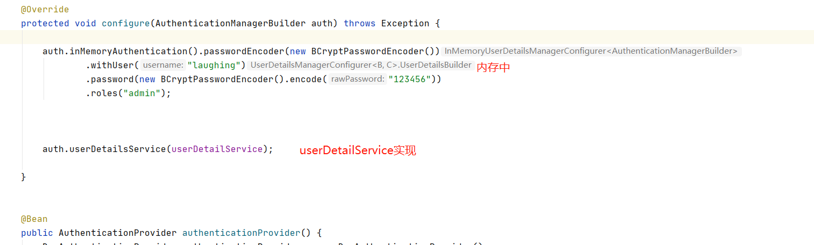
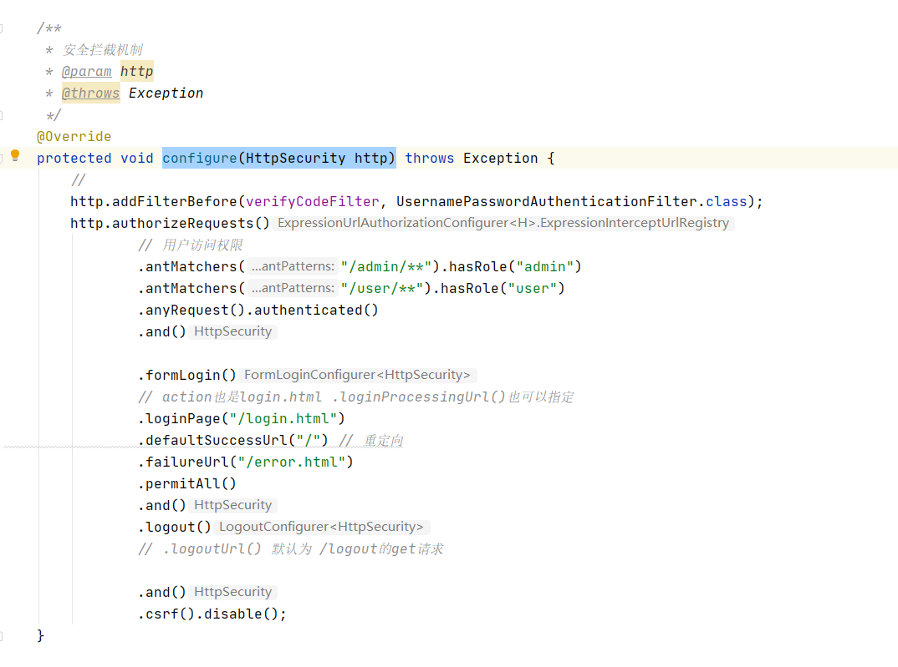

## 一、Spring Security配置类

Spring Security的config类继承WebSecurityConfigurerAdapter。完成认证、拦截、授权、密码加密等功能。

```
@Configuration
public class SecurityConfig extends WebSecurityConfigurerAdapter{}
```


## 二、认证

在 Spring Security 中，用来处理身份认证的类是 AuthenticationManager，我们也称之为认证管理器。实现类为ProviderManager。

AuthenticationManager 中规范了 Spring Security 的过滤器要如何执行身份认证，并在身份认证成功后返回一个经过认证的 Authentication 对象。

AuthenticationManagerBuilder 为认证管理器构建器。

在配置类中，将userDetailService放入AuthenticationManagerBuilder构建，实现用户身份认证。




## 三、授权

授权通过安全拦截机制,继承configure(HttpSecurity http)方法。




