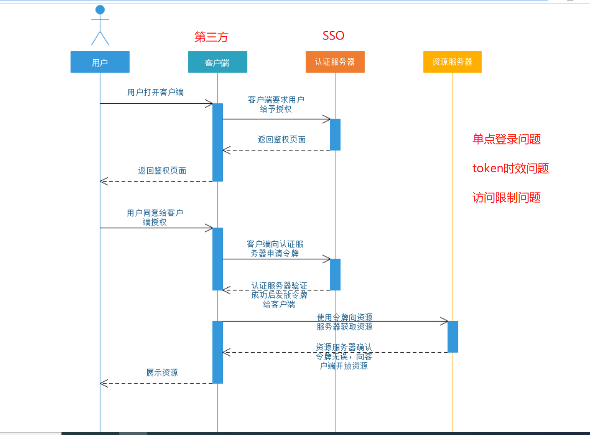
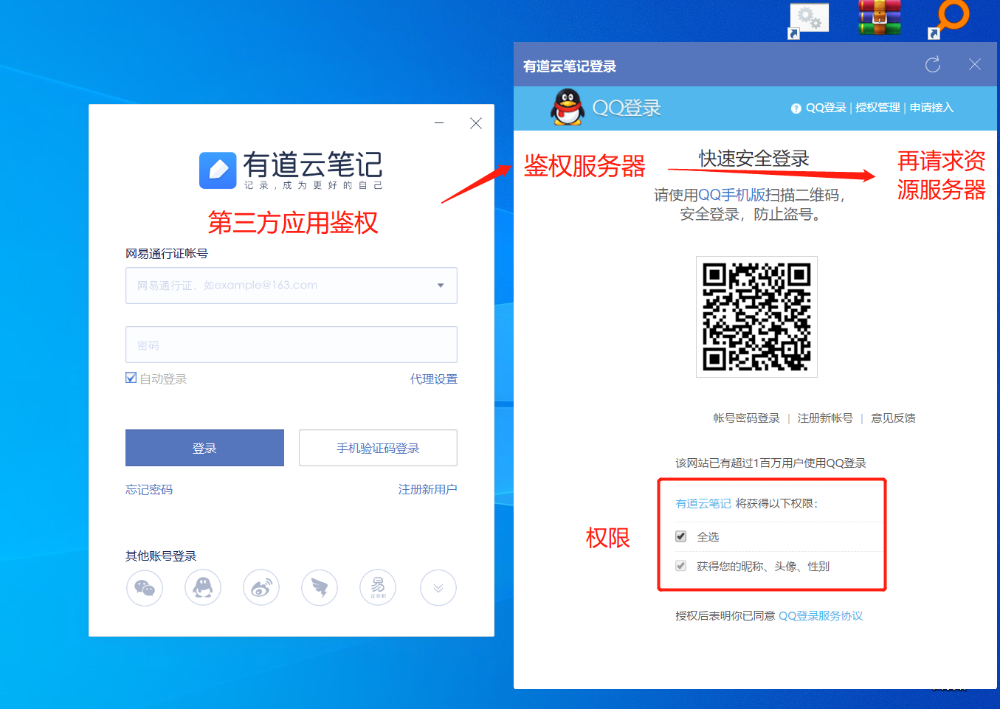

### **1、Spring Security安全框架简介**<br/>

Spring Security 基于 Servlet 过滤器、IoC 和 AOP，为 Web 请求和方法调用提供**身份验证**和**访问控制**。


### **2、OAuth2.0协议简介**<br/>

OAuth（开放授权）是一个开放标准，允许用户授权第三方网站访问他们存储在另外的服务提供者上的信息，而不需要将用户名和密码提供给第三方网站或分享他们数据的所有内容。比如**微信登录OAuth2.0**<br/>


OAuth 在 "客户端" 与 "服务提供商" 之间，设置了一个授权层（authorization layer）。"客户端" 不能直接登录 "服务提供商"，只能登录授权层，以此将用户与客户端区分开来。"客户端" 登录授权层所用的令牌（token），与用户的密码不同。用户可以在登录的时候，指定授权层令牌的权限范围和有效期。"客户端" 登录授权层以后，"服务提供商" 根据令牌的权限范围和有效期，向 "客户端" 开放用户储存的资料。<br/>


  <br>

  <br>


### **3、Access Token令牌刷新访问**<br/>

```
http://www.laughing.com/user?access_token=123456&client_id=xxxxxx
```

OAuth2.0 引入了 Refresh Token 机制,access_token定时失效。<br>
传入 refresh_token 和 client_id，认证服务器验证通过后，返回一个新的 Access Token。<br>

```
http://www.laughing.com/refresh?refresh_token=&client_id=xxxxxx
```

Refresh Token **一定是保存在客户端的服务器上**,失效很长<br>

OAuth2.0 引入了 `client_secret` 机制。即每一个 `client_id` 都对应一个 `client_secret`。这个 `client_secret` 会在客户端申请 `client_id` 时，随 `client_id` 一起分配给客户端。**客户端必须把 `client_secret` 妥善保管在服务器上**，决不能泄露。刷新 Access Token 时，需要验证这个 `client_secret`<br>

```text
http://www.laughing.com/refresh?refresh_token=&client_id=&client_secret=
```

### **4、客户端授权模式**<br/>

OAuth 2.0 客户端授权模式有四种。<br/>

### **implicit 简化模式:**<br/>

1、访问:  www.laughing.cn 通过QQ登录<br/>

2、到QQ登录页面（认证服务器）<br/>

3、返回http://www.laughing.com/user?access_token=123456<br/>

4、laughing.com拿着这个token去访问QQ的资源服务器<br/>


### **authorization code 授权码模式：**<br/>

简单模式下，token 是不安全的。这是因为在第 4 步当中直接把 token 返回给应用。而这一步容易被拦截、窃听。<br/>

1、访问:  www.laughing.cn 通过QQ登录<br/>

2、到QQ登录页面（认证服务器）<br/>

3、返回http://www.laughing.com/user?access_token=123456<br/>

这个token是刷新的，我的laughing应用服务器会去请求刷新的access_token和refresh_token<br/>

www.laughing.cn/login?code=&client_id=&client_secret=<br/>

需要传入 `code`、`client_id` 以及 `client_secret`。验证通过后，返回 `access_token` 和 `refresh_token`。一旦换取成功，`code` 立即作废，不能再使用第二次。<br/>

### **resource owner password credentials 密码模式：**<br/>

这个密码是提供给客户端的。一个典型的例子是同一个企业内部的不同产品要使用本企业的 oAuth2.0 体系。

用户直接通过客户端输入账号密码向认证服务器请求token。

### **client credentials 客户端模式：**<br/>

调用者是一个后端的模块，没有用户界面的时候，可以使用客户端模式。鉴权服务器直接对客户端进行身份验证，验证通过后，返回 token。


&nbsp;&nbsp;&nbsp;&nbsp; 本人授权[维权骑士](http://rightknights.com)对我发布文章的版权行为进行追究与维权。未经本人许可，不可擅自转载或用于其他商业用途。


