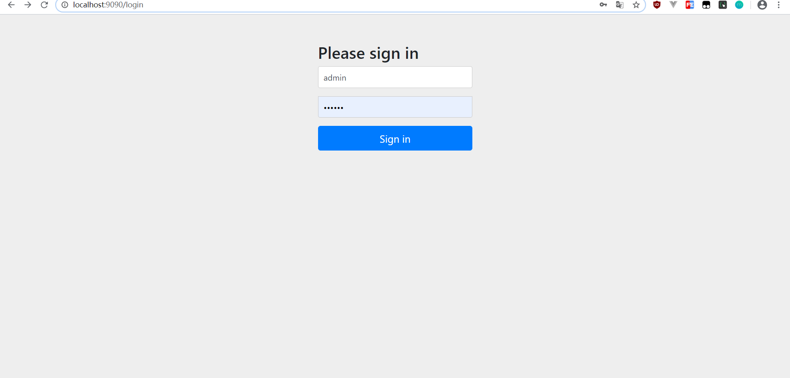
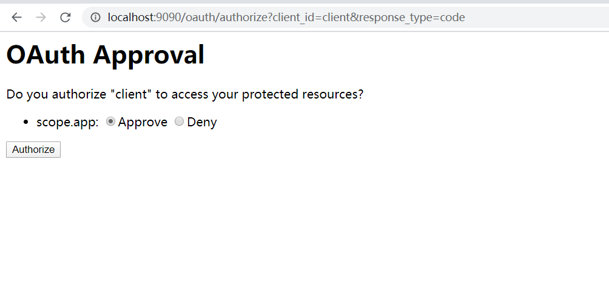
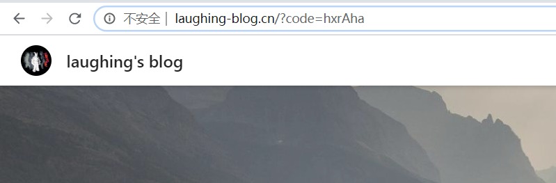
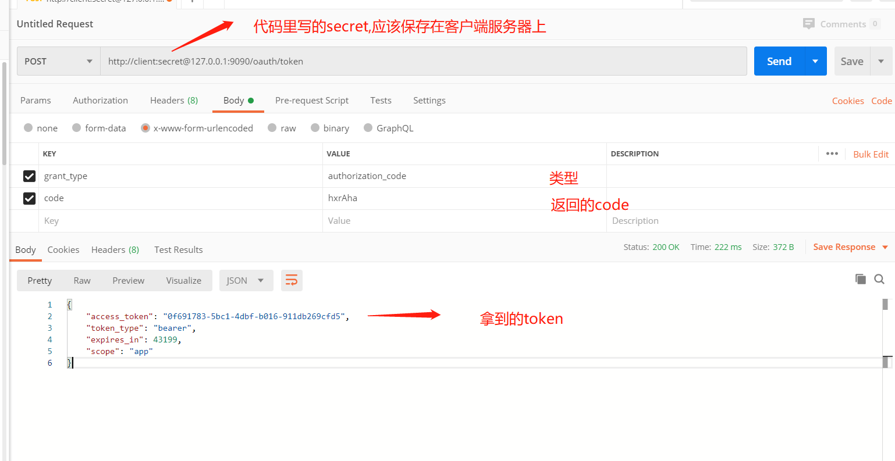
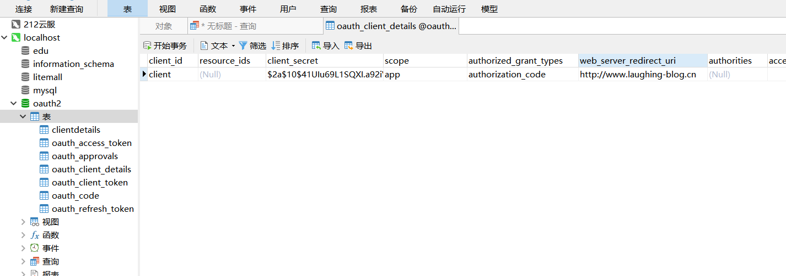
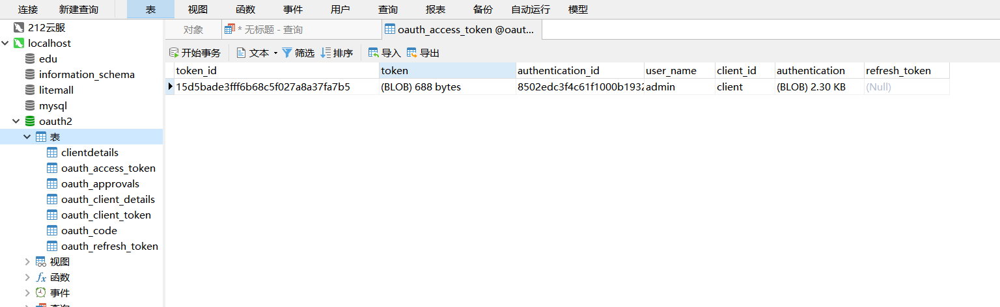

### 1、Spring Security 认证服务器端


```
/**
 * 配置认证服务器
 * @author laughing
 * @version 1.0
 * @date 2020/5/22 12:19
 */
@Configuration
@EnableAuthorizationServer // 开启认证服务
public class AuthorizationServerConfigurer extends AuthorizationServerConfigurerAdapter {
    @Autowired
    private BCryptPasswordEncoder passwordEncoder;

    @Override  //配置客户端信息
    public void configure(ClientDetailsServiceConfigurer clients) throws Exception {

        clients
                .inMemory()  //放在内存中
                .withClient("cient") //cientID
                .secret(passwordEncoder.encode("secret"))  //客户端secret
                .authorizedGrantTypes("authorization_code")  //授权码模式
                .scopes("app")  //授权范围
                .redirectUris("www.laughing.cn"); //回调地址

    }

}
```


```
/**
 * 服务器安全配置
 *
 * @author laughing
 * @version 1.0
 * @date 2020/5/22 12:28
 */
@Configuration
@EnableWebSecurity
public class WebSecurityConfiguration extends WebSecurityConfigurerAdapter {
    @Bean
    public BCryptPasswordEncoder passwordEncoder() {
        return new BCryptPasswordEncoder();
    }

    // 从数据库查用户信息
    @Override
    protected void configure(AuthenticationManagerBuilder auth) throws Exception {
        // 密码加密类
        PasswordEncoderFactories.createDelegatingPasswordEncoder();

        auth.inMemoryAuthentication()
                .withUser("admin").password(passwordEncoder().encode("111111")).roles("ADMIN")
                .and()
                .withUser("user").password(passwordEncoder().encode("111111")).roles("USER");
    }
}
```

## 访问获取授权码

```
http://localhost:9090/oauth/authorize?client_id=client&response_type=code
跳到
http://localhost:9090/login
```


  <br>

  <br>

  <br>

**拿到授权码  code=hxrAha  注意这个code只能用一次**<br>

### 通过授权码向服务器申请令牌<br>
  <br>

### 2、服务器端用JDBC存储令牌<br>


###  初始化 oAuth2 相关表：<br>

使用官方提供的建表脚本初始化 oAuth2 相关表，地址如下：<br>

```text
https://github.com/spring-projects/spring-security-oauth/blob/master/spring-security-oauth2/src/test/
```

**在mysql建表后，在oauth_client_details存储客户端信息，注意client_secret需要加密**<br>
**System.out.println(new BCryptPasswordEncoder().encode("123456"));**<br>


  <br>


###  yml文件：<br>


```
spring:
  application:
    name: oauth2-server
  datasource:
    type: com.zaxxer.hikari.HikariDataSource
    driver-class-name: com.mysql.cj.jdbc.Driver
    jdbc-url: jdbc:mysql://127.0.0.1:3306/oauth2?serverTimezone=GMT&useUnicode=true&characterEncoding=utf-8&useSSL=false
    username: root
    password: gwssi
    hikari:
      minimum-idle: 5
      idle-timeout: 600000
      maximum-pool-size: 10
      auto-commit: true
      pool-name: MyHikariCP
      max-lifetime: 1800000
      connection-timeout: 30000
      connection-test-query: SELECT 1


server:
  port: 9090
```

###  AuthorizationServerConfiguration ：<br>

```
/**
 * @author fzh
 * @version 1.0
 * @date 2020/5/22 15:31
 */
@Configuration
@EnableAuthorizationServer
public class AuthorizationServerConfiguration extends AuthorizationServerConfigurerAdapter {


    @Bean
    @Primary
    @ConfigurationProperties(prefix = "spring.datasource")
    public DataSource dataSource() {
        // 配置数据源（注意，我使用的是 HikariCP 连接池），以上注解是指定数据源，否则会有冲突
        return DataSourceBuilder.create().build();
    }

    @Bean
    public TokenStore tokenStore() {
        // 基于 JDBC 实现，令牌保存到数据
        return new JdbcTokenStore(dataSource());
    }

    @Bean
    public ClientDetailsService jdbcClientDetails() {
        // 基于 JDBC 实现，需要事先在数据库配置客户端信息
        return new JdbcClientDetailsService(dataSource());
    }

    @Override
    public void configure(AuthorizationServerEndpointsConfigurer endpoints) throws Exception {
        // 设置令牌
        endpoints.tokenStore(tokenStore());
    }

    @Override
    public void configure(ClientDetailsServiceConfigurer clients) throws Exception {
        // 读取客户端配置
        clients.withClientDetails(jdbcClientDetails());
    }
}
```

###  操作成功后数据库 oauth_access_token 表中会增加一笔记录，效果图如下 ：<br>

  <br>


&nbsp;&nbsp;&nbsp;&nbsp; 本人授权[维权骑士](http://rightknights.com)对我发布文章的版权行为进行追究与维权。未经本人许可，不可擅自转载或用于其他商业用途。


