## 一、项目搭建

### 依赖

```
<dependency>
    <groupId>org.springframework.boot</groupId>
    <artifactId>spring-boot-starter-security</artifactId>
</dependency>
```

### 编写一个控制层接口

```
@RestController
public class HelloController {
    @GetMapping("/")
    public String hello() {
        return "登陆成功";
    }
}
```

## 二、表单登录

启动后访问接口会重定向到登录页

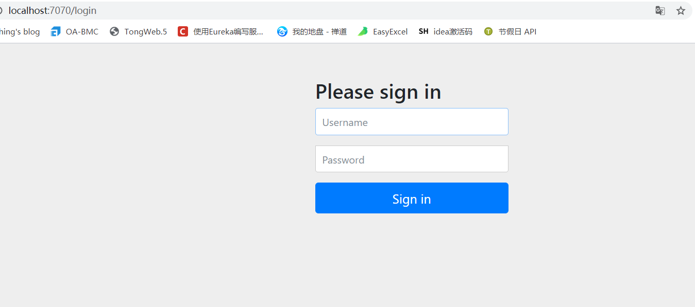

在控制台生成UUID 的临时密码字符串，默认用户名为user

```
Using generated security password: f0af6a0a-fbef-465e-941a-ec9afbaa9af9
```

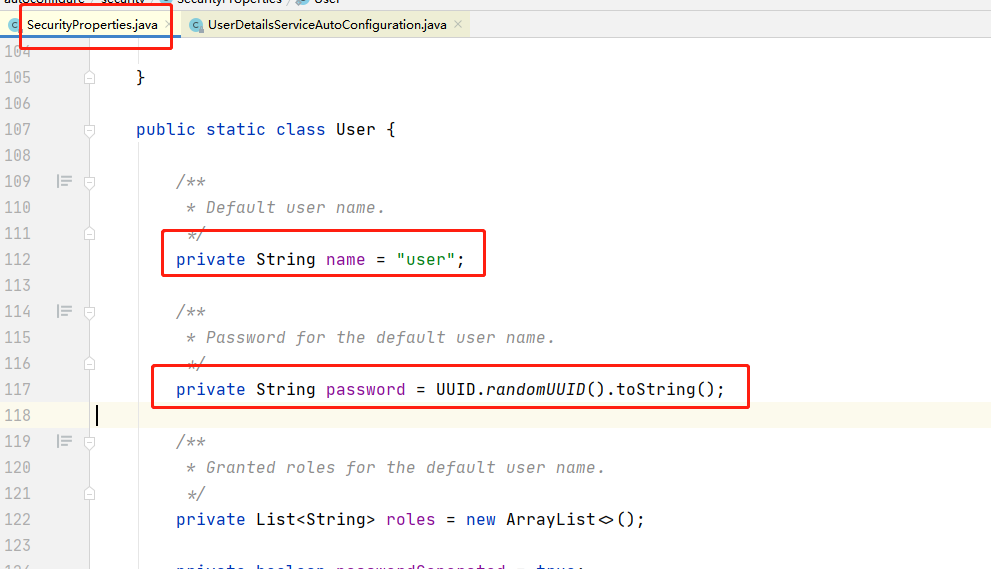


登录后我们可访问控制层接口。

## 三、自定义配置

### yml配置

密码是springboot auto配置，在SecurityProperties中定义，所以我们可在yml中自定义。

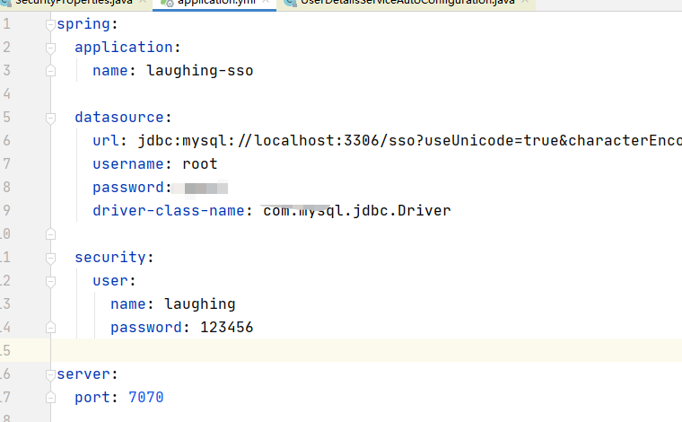


### PasswordEncoder 

Spring Security 提供了多种密码加密方案，官方推荐使用 BCryptPasswordEncoder，BCryptPasswordEncoder 使用 BCrypt 强哈希函数，

PasswordEncoder为Spring Security的加密接口。提供encode、matches 方法进行加密解密。

### 配置类

 SecurityConfig 继承自 WebSecurityConfigurerAdapter，重写里边的 configure 方法。

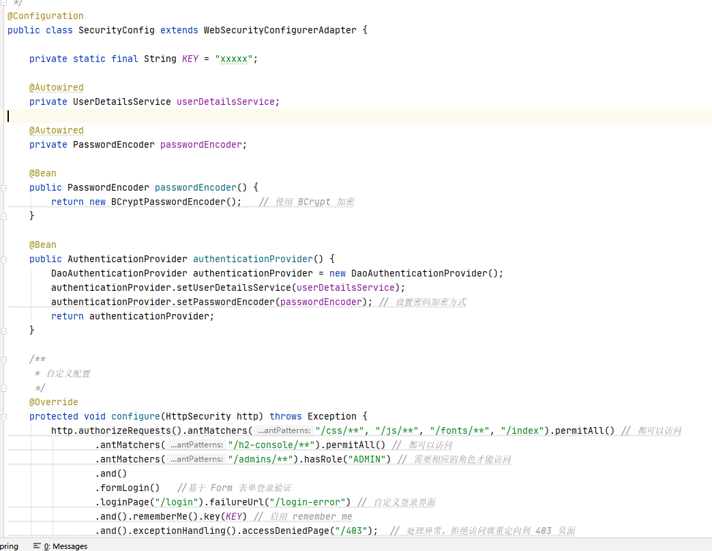


### 自定义登录页

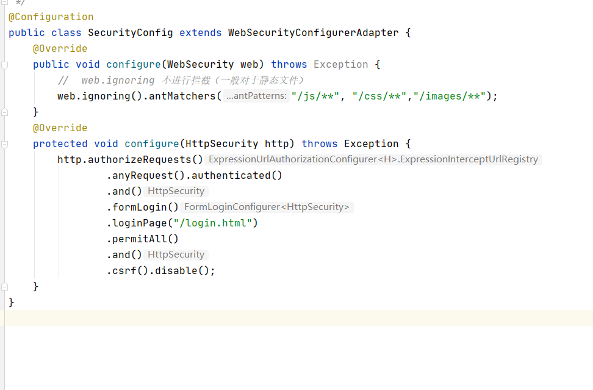

当我们定义了登录页面为 /login.html 的时候，Spring Security 也会帮我们自动注册一个 /login.html 的接口，这个接口是 POST 请求，用来处理登录逻辑。

## 四、登录页面

这里用vue+element-ui写了一个，发起一个post请求验证

```
<!DOCTYPE html>
<html xmlns:th="http://www.thymeleaf.org">
<title>login</title>
<head>
    <meta charset="UTF-8">
    <!-- import CSS -->
    <link rel="stylesheet" href="https://unpkg.com/element-ui/lib/theme-chalk/index.css">
    <script src="https://cdn.bootcss.com/jquery/3.4.1/jquery.js"></script>
</head>
<body>
<div id="app">
    <el-form ref="loginform" :model="loginform" action="/login.html" method="post" >
        <el-container>
            <el-header>LAUGHING-SSO</el-header>
            <el-main style="position: fixed ; width:100%;top:30%; ">
                <el-row>
                    <el-col :span="8" :offset="9">
                    </el-col>
                </el-row>
                <el-row>
                    <el-col :span="8" :offset="9">
                        <div class="" style="width: 75%">

                                <el-form-item label="用户名">
                                    <el-input v-model="loginform.username" name="username"></el-input>
                                </el-form-item>
                                <el-form-item label="密码">
                                    <el-input v-model="loginform.password"  name="password"></el-input>
                                </el-form-item>
                        </div>
                    </el-col>
                </el-row>
                </br>      </br>
                <el-row gutter="5">
                    <el-col :span="8" :offset="8">
                        <div style=" text-align: center;">
                            <!--v-on:click="login"  native-type="submit"-->
                            <el-button type="primary" round  native-type="submit" style="width: 100px;bottom: 20%">登录</el-button>
                        </div>
                    </el-col>
                </el-row>
            </el-main>
        </el-container>
    </el-form>
</div>
<div class="foot">京ICP备20013876<br>@laughing 2020 - 2020</div>
</body>
<!-- import Vue before Element -->
<script src="https://unpkg.com/vue/dist/vue.js"></script>
<!-- import JavaScript -->
<script src="https://unpkg.com/element-ui/lib/index.js"></script>
<script>
    new Vue({
        el: '#app',
        data() {
            // 00 部门管理-培训,00 部门管理-a会议,00 其他,10 项目管理,20 咨询售前,30 需求分析,40 系统设计,50 编码,60 测试,70 基础架构实施,80 运维一线支持,80 运维-程序优化,80 运维-数据,80 运维-基础架构,{.type}
            return {
                loginform: {
                    password: '',
                    username: '',
                },
            };
        },
        methods: {
            login() {

            }
        }
    })
</script>
<style>
    body {
        background: linear-gradient(rgba(0, 0, 0, 0.5), rgba(0, 0, 0, 0.5)), url(https://api.dujin.org/bing/1920.php) 0px 0px no-repeat;
    }

    header {
        color: #ffffff;
        font-size: 30px;
        text-align: center;
        line-height: 400px;
    }

    .el-form-item__label {
        color: #ffffff;
    }


    .app-block {
        width: 28%;
        margin: 0 auto;
        text-align: center;
        padding: 3em 5em;
        height: 80%;
    }

    .foot {
        color: white;
        font-size: 14px;
        position: fixed;
        bottom: 8%;
        left: 45%;
    }
</style>
</html>
```

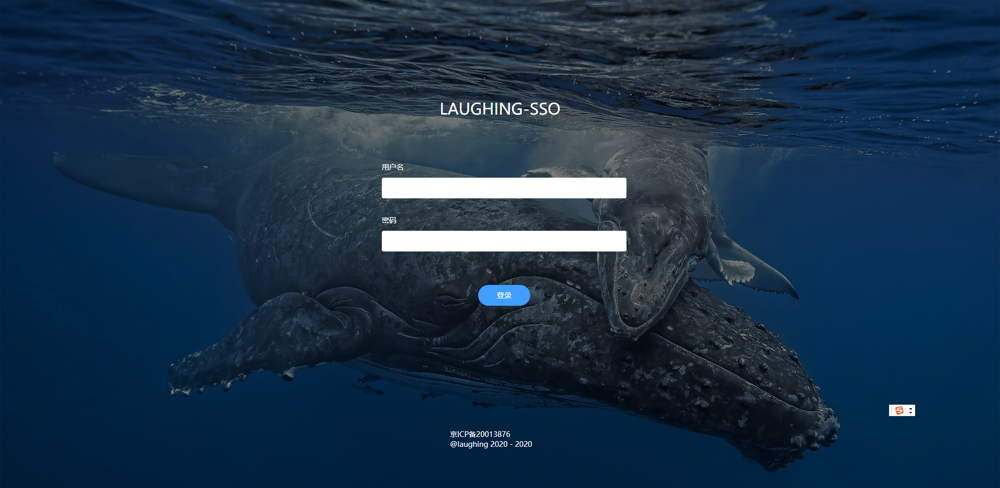

登陆成功后返回.defaultSuccessUrl("/") // 重定向

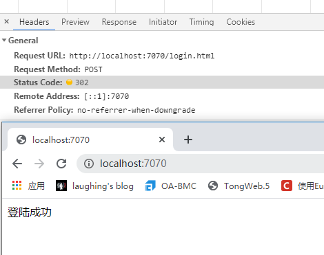


登录失败返回http://localhost:7070/login.html?error

退出登录默认为get请求http://localhost:7070/logout


## 设定用户访问权限

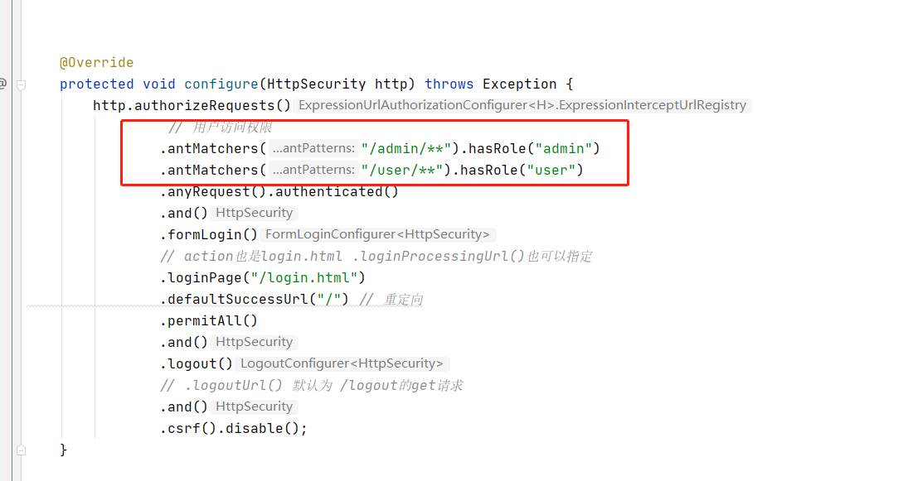


## 五、使用数据库存储用户登录

## JdbcUserDetailsManager

Spring security提供jdbcTemplte的默认数据库方法，并在users.ddl中有数据库建表语句。

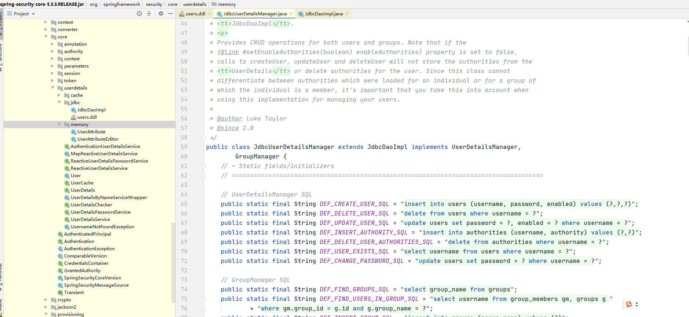

new JdbcUserDetailsManager类来进行配置；

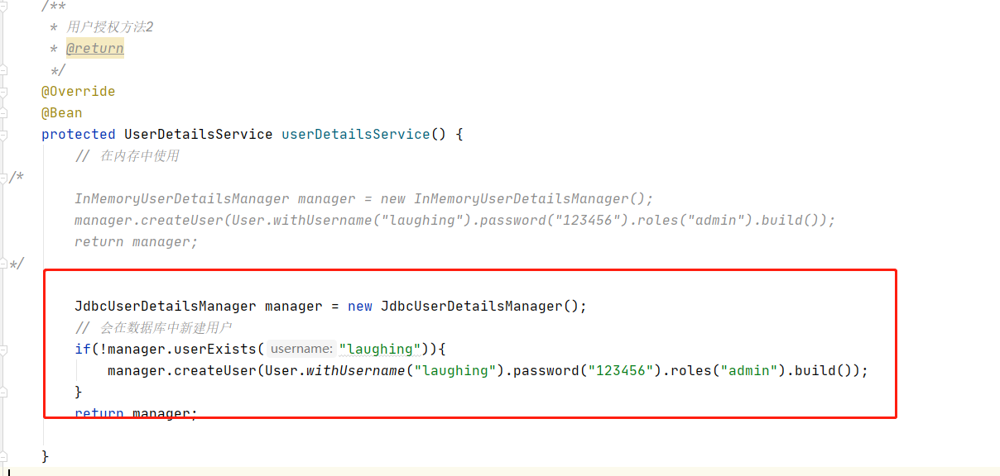


## 使用UserService自定义

UserDetail是Spring Security基础接口，包含某个用户的账号，密码，权限，状态（是否锁定）等信息。

这边使用mybatis-plus进行数据库操作。建表采用Spring Security RBAC的基于角色的权限控制


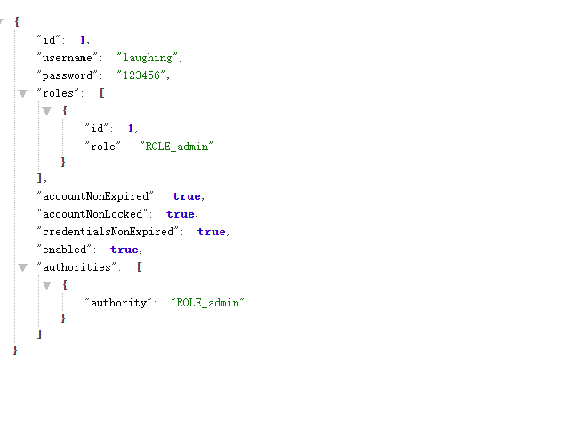

## 六、加密

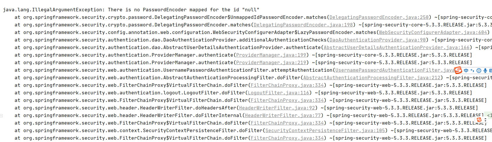


```
<dependency>
 <groupId>commons-codec</groupId>
 <artifactId>commons-codec</artifactId>
 <version>1.11</version>
</dependency>
```


```
@Service
public class MyPasswordEncoderService implements PasswordEncoder {

    @Override
    public String encode(CharSequence rawPassword) {
        return DigestUtils.md5DigestAsHex(rawPassword.toString().getBytes());
    }

    @Override
    public boolean matches(CharSequence rawPassword, String encodedPassword) {
        return encodedPassword.equals(DigestUtils.md5DigestAsHex(rawPassword.toString().getBytes()));
    }
}
```
