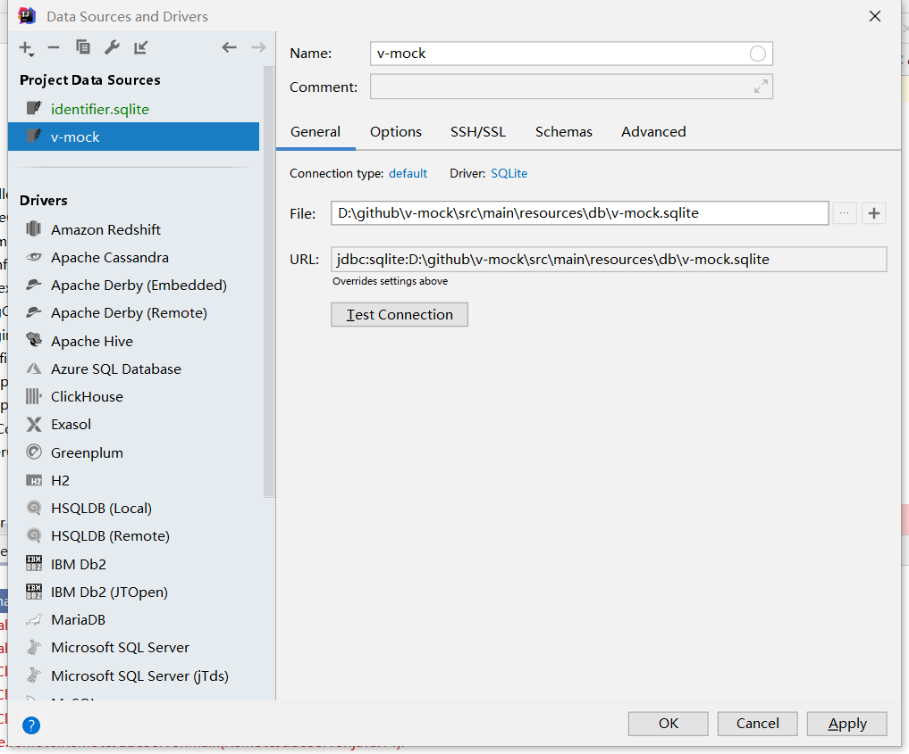
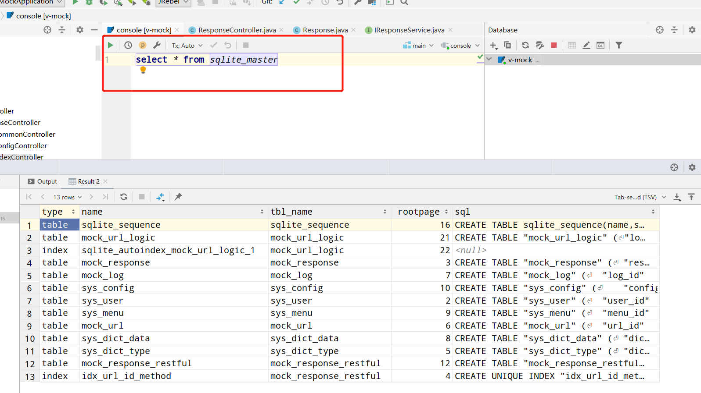

### 一、简介与应用场景

SQLite，是一款轻型的关系数据库，一般用于对并发数量要求不高的本地查询，小软件或者小网站等。同时SQLite是使用最广泛的嵌入式数据库引擎，机端存储少量数据等（比如日常使用的微信，聊天记录就是放本地数据库）。


### 二、安装

SQLite Download Page：<br>
[https://www.sqlite.org/download.html](https://www.sqlite.org/download.html)<br>

下载 **sqlite-tools-win32-\*.zip** 和 **sqlite-dll-win32-\*.zip** 压缩文件<br>

### 三、Spring Boot集成

**pom:**

```
<!-- sqlite 驱动-->
<dependency>
    <groupId>org.xerial</groupId>
    <artifactId>sqlite-jdbc</artifactId>
    <version>${sqlite.jdbc.version}</version>
</dependency>
<!--阿里数据库连接池 -->
<dependency>
    <groupId>com.alibaba</groupId>
    <artifactId>druid-spring-boot-starter</artifactId>
    <version>${druid.version}</version>
</dependency>

```


```
datasource:
  type: com.alibaba.druid.pool.DruidDataSource
  driverClassName: org.sqlite.JDBC
  druid:
    # 数据源
    url: jdbc:sqlite::resource:db/v-mock.sqlite
    # 初始连接数
    initialSize: 5
    # 最小连接池数量
    minIdle: 5
    # 最大连接池数量
    maxActive: 10
    # 配置获取连接等待超时的时间
    maxWait: 30000
    # 配置间隔多久才进行一次检测，检测需要关闭的空闲连接，单位是毫秒
    timeBetweenEvictionRunsMillis: 60000
    # 配置一个连接在池中最小生存的时间，单位是毫秒
    minEvictableIdleTimeMillis: 300000
    # 配置一个连接在池中最大生存的时间，单位是毫秒
    maxEvictableIdleTimeMillis: 900000
    # 配置检测连接是否有效
    validationQuery: SELECT 1
    testWhileIdle: true
    webStatFilter:
      enabled: false
    statViewServlet:
      enabled: false
    filter:
      stat:
        enabled: true
        # 慢SQL记录
        log-slow-sql: true
        slow-sql-millis: 1000
        merge-sql: true
      wall:
        config:
          multi-statement-allow: true
```


### 四、Idea配置





SQLite数据库中有一个内置表，名为SQLITE_MASTER，此表中存储着当前数据库中所有表的相关信息，比如表的名称、用于创建此表的sql语句、索引、索引所属的表、创建索引的sql语句等:

```
select * from sqlite_master
```





&nbsp;&nbsp;&nbsp;&nbsp; 本人授权[维权骑士](http://rightknights.com)对我发布文章的版权行为进行追究与维权。未经本人许可，不可擅自转载或用于其他商业用途。


