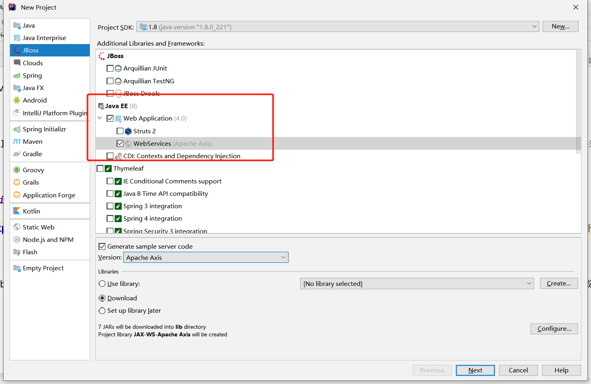
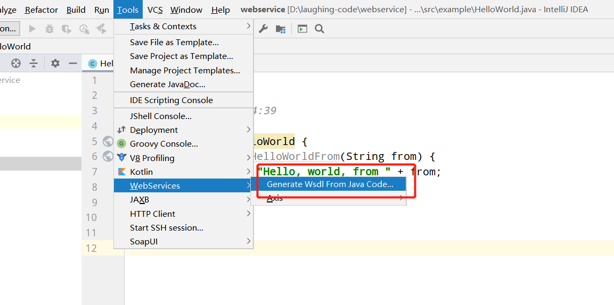
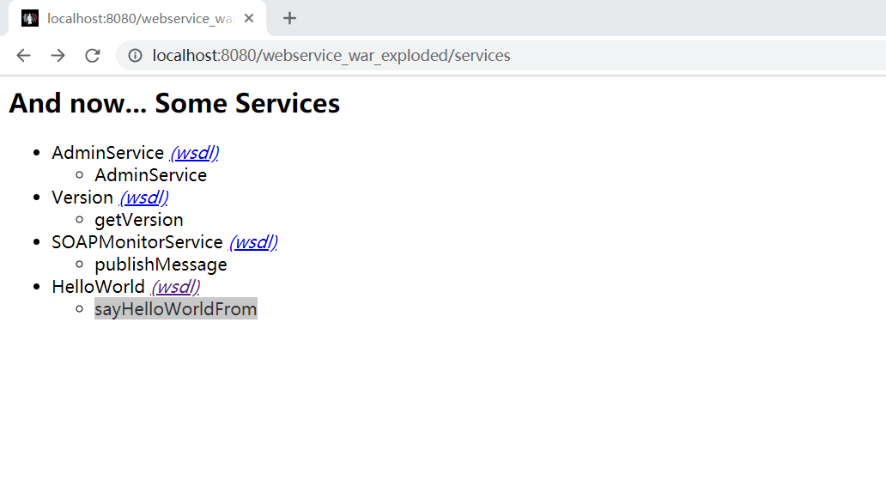

webservice作为较早的不同程序访问技术，已经有一段时间了，它基于xml数据通信，在最新的rpc远程调用技术是json

现在rpc远程调用技术基本都用json。webservice作为较早程序访问技术，基于xml数据通信，业务使用，学习一下。

### **1、Webservice简介** 

### Web Service: 

Web Service也叫XML Web Service WebService是一种可以接收其它系统中传递过来的请求,通过SOAP在Web上提供的软件服务，使用WSDL文件进行说明，并通过UDDI进行注册。他有**跨平台的可互操作性**.

### SOAP ： 

SOAP 是基于 XML 的简易协议，SOAP 请求是HTTP POST的一个专用版本，遵循一种特殊的xml消息格式Content-type设置为: text/xml任何数据都可以xml化。

### WSDL： 

WSDL：(Web Services Description Language) WSDL 文件是一个 XML 文档，用于说明一组 SOAP 消息以及如何交换这些消息。

### UDDI: 

UDDI (Universal Description, Discovery, and Integration) 是一个主要针对Web服务供应商和使用者的新项目。在用户能够调用Web服务之前，必须确定这个服务内包含哪些商务方法，找到被调用的接口定义，还要在服务端来编制软件，UDDI是一种根据描述文档来引导系统查找相应服务的机制。UDDI利用SOAP消息机制（标准的XML/HTTP）来发布，编辑，浏览以及查找注册信息。它采用XML格式来封装各种不同类型的数据，并且发送到注册中心或者由注册中心来返回需要的数据。

### 2、webservice用axis2发布服务端 

  首先需要从[http://axis.apache.org/axis2/java/core/download.html](http://axis.apache.org/axis2/java/core/download.html)下载axis2的项目，直接下载war包下来

  

生成wsdl文件:

用tomcat启一下:
  

&nbsp;&nbsp;&nbsp;&nbsp; 本人授权[维权骑士](http://rightknights.com)对我发布文章的版权行为进行追究与维权。未经本人许可，不可擅自转载或用于其他商业用途。

