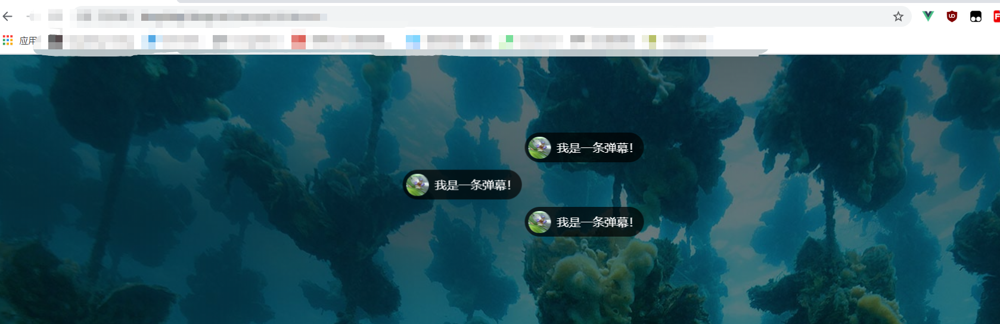
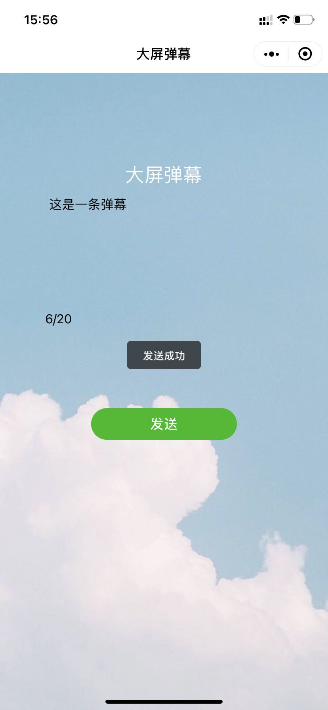
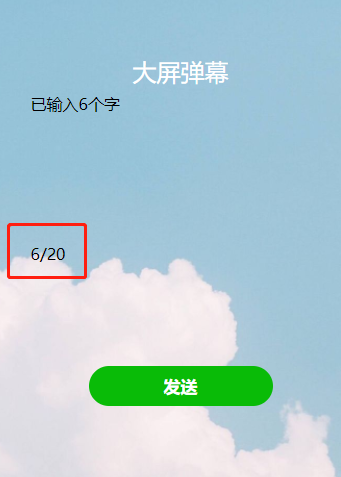
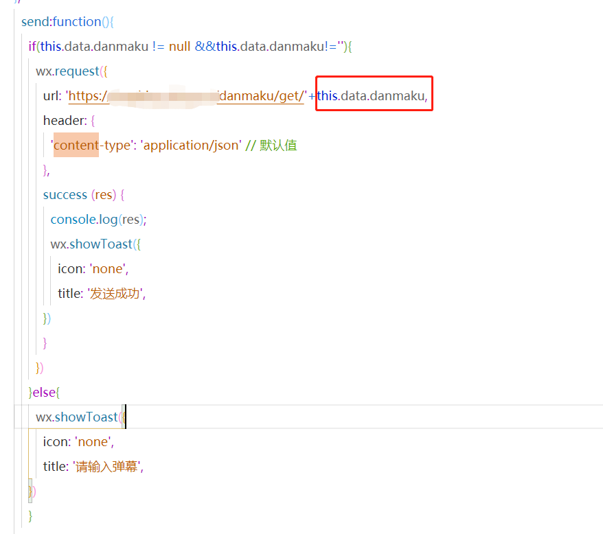
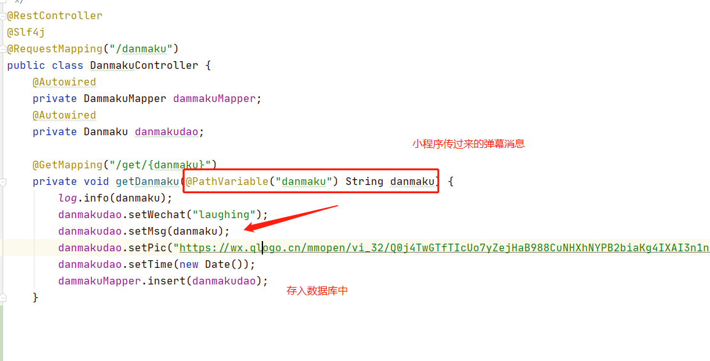
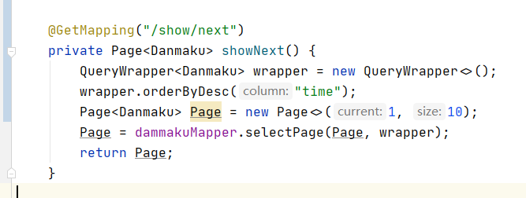
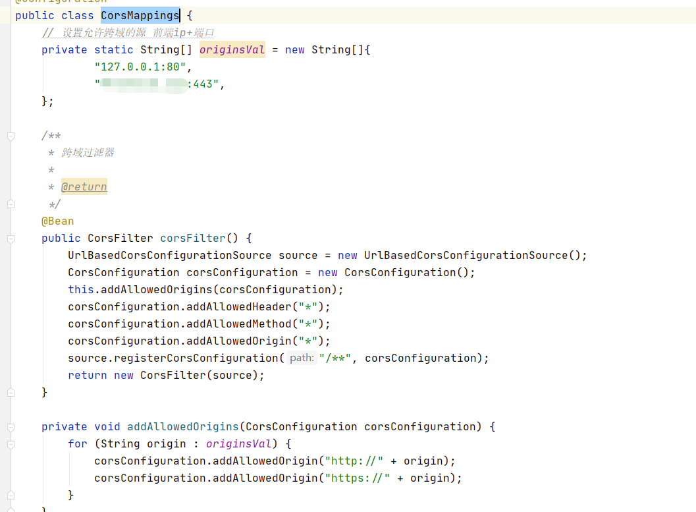
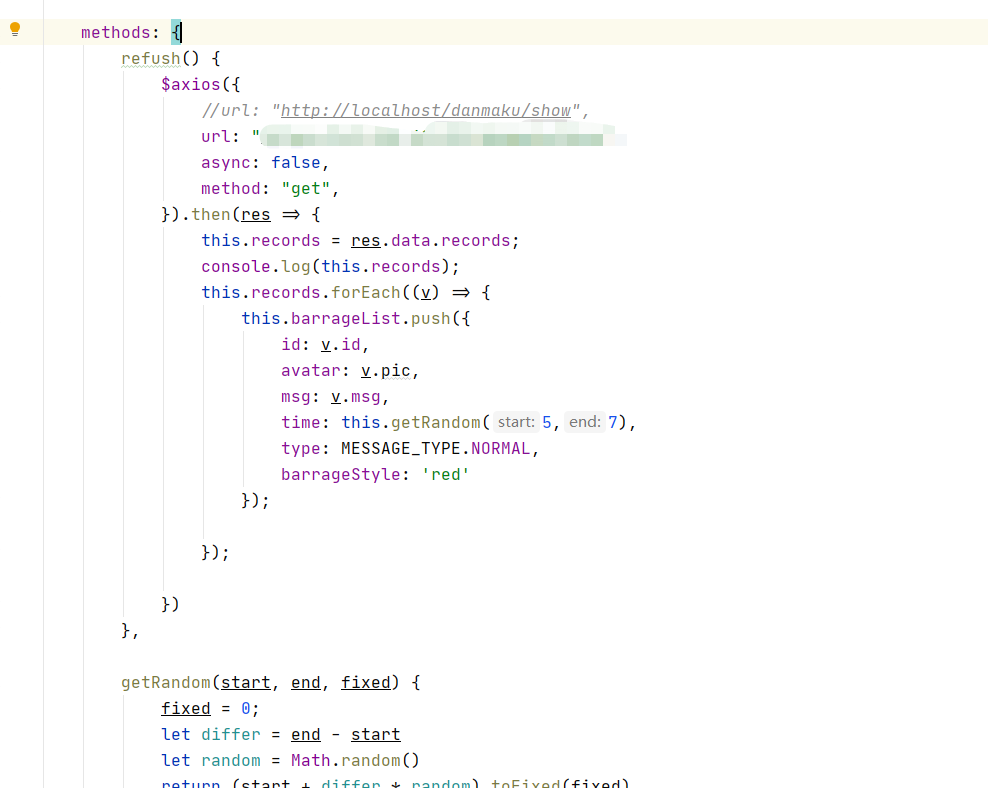
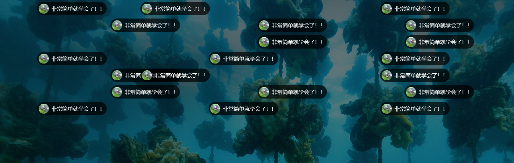
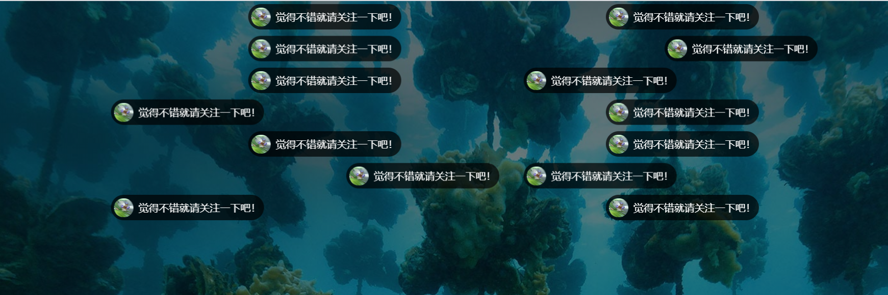

## 一、项目介绍
本项目实现了，通过微信小程序，实时发送弹幕到浏览器页面的大屏功能。
适用于各种晚会、酒吧、婚宴等场景，扫码发弹幕到大屏幕，吐槽、活跃气氛、抽奖等。效果如图：



## 二、微信小程序开发
微信小程序端的开发非常简单，功能上就是发送弹幕的消息到服务器端即可。这里加上了一个20字的字数限制，并能实时显示已输入多少字。



显示字数的页面


    <div class="weui_textarea_counter"><span id="content">{{content}}</span>/20</div>

js获取方法：

```
  getInput:function(e){
    this.setData({
      danmaku: e.detail.value,
      content: e.detail.value.length
    })
},
```

拿到输入danmaku的length即可，数据绑定的模式会自动更新

弹幕发送方法：

按钮绑定send方法，将数据通过wx.request方法做一https请求发送出去即可，这里还加了发送成功的提示和必填验证。wx.showToast方法是直接引用weui的，具体可参考我之前的文章。在后续的版本里，会把微信头像和微信名也传至服务器上。




## 三、服务器端开发

微信小程序如果做服务器端请求，必须是https的域名，所以得先装SSL证书，有了SSL证书，放在项目的资源目录中，需在springboot的yml文件中配置ssl即可。具体可参考微信公众号。

这里服务端是一个springboot的mybatis-plus项目，数据库采用mysql。也很容易。



再写一个查分页数据的方法即可，可以实现一次传多少条弹幕。





新建CorsMappings类，做一下大屏跨域请求的访问许可。注意这里的服务器端口是https的默认443端口




## 四、大屏页面弹幕实现

大屏幕前端新建一个vue3.0项目，用脚手架即可。这里用到一个vue-baberrage的弹幕组件。需要install进来。

```
npm install vue-baberrage
```

模板：

```
<template>
    <div class="home">
        <div class="barrages-drop">
            <vue-baberrage
                    :isShow="barrageIsShow"
                    :barrageList="barrageList"
                    :maxWordCount="maxWordCount"
                    :throttleGap="throttleGap"
                    :loop="barrageLoop"
                    :boxHeight="boxHeight"
                    :messageHeight="messageHeight"
                    :message-gap="10"
            >
            </vue-baberrage>
        </div>
    </div>
</template>
```

用axios的异步get方法定时请求后端，访问数据库即可实现。




添加上喜欢的背景图片，晚会主题、酒吧logo之类的就可以使用了。




那么



&nbsp;&nbsp;&nbsp;&nbsp; 本人授权[维权骑士](http://rightknights.com)对我发布文章的版权行为进行追究与维权。未经本人许可，不可擅自转载或用于其他商业用途。


