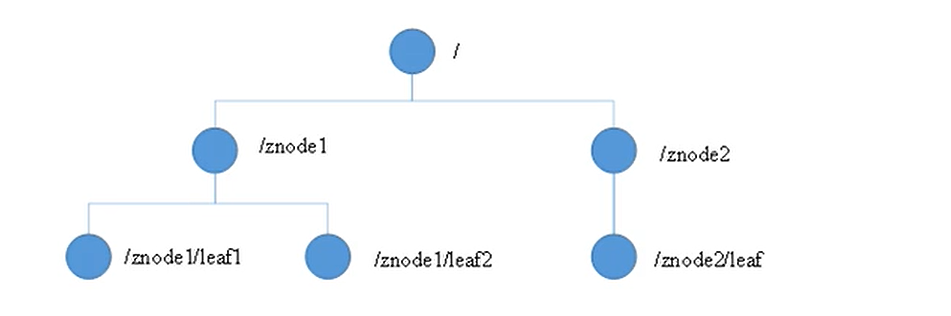
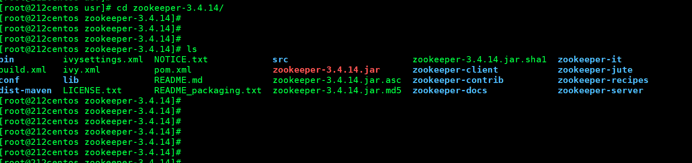
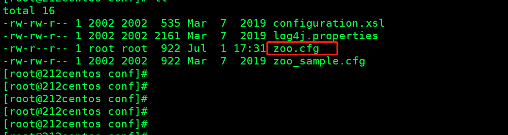
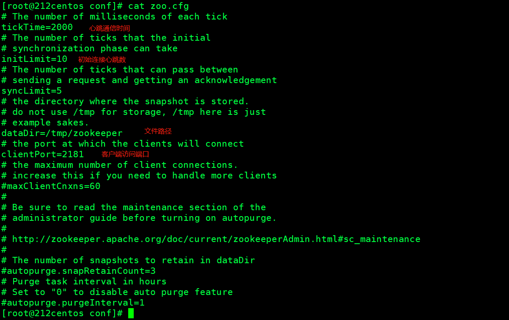
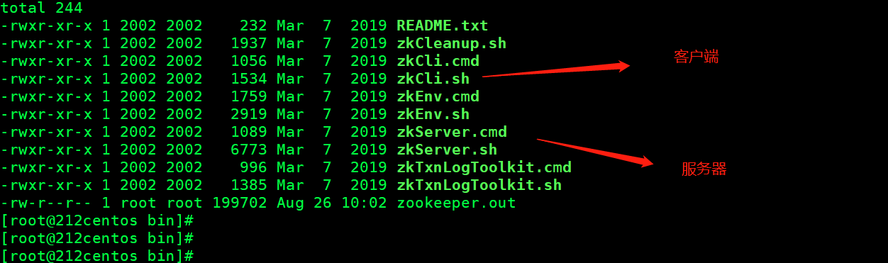
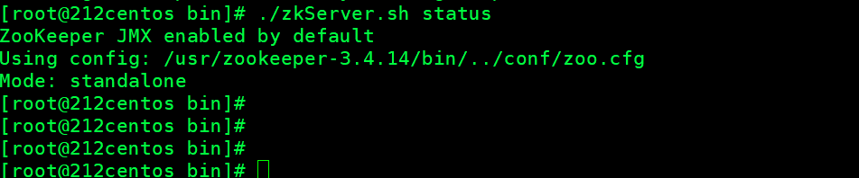

## 一、Zookeeper简介

ZooKeeper是一个典型的**分布式数据一致性**的**解决方案**。分布式应用程序可以基于它实现诸如**数据发布/订阅、负载均衡、命名服务、分布式协调/通知、集群管理、Master选举、分布式锁和分布式队列**等功能。ZooKeeper可以保证如下分布式一致性特性。

zookeeper从设计模式上来看，是一**个基于观察者模式**设计的服务管理框架。

## 二、Zookeeper特点

1、Zookeeper有一个leader和多个follower

2、集群中有**半数以上**的节点存活，zookeeper可正常服务

3、全局数据一致。每个server保存一份相同对数据副本。

4、更新请求，顺序执行。

5、数据更新原子性。

6、实时性，客户端读取最新数据。

## 三、Zookeeper数据结构

Zookeeper数据结构类似于Unix文件系统



**每个Znode默认能存储1MB的数据**。通过路径唯一标识。

## 四、应用场景

### 统一命名

在分布式环境下，对IP主机进行命名。

例如在服务注册发现，直接用服务名。

### 统一配置管理

一般要求一个集群，所以的服务配置信息是一致的。

对配置文件修改后，能快速同步到所有节点。

将配置信息写入一个Znode上，每个客户端监听这个节点，实现同步。

### 统一集群管理

实时掌握每个节点的状态。

### 服务器动态上下线

服务注册与发行。高可用。

### 负载均衡

zookeeper记录每台服务器的访问数，让访问数量最少的服务器去处理最新的客户端请求。

## 五、使用

### 安装

官网： [https://zookeeper.apache.org/](https://zookeeper.apache.org/)



### 配置



将zoo_sample.cfg复制一份zoo.cfg作为配置文件。

tickTime 心跳通信时间 默认2000ms

syncLimit为启动后，5次心跳，10秒之后无连接则判断应用挂掉。



### 启动服务端



```
./zkServer.sh start
```

查看状态

```
./zkServer.sh status
```




### 启动客户端

```
./zkCli.sh
# 退出
quit
```


## 六、内部原理

### 半数机制

集群中半数以上服务存活，集群可用。

因此Zookeeper适合安装奇数台。

### 选举

zookeeper没有指定master和slave，但zookeeper在工作时，会选举一个leader,其余为follower。

假设五台服务器组成的zookeeper集群。

1、第一台服务器启动，发出去报文无响应，选举状态会一直looking

2、服务器2启动，相互投票，id大的2胜出。两票，但是没有超过半数。

3、服务3启动，3票作为leader

4、服务4、5启动，作为follower

### 节点类型

持久（persistent）客户端与服务端连接断开，节点不删除，目录仍然存在。

创建Znode会设置顺序编号，名称附加个序号，由父节点维护

短暂（epheme）客户端与服务端连接断开，节点删除


